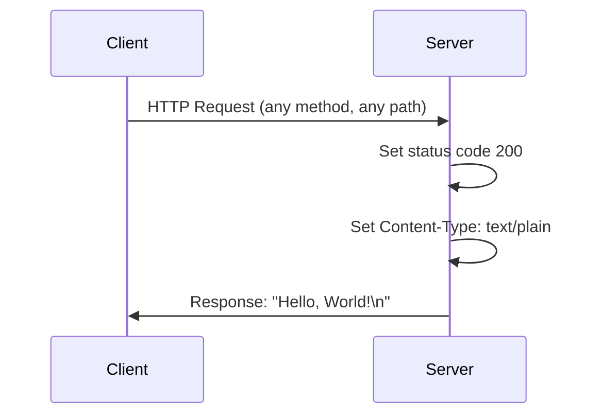
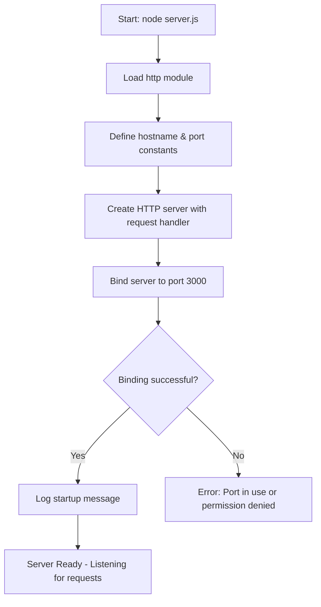

# Hello World HTTP Server

A simple, zero-dependency Node.js HTTP server that responds with "Hello, World!" to all incoming requests. This project demonstrates the fundamentals of creating a web server using only Node.js built-in modules.

## Features

- **Zero Dependencies**: Uses only Node.js built-in `http` module - no npm packages required
- **Minimal Footprint**: Single-file implementation (~15 lines of functional code)
- **Educational**: Well-documented code perfect for learning HTTP server basics
- **Cross-Platform**: Runs on any system with Node.js installed (Windows, macOS, Linux)
- **Instant Setup**: Clone and run immediately with no build steps

## Prerequisites

Before running this server, ensure you have the following installed:

| Requirement | Minimum Version | Check Command |
|-------------|-----------------|---------------|
| Node.js | v12.0.0 or higher | `node --version` |
| npm | v7.0.0 or higher (included with Node.js) | `npm --version` |

### Verify Installation

```bash
# Check Node.js version
node --version
# Expected output: v12.0.0 or higher (e.g., v20.20.0)

# Check npm version
npm --version
# Expected output: v7.0.0 or higher (e.g., 11.1.0)
```

## Installation

1. **Clone the repository**

   ```bash
   git clone <repository-url>
   cd hello_world
   ```

2. **Verify the setup** (Optional)

   ```bash
   # Check that server.js exists
   ls server.js
   
   # Validate JavaScript syntax
   node --check server.js
   ```

> **Note**: No `npm install` is required! This project has zero external dependencies.

## Usage

### Starting the Server

Run the server using Node.js:

```bash
node server.js
```

**Expected Output:**

```
Server running at http://127.0.0.1:3000/
```

### Verifying the Server is Running

**Option 1: Using a Web Browser**

Open your web browser and navigate to:
```
http://127.0.0.1:3000/
```

**Option 2: Using curl (Command Line)**

```bash
curl http://127.0.0.1:3000/
```

**Expected Response:**

```
Hello, World!
```

**Option 3: Using curl with Headers**

```bash
curl -i http://127.0.0.1:3000/
```

**Expected Response with Headers:**

```
HTTP/1.1 200 OK
Content-Type: text/plain
Date: [current date]
Connection: keep-alive
Keep-Alive: timeout=5

Hello, World!
```

### Stopping the Server

Press `Ctrl + C` in the terminal where the server is running.

## API Reference

### Request Flow



### Endpoint Details

| Property | Value |
|----------|-------|
| **URL** | `/*` (all paths accepted) |
| **Methods** | All HTTP methods (GET, POST, PUT, DELETE, etc.) |
| **Authentication** | None required |
| **Rate Limiting** | None |

### Response Specification

| Property | Value |
|----------|-------|
| **Status Code** | `200 OK` |
| **Content-Type** | `text/plain` |
| **Body** | `Hello, World!\n` |
| **Body Length** | 14 bytes |

### Example Requests

**GET Request:**

```bash
curl -X GET http://127.0.0.1:3000/
# Response: Hello, World!
```

**POST Request:**

```bash
curl -X POST http://127.0.0.1:3000/api/data
# Response: Hello, World!
```

**Any Path:**

```bash
curl http://127.0.0.1:3000/any/path/here
# Response: Hello, World!
```

## Configuration

The server configuration is defined as constants in `server.js`:

| Variable | Default Value | Description |
|----------|---------------|-------------|
| `hostname` | `'127.0.0.1'` | The IP address the server binds to |
| `port` | `3000` | The port number the server listens on |

### Modifying Configuration

To change the server settings, edit the constants in `server.js`:

```javascript
// server.js - Lines 28-39

// Change hostname to allow external access
const hostname = '0.0.0.0';  // Accepts connections from any IP

// Change port number
const port = 8080;  // Use port 8080 instead of 3000
```

### Common Configuration Scenarios

| Scenario | hostname | port | Access URL |
|----------|----------|------|------------|
| Local development | `'127.0.0.1'` | `3000` | `http://127.0.0.1:3000/` |
| Local network access | `'0.0.0.0'` | `3000` | `http://<your-ip>:3000/` |
| Production (with reverse proxy) | `'127.0.0.1'` | `3000` | Via nginx/Apache |
| Alternative port | `'127.0.0.1'` | `8080` | `http://127.0.0.1:8080/` |

## Deployment

### Server Startup Flow



### Production Considerations

#### 1. Network Binding

For production deployment, modify the hostname to accept external connections:

```javascript
const hostname = '0.0.0.0';  // Accept connections from any network interface
```

#### 2. Process Managers

Use a process manager to keep the server running and handle restarts:

**Using PM2:**

```bash
# Install PM2 globally
npm install -g pm2

# Start the server with PM2
pm2 start server.js --name "hello-world"

# View running processes
pm2 list

# View logs
pm2 logs hello-world

# Stop the server
pm2 stop hello-world

# Enable startup on system reboot
pm2 startup
pm2 save
```

**Using forever:**

```bash
# Install forever globally
npm install -g forever

# Start the server
forever start server.js

# View running processes
forever list

# Stop the server
forever stop server.js
```

#### 3. Reverse Proxy Setup

**Nginx Configuration Example:**

```nginx
server {
    listen 80;
    server_name yourdomain.com;

    location / {
        proxy_pass http://127.0.0.1:3000;
        proxy_http_version 1.1;
        proxy_set_header Upgrade $http_upgrade;
        proxy_set_header Connection 'upgrade';
        proxy_set_header Host $host;
        proxy_cache_bypass $http_upgrade;
    }
}
```

#### 4. Docker Deployment

**Dockerfile:**

```dockerfile
FROM node:20-alpine

WORKDIR /app

COPY server.js .

EXPOSE 3000

CMD ["node", "server.js"]
```

**Build and Run:**

```bash
# Build the Docker image
docker build -t hello-world-server .

# Run the container
docker run -p 3000:3000 hello-world-server
```

#### 5. Cloud Hosting Options

This server can be deployed to various cloud platforms:

| Platform | Deployment Method |
|----------|-------------------|
| **Heroku** | Git push with Procfile |
| **AWS EC2** | Direct Node.js installation |
| **Google Cloud Run** | Container deployment |
| **Azure App Service** | Node.js web app |
| **DigitalOcean App Platform** | Git-based deployment |
| **Railway** | One-click deployment |
| **Render** | Git-based deployment |

## Project Structure

```
hello_world/
├── server.js           # Main HTTP server implementation
├── package.json        # Node.js package manifest
├── package-lock.json   # Dependency lock file (empty - no deps)
└── README.md           # This documentation file
```

### File Descriptions

| File | Purpose |
|------|---------|
| `server.js` | Contains the HTTP server implementation with JSDoc documentation |
| `package.json` | Defines project metadata (name, version, author, license) |
| `package-lock.json` | Lock file for npm (empty since no dependencies) |
| `README.md` | Comprehensive project documentation |

## Troubleshooting

### Common Issues and Solutions

#### Error: `EADDRINUSE` - Port Already in Use

**Symptom:**
```
Error: listen EADDRINUSE: address already in use 127.0.0.1:3000
```

**Solutions:**

1. Find and kill the process using the port:
   ```bash
   # On Linux/macOS
   lsof -i :3000
   kill -9 <PID>
   
   # On Windows
   netstat -ano | findstr :3000
   taskkill /PID <PID> /F
   ```

2. Or change the port in `server.js`:
   ```javascript
   const port = 3001;  // Use a different port
   ```

#### Error: `EACCES` - Permission Denied

**Symptom:**
```
Error: listen EACCES: permission denied 127.0.0.1:80
```

**Cause:** Ports below 1024 require root/administrator privileges.

**Solution:** Use a port number above 1024 (e.g., 3000, 8080).

#### Error: `command not found: node`

**Symptom:**
```
bash: node: command not found
```

**Solution:** Install Node.js from [nodejs.org](https://nodejs.org/) or using a version manager:

```bash
# Using nvm (Node Version Manager)
curl -o- https://raw.githubusercontent.com/nvm-sh/nvm/v0.39.0/install.sh | bash
nvm install node
```

#### Connection Refused When Accessing Server

**Symptom:** Browser shows "Connection refused" or curl returns an error.

**Possible Causes and Solutions:**

1. **Server not running**: Start the server with `node server.js`
2. **Wrong URL**: Ensure you're using `http://127.0.0.1:3000/` (not https)
3. **Firewall blocking**: Check firewall settings
4. **Wrong port**: Verify the port number matches `server.js`

#### Server Starts but Exits Immediately

**Symptom:** Server starts and immediately returns to command prompt.

**Possible Cause:** Syntax error in server.js

**Solution:** Validate the file:
```bash
node --check server.js
```

## Contributing

Contributions are welcome! Here's how you can help:

### How to Contribute

1. **Fork the repository**
2. **Create a feature branch**
   ```bash
   git checkout -b feature/your-feature-name
   ```
3. **Make your changes**
4. **Test your changes**
   ```bash
   node server.js
   curl http://127.0.0.1:3000/
   ```
5. **Commit your changes**
   ```bash
   git commit -m "Add: description of your changes"
   ```
6. **Push to your fork**
   ```bash
   git push origin feature/your-feature-name
   ```
7. **Open a Pull Request**

### Contribution Guidelines

- Keep the zero-dependency philosophy
- Add JSDoc comments for any new functions
- Update README.md if adding new features
- Test changes before submitting

### Ideas for Contributions

- Add routing support
- Implement different response formats (JSON, HTML)
- Add request logging
- Create unit tests
- Add environment variable configuration

## License

This project is licensed under the **MIT License**.

```
MIT License

Copyright (c) 2024 hxu

Permission is hereby granted, free of charge, to any person obtaining a copy
of this software and associated documentation files (the "Software"), to deal
in the Software without restriction, including without limitation the rights
to use, copy, modify, merge, publish, distribute, sublicense, and/or sell
copies of the Software, and to permit persons to whom the Software is
furnished to do so, subject to the following conditions:

The above copyright notice and this permission notice shall be included in all
copies or substantial portions of the Software.

THE SOFTWARE IS PROVIDED "AS IS", WITHOUT WARRANTY OF ANY KIND, EXPRESS OR
IMPLIED, INCLUDING BUT NOT LIMITED TO THE WARRANTIES OF MERCHANTABILITY,
FITNESS FOR A PARTICULAR PURPOSE AND NONINFRINGEMENT. IN NO EVENT SHALL THE
AUTHORS OR COPYRIGHT HOLDERS BE LIABLE FOR ANY CLAIM, DAMAGES OR OTHER
LIABILITY, WHETHER IN AN ACTION OF CONTRACT, TORT OR OTHERWISE, ARISING FROM,
OUT OF OR IN CONNECTION WITH THE SOFTWARE OR THE USE OR OTHER DEALINGS IN THE
SOFTWARE.
```

---

**Author:** hxu  
**Version:** 1.0.0  
**Last Updated:** 2024
