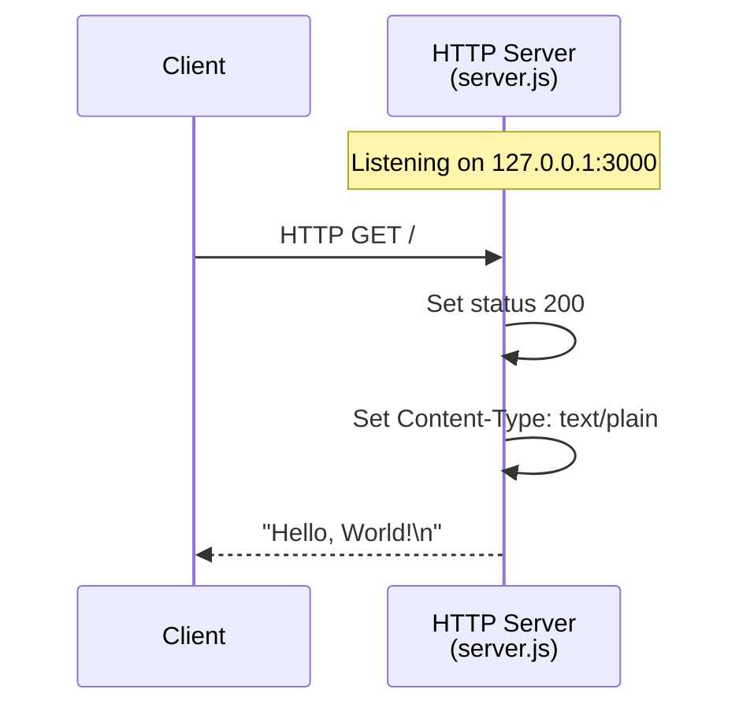
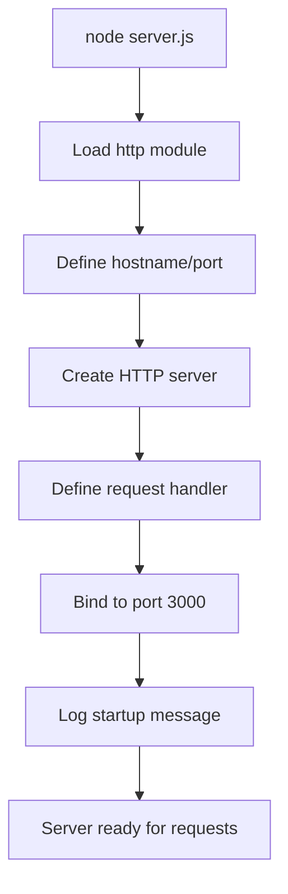

# Hello World HTTP Server


A minimal HTTP server implementation in Node.js that demonstrates the basic usage of the built-in `http` module. This project serves as a Backprop integration test harness.

---

## Table of Contents

- [Overview](#overview)
- [Quick Start](#quick-start)
- [Prerequisites](#prerequisites)
- [Installation](#installation)
- [Usage](#usage)
- [API Reference](#api-reference)
- [Configuration](#configuration)
- [Deployment](#deployment)
- [Troubleshooting](#troubleshooting)
- [License](#license)

---

## Overview

This project provides a simple "Hello, World!" HTTP server built with Node.js. It demonstrates:

- **Zero Dependencies**: Uses only Node.js built-in modules
- **Minimal Footprint**: Single file implementation (~80 lines with documentation)
- **Easy to Understand**: Well-documented code with JSDoc annotations
- **Development Ready**: Perfect starting point for learning Node.js HTTP servers

### Technology Stack

| Component | Technology |
|-----------|------------|
| Runtime | Node.js (v12+) |
| HTTP Module | Built-in `http` module |
| Package Manager | npm |

### Request/Response Flow



---

## Quick Start

Get up and running in 3 simple steps:

```bash
# 1. Clone the repository
git clone <repository-url>
cd hello_world

# 2. Install dependencies (none required, but validates package.json)
npm install

# 3. Start the server
node server.js
```

Then open your browser to [http://127.0.0.1:3000](http://127.0.0.1:3000) or use curl:

```bash
curl http://127.0.0.1:3000
# Output: Hello, World!
```

---

## Prerequisites

Before you begin, ensure you have the following installed:

### Required Software

| Software | Minimum Version | Recommended Version | Verification Command |
|----------|-----------------|---------------------|---------------------|
| Node.js | 12.0.0 | 20.x LTS | `node --version` |
| npm | 7.0.0 | 10.x+ | `npm --version` |

### Verify Installation

```bash
# Check Node.js version
node --version
# Expected output: v12.0.0 or higher (e.g., v20.20.0)

# Check npm version
npm --version
# Expected output: 7.0.0 or higher (e.g., 11.1.0)
```

### Installing Node.js

If you don't have Node.js installed:

- **Official Website**: Download from [nodejs.org](https://nodejs.org/)
- **macOS (Homebrew)**: `brew install node`
- **Ubuntu/Debian**: `sudo apt install nodejs npm`
- **Windows**: Download installer from [nodejs.org](https://nodejs.org/)

---

## Installation

### Step 1: Clone the Repository

```bash
git clone <repository-url>
cd hello_world
```

### Step 2: Install Dependencies

Although this project has zero runtime dependencies, run npm install to ensure the package.json is valid:

```bash
npm install
```

Expected output:
```
up to date, audited 1 package in Xms
found 0 vulnerabilities
```

### Step 3: Verify Installation

Check that the server file exists and has valid syntax:

```bash
node --check server.js
# No output indicates success
```

---

## Usage

### Starting the Server

Run the server using Node.js:

```bash
node server.js
```

**Expected Output:**
```
Server running at http://127.0.0.1:3000/
```

### Server Startup Flow



### Testing the Server

#### Using curl

```bash
curl http://127.0.0.1:3000
# Output: Hello, World!
```

#### Using a Web Browser

Open your browser and navigate to:
- [http://127.0.0.1:3000](http://127.0.0.1:3000)
- [http://localhost:3000](http://localhost:3000)

#### Using Node.js fetch (Node.js 18+)

```javascript
// test-client.js
fetch('http://127.0.0.1:3000')
  .then(response => response.text())
  .then(data => console.log(data));
// Output: Hello, World!
```

### Stopping the Server

Press `Ctrl+C` in the terminal where the server is running.

---

## API Reference

### Endpoint Overview

| Method | Path | Description |
|--------|------|-------------|
| ANY | / | Returns "Hello, World!" response |
| ANY | /* | Returns "Hello, World!" response (all paths) |

### GET / (or any path)

Returns a plain text "Hello, World!" greeting.

**Request:**
```
GET / HTTP/1.1
Host: 127.0.0.1:3000
```

**Response:**
```
HTTP/1.1 200 OK
Content-Type: text/plain
Date: <current-date>
Connection: keep-alive
Keep-Alive: timeout=5

Hello, World!
```

#### Response Details

| Field | Value | Description |
|-------|-------|-------------|
| Status Code | 200 | OK - Request successful |
| Content-Type | text/plain | Response body is plain text |
| Body | Hello, World!\n | The greeting message |

### Example Requests

#### cURL Examples

```bash
# Basic GET request
curl http://127.0.0.1:3000

# GET with verbose output (see headers)
curl -v http://127.0.0.1:3000

# HEAD request (headers only)
curl -I http://127.0.0.1:3000

# POST request (also returns Hello, World!)
curl -X POST http://127.0.0.1:3000
```

#### Using wget

```bash
wget -qO- http://127.0.0.1:3000
# Output: Hello, World!
```

---

## Configuration

The server configuration is defined through constants in `server.js`:

### Configuration Constants

| Constant | Type | Default | Description |
|----------|------|---------|-------------|
| `hostname` | string | `'127.0.0.1'` | IP address to bind the server |
| `port` | number | `3000` | Port number to listen on |

### Modifying Configuration

To change the server binding, edit the constants in `server.js`:

```javascript
// server.js - Configuration section
const hostname = '127.0.0.1';  // Change to '0.0.0.0' for all interfaces
const port = 3000;              // Change to desired port number
```

#### Common Configuration Changes

| Use Case | hostname | port | Notes |
|----------|----------|------|-------|
| Local development | `'127.0.0.1'` | `3000` | Default - local access only |
| Network access | `'0.0.0.0'` | `3000` | Allow connections from other machines |
| Production (behind proxy) | `'127.0.0.1'` | `3000` | Proxy handles external connections |
| Alternative port | `'127.0.0.1'` | `8080` | If port 3000 is in use |

### Environment Variables (Optional Enhancement)

For production flexibility, you could modify the server to use environment variables:

```javascript
// Enhanced configuration (example)
const hostname = process.env.HOST || '127.0.0.1';
const port = process.env.PORT || 3000;
```

Then run with:
```bash
PORT=8080 HOST=0.0.0.0 node server.js
```

---

## Deployment

### Production Considerations

Before deploying to production, consider:

1. **Process Management**: Use a process manager to keep the server running
2. **Reverse Proxy**: Place behind nginx or similar for HTTPS termination
3. **Logging**: Add proper logging for monitoring
4. **Error Handling**: Implement comprehensive error handling
5. **Security**: Bind to localhost and use a reverse proxy for external access

### Deployment Options

#### Option 1: PM2 Process Manager

PM2 keeps your server running and automatically restarts on crashes.

```bash
# Install PM2 globally
npm install -g pm2

# Start the server with PM2
pm2 start server.js --name hello-world

# View running processes
pm2 list

# View logs
pm2 logs hello-world

# Stop the server
pm2 stop hello-world

# Restart the server
pm2 restart hello-world

# Enable startup on system boot
pm2 startup
pm2 save
```

#### Option 2: Docker Container

Create a `Dockerfile`:

```dockerfile
FROM node:20-alpine

WORKDIR /app

COPY package*.json ./
RUN npm install --production

COPY server.js .

EXPOSE 3000

USER node

CMD ["node", "server.js"]
```

Build and run:

```bash
# Build the image
docker build -t hello-world-server .

# Run the container
docker run -d -p 3000:3000 --name hello-world hello-world-server

# View logs
docker logs hello-world

# Stop the container
docker stop hello-world
```

#### Option 3: nginx Reverse Proxy

Example nginx configuration:

```nginx
server {
    listen 80;
    server_name your-domain.com;

    location / {
        proxy_pass http://127.0.0.1:3000;
        proxy_http_version 1.1;
        proxy_set_header Host $host;
        proxy_set_header X-Real-IP $remote_addr;
        proxy_set_header X-Forwarded-For $proxy_add_x_forwarded_for;
    }
}
```

#### Option 4: Systemd Service (Linux)

Create `/etc/systemd/system/hello-world.service`:

```ini
[Unit]
Description=Hello World HTTP Server
After=network.target

[Service]
Type=simple
User=node
WorkingDirectory=/path/to/hello_world
ExecStart=/usr/bin/node server.js
Restart=on-failure
RestartSec=10

[Install]
WantedBy=multi-user.target
```

Enable and start:

```bash
sudo systemctl daemon-reload
sudo systemctl enable hello-world
sudo systemctl start hello-world
sudo systemctl status hello-world
```

---

## Troubleshooting

### Common Issues and Solutions

#### Port Already in Use (EADDRINUSE)

**Error:**
```
Error: listen EADDRINUSE: address already in use 127.0.0.1:3000
```

**Solutions:**

1. Find and kill the process using the port:
   ```bash
   # Find process on port 3000
   lsof -i :3000
   # or on Linux
   netstat -tlnp | grep 3000
   
   # Kill the process
   kill <PID>
   ```

2. Use a different port:
   ```javascript
   const port = 3001;  // Change in server.js
   ```

#### Node.js Not Found

**Error:**
```
command not found: node
```

**Solution:**
- Install Node.js from [nodejs.org](https://nodejs.org/)
- Verify installation: `node --version`

#### Permission Denied (EACCES)

**Error:**
```
Error: listen EACCES: permission denied 0.0.0.0:80
```

**Solutions:**

1. Use a port above 1024 (e.g., 3000)
2. Run with elevated privileges (not recommended):
   ```bash
   sudo node server.js
   ```

#### Connection Refused

**Error:**
```
curl: (7) Failed to connect to 127.0.0.1 port 3000: Connection refused
```

**Solutions:**

1. Ensure the server is running
2. Check the correct port is being used
3. Verify no firewall is blocking the connection

#### Cannot Access from Other Machines

**Problem:** Server works locally but not from other computers.

**Solution:** Change hostname to bind to all interfaces:
```javascript
const hostname = '0.0.0.0';  // Instead of '127.0.0.1'
```

### Debug Mode

Run with verbose output:

```bash
# Enable Node.js debugging
NODE_DEBUG=http node server.js

# Or use inspect for breakpoint debugging
node --inspect server.js
```

---

## License

This project is licensed under the MIT License.

```
MIT License

Copyright (c) 2024 hxu

Permission is hereby granted, free of charge, to any person obtaining a copy
of this software and associated documentation files (the "Software"), to deal
in the Software without restriction, including without limitation the rights
to use, copy, modify, merge, publish, distribute, sublicense, and/or sell
copies of the Software, and to permit persons to whom the Software is
furnished to do so, subject to the following conditions:

The above copyright notice and this permission notice shall be included in all
copies or substantial portions of the Software.

THE SOFTWARE IS PROVIDED "AS IS", WITHOUT WARRANTY OF ANY KIND, EXPRESS OR
IMPLIED, INCLUDING BUT NOT LIMITED TO THE WARRANTIES OF MERCHANTABILITY,
FITNESS FOR A PARTICULAR PURPOSE AND NONINFRINGEMENT. IN NO EVENT SHALL THE
AUTHORS OR COPYRIGHT HOLDERS BE LIABLE FOR ANY CLAIM, DAMAGES OR OTHER
LIABILITY, WHETHER IN AN ACTION OF CONTRACT, TORT OR OTHERWISE, ARISING FROM,
OUT OF OR IN CONNECTION WITH THE SOFTWARE OR THE USE OR OTHER DEALINGS IN THE
SOFTWARE.
```

---

## Additional Resources

- [Node.js Documentation](https://nodejs.org/docs/)
- [Node.js HTTP Module](https://nodejs.org/api/http.html)
- [npm Documentation](https://docs.npmjs.com/)
- [JSDoc Documentation](https://jsdoc.app/)

---

*Source: This documentation was generated for the hello_world package (v1.0.0)*
