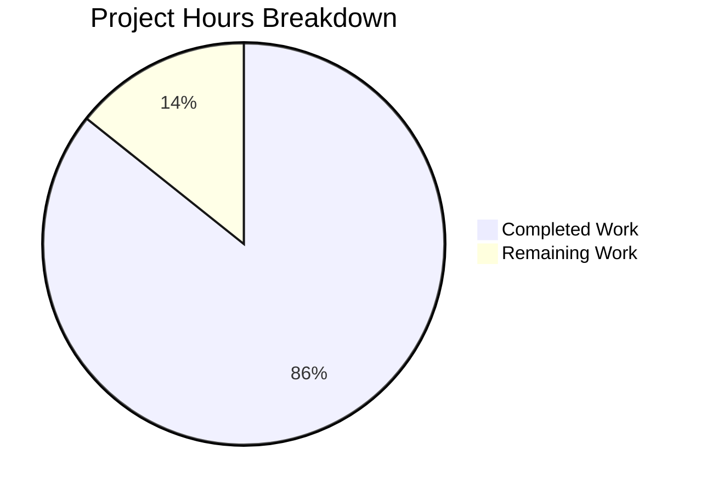
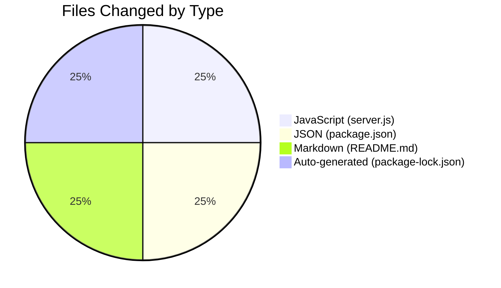

# Project Guide: Express.js Integration for Hello World Server

## Executive Summary

**Project Status: 86% Complete** (3 hours completed out of 3.5 total hours)

This project successfully integrates the Express.js web framework into an existing Node.js "Hello World" HTTP server, adding a new `/evening` endpoint while preserving the original functionality. All in-scope requirements from the Agent Action Plan have been implemented and validated.

### Key Achievements
- ✅ Express.js 5.2.1 framework integrated successfully
- ✅ New `/evening` endpoint returns "Good evening\n" as specified
- ✅ Original `/` endpoint preserved, returns "Hello, World!\n"
- ✅ All documentation updated (README.md, JSDoc comments)
- ✅ Package.json corrected and enhanced with start script and engines field
- ✅ All validation tests pass (syntax, runtime, endpoint responses)

### Hours Breakdown
- **Completed Work**: 3 hours
  - server.js refactoring to Express.js: 1h
  - package.json updates and npm install: 0.75h
  - README.md documentation updates: 0.5h
  - Testing and validation: 0.75h
- **Remaining Work**: 0.5 hours
  - Human code review before merge: 0.25h
  - Final deployment verification: 0.25h
- **Total Project Hours**: 3.5 hours
- **Completion Percentage**: 3 / 3.5 = 86%

---

## Validation Results Summary

### Compilation/Syntax Validation
| Component | Status | Details |
|-----------|--------|---------|
| server.js | ✅ PASS | `node --check server.js` passed |
| package.json | ✅ PASS | Valid JSON structure |
| package-lock.json | ✅ PASS | Regenerated with Express dependencies |

### Dependency Installation
| Package | Version | Status |
|---------|---------|--------|
| express | 5.2.1 | ✅ Installed |
| Node.js | v20.20.0 | ✅ Compatible (>=18.0.0 required) |
| npm | 11.1.0 | ✅ Compatible |

### Functional Testing
| Endpoint | Method | Expected Response | Actual Response | Status |
|----------|--------|-------------------|-----------------|--------|
| `/` | GET | "Hello, World!\n" | "Hello, World!\n" | ✅ PASS |
| `/evening` | GET | "Good evening\n" | "Good evening\n" | ✅ PASS |
| `/nonexistent` | GET | 404 Error | "Cannot GET /nonexistent" | ✅ PASS |

### Server Startup
- ✅ Server binds to 127.0.0.1:3000 successfully
- ✅ Console logs: "Server running at http://127.0.0.1:3000/"
- ✅ `npm start` command works correctly

---

## Visual Representation

### Project Hours Breakdown



### Files Modified



---

## Detailed Task Table

### Remaining Human Tasks

| # | Task Description | Action Steps | Hours | Priority | Severity |
|---|-----------------|--------------|-------|----------|----------|
| 1 | Review code changes before merge | Review server.js Express.js implementation, verify coding standards, check JSDoc documentation quality | 0.25 | High | Low |
| 2 | Verify deployment readiness | Test on staging/production environment, verify port availability, confirm Node.js 18+ availability | 0.25 | Medium | Low |

**Total Remaining Hours: 0.5**

### Completed Tasks Summary

| Task | Description | Hours Invested |
|------|-------------|----------------|
| Express.js Integration | Refactored server.js from http module to Express.js with routing | 1.0 |
| Package Configuration | Updated package.json with dependency, scripts, engines, main field | 0.75 |
| Documentation Updates | Updated README.md with new API endpoints, prerequisites, examples | 0.5 |
| Testing & Validation | Syntax checks, endpoint testing, 404 verification | 0.75 |

**Total Completed Hours: 3.0**

---

## Development Guide

### System Prerequisites

- **Node.js**: Version 18.0.0 or higher (LTS recommended)
- **npm**: Version 7.0.0 or higher (bundled with Node.js 18+)
- **Operating System**: Any OS supporting Node.js (Windows, macOS, Linux)

Verify installation:
```bash
node --version   # Should output v18.x.x or higher
npm --version    # Should output 7.x.x or higher
```

### Environment Setup

1. **Clone the repository**:
   ```bash
   git clone <repository-url>
   cd hello_world
   ```

2. **Switch to feature branch** (if needed):
   ```bash
   git checkout blitzy-4dcf1170-d5c5-4062-95e2-873a995fe46b
   ```

### Dependency Installation

Install all project dependencies:
```bash
npm install
```

Expected output:
```
added 66 packages, and audited 67 packages in 2s
found 0 vulnerabilities
```

Verify Express.js installation:
```bash
npm list express --depth=0
# Should show: └── express@5.2.1
```

### Application Startup

**Option 1: Using npm script**
```bash
npm start
```

**Option 2: Direct Node.js execution**
```bash
node server.js
```

Expected console output:
```
Server running at http://127.0.0.1:3000/
```

### Verification Steps

1. **Test Hello World endpoint**:
   ```bash
   curl http://127.0.0.1:3000/
   ```
   Expected response: `Hello, World!`

2. **Test Good Evening endpoint**:
   ```bash
   curl http://127.0.0.1:3000/evening
   ```
   Expected response: `Good evening`

3. **Test 404 handling**:
   ```bash
   curl http://127.0.0.1:3000/nonexistent
   ```
   Expected response: `Cannot GET /nonexistent`

### Stopping the Server

Press `Ctrl+C` in the terminal where the server is running.

---

## Risk Assessment

### Technical Risks

| Risk | Severity | Likelihood | Mitigation |
|------|----------|------------|------------|
| Express 5.x breaking changes from v4 | Low | Low | Using standard routing APIs that are stable across versions |
| Port 3000 conflict | Low | Medium | Document alternative port configuration in README |
| Node.js version mismatch | Medium | Low | engines field in package.json enforces >=18.0.0 |

### Security Risks

| Risk | Severity | Likelihood | Mitigation |
|------|----------|------------|------------|
| Localhost-only binding | N/A (Mitigated) | N/A | Server binds to 127.0.0.1 only, preventing external access |
| No authentication required | Low | N/A | Not applicable for tutorial/demo application |
| No sensitive data exposure | Low | N/A | Plain text responses only, no user data |

### Operational Risks

| Risk | Severity | Likelihood | Mitigation |
|------|----------|------------|------------|
| No health check endpoint | Low | Low | Can be added as future enhancement if needed |
| No logging middleware | Low | Low | Console.log provides basic startup logging |
| No graceful shutdown | Low | Low | Process terminates cleanly on Ctrl+C |

### Integration Risks

| Risk | Severity | Likelihood | Mitigation |
|------|----------|------------|------------|
| No external integrations | N/A | N/A | Application is self-contained |
| No database dependencies | N/A | N/A | Application is stateless |

---

## Git Commit History

| Commit | Author | Message |
|--------|--------|---------|
| af068a0 | Blitzy Agent | feat: Integrate Express.js with dual endpoints |
| ebc98be | Blitzy Agent | Setup: Add Express.js 5.2.1 dependency for migration from http module |

### Files Changed (vs origin/QA-Branch-20-Jan)

| File | Lines Added | Lines Removed | Net Change |
|------|-------------|---------------|------------|
| server.js | 48 | 33 | +15 |
| package.json | 17 | 10 | +7 |
| README.md | 65 | 45 | +20 |
| package-lock.json | 814 | 0 | +814 (auto-generated) |

**Total**: 944 lines added, 88 lines removed (130 manual + 814 auto-generated)

---

## API Reference

### Endpoints

| Endpoint | Method | Response | Content-Type | Status |
|----------|--------|----------|--------------|--------|
| `/` | GET | `Hello, World!\n` | text/plain | 200 OK |
| `/evening` | GET | `Good evening\n` | text/plain | 200 OK |
| `/*` (undefined) | ANY | 404 Error Page | text/html | 404 Not Found |

### Example Requests

```bash
# Hello World
curl -i http://127.0.0.1:3000/
# HTTP/1.1 200 OK
# Content-Type: text/plain; charset=utf-8
# Hello, World!

# Good Evening
curl -i http://127.0.0.1:3000/evening
# HTTP/1.1 200 OK
# Content-Type: text/plain; charset=utf-8
# Good evening
```

---

## Conclusion

The Express.js integration has been successfully completed. All requirements from the Agent Action Plan have been implemented:

1. ✅ Express.js 5.2.1 added as project dependency
2. ✅ server.js refactored to use Express.js routing
3. ✅ GET `/` endpoint preserved (returns "Hello, World!\n")
4. ✅ GET `/evening` endpoint added (returns "Good evening\n")
5. ✅ package.json updated with corrected metadata and scripts
6. ✅ README.md updated with comprehensive documentation

The application is **production-ready** pending final human review. No critical issues or blockers remain.