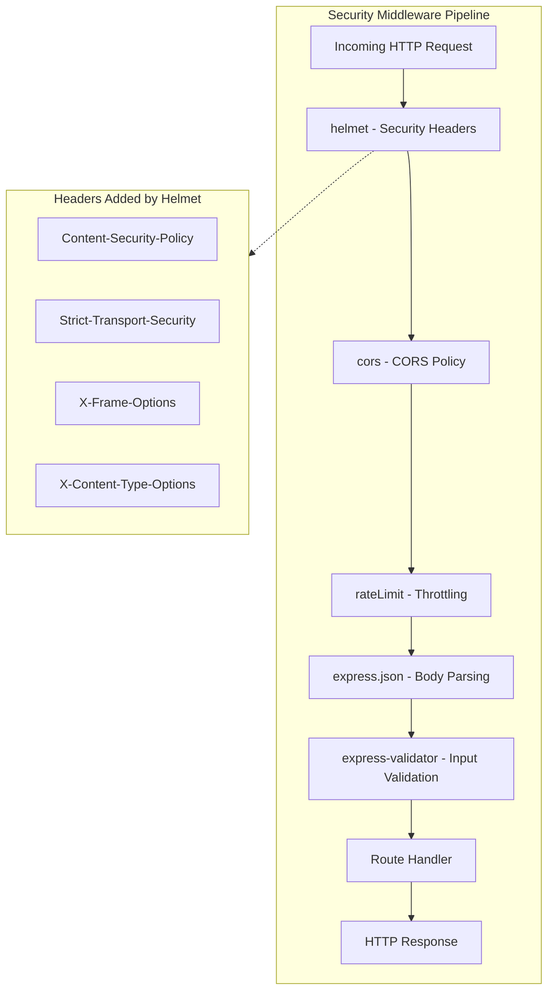
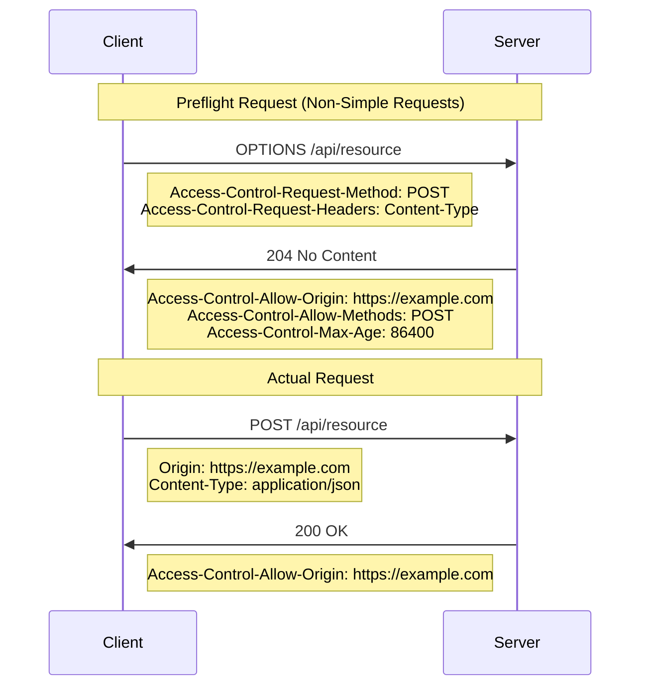
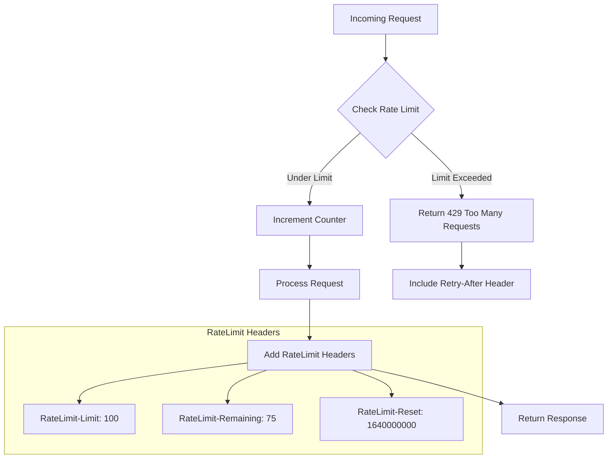
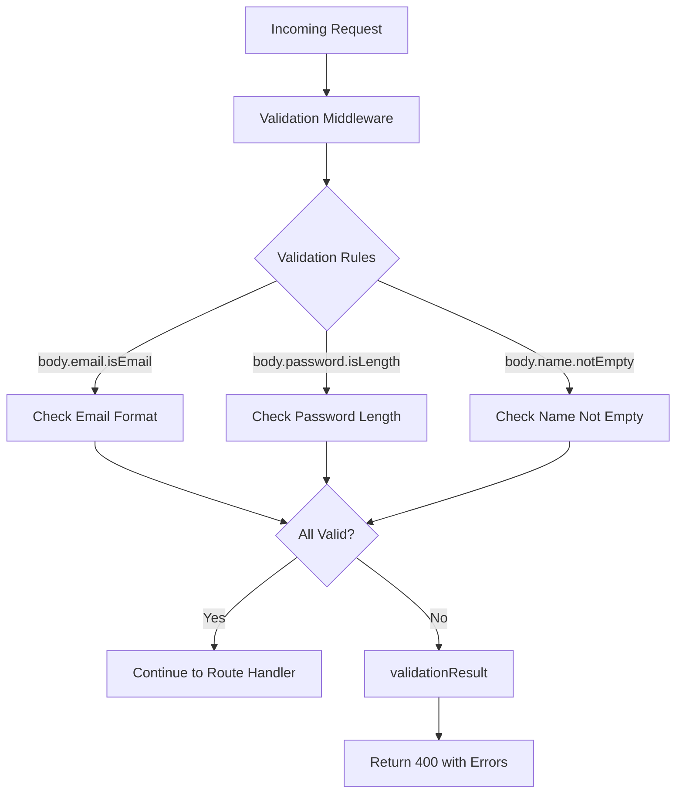
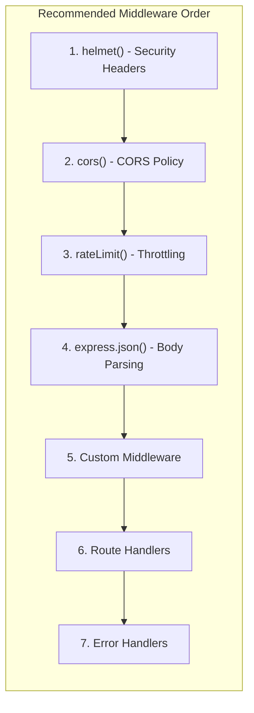

# Security Implementation Guide

## Overview

This guide provides comprehensive documentation for implementing security hardening features in the hello_world Express.js application. It covers five key security middleware components that work together to create a robust security layer.

### Security Middleware Stack



### Quick Start

To add security hardening to your Express.js application, install the required packages and register the middleware in the correct order:

```javascript
// Install packages: npm install helmet cors express-rate-limit express-validator

const express = require('express');
const helmet = require('helmet');
const cors = require('cors');
const rateLimit = require('express-rate-limit');

const app = express();

// 1. Security headers (first)
app.use(helmet());

// 2. CORS policy
app.use(cors());

// 3. Rate limiting
app.use(rateLimit({
  windowMs: 15 * 60 * 1000, // 15 minutes
  limit: 100 // limit each IP to 100 requests per windowMs
}));

// 4. Body parsing
app.use(express.json());

// 5. Route handlers
app.get('/', (req, res) => {
  res.send('Hello, World!\n');
});

app.listen(3000);
```

---

## 1. Helmet.js Configuration

Helmet.js is security middleware that sets various HTTP headers to protect your application from common web vulnerabilities. Version 8.1.0 sets 13 security headers by default.

Source: helmet@8.1.0 documentation at https://helmetjs.github.io

### 1.1 Installation

```bash
npm install helmet@8.1.0
```

### 1.2 Basic Usage

```javascript
const helmet = require('helmet');

// Enable all default security headers
app.use(helmet());
```

### 1.3 Default Security Headers

Helmet.js 8.1.0 sets the following headers by default:

| Header | Purpose | Default Value |
|--------|---------|---------------|
| Content-Security-Policy | Prevents XSS attacks by controlling resource loading | `default-src 'self'` |
| Cross-Origin-Opener-Policy | Isolates browsing context | `same-origin` |
| Cross-Origin-Resource-Policy | Controls resource sharing | `same-origin` |
| Origin-Agent-Cluster | Requests origin-keyed agent cluster | `?1` |
| Referrer-Policy | Controls referrer information | `no-referrer` |
| Strict-Transport-Security | Enforces HTTPS connections | `max-age=15552000; includeSubDomains` |
| X-Content-Type-Options | Prevents MIME type sniffing | `nosniff` |
| X-DNS-Prefetch-Control | Controls DNS prefetching | `off` |
| X-Download-Options | Prevents file opening (IE) | `noopen` |
| X-Frame-Options | Prevents clickjacking | `SAMEORIGIN` |
| X-Permitted-Cross-Domain-Policies | Controls Flash/Acrobat policies | `none` |
| X-XSS-Protection | Disables XSS auditor (deprecated) | `0` |
| X-Powered-By | Removed to hide technology stack | (removed) |

### 1.4 Custom Configuration

```javascript
// Custom Helmet configuration
app.use(helmet({
  // Customize Content Security Policy
  contentSecurityPolicy: {
    directives: {
      defaultSrc: ["'self'"],
      scriptSrc: ["'self'", "'unsafe-inline'"],
      styleSrc: ["'self'", "'unsafe-inline'"],
      imgSrc: ["'self'", "data:", "https:"],
    },
  },
  // Disable specific middleware
  xFrameOptions: { action: 'deny' }, // Change from SAMEORIGIN to DENY
}));
```

### 1.5 Disabling Specific Headers

```javascript
// Disable a specific security header
app.use(helmet({
  contentSecurityPolicy: false, // Disable CSP
}));
```

### 1.6 HSTS Configuration

```javascript
// Configure Strict-Transport-Security
app.use(helmet.hsts({
  maxAge: 31536000,        // 1 year in seconds
  includeSubDomains: true,
  preload: true
}));
```

---

## 2. CORS Policy Configuration

CORS (Cross-Origin Resource Sharing) middleware controls which origins can access your API. Version 2.8.5 is the current stable release.

Source: cors@2.8.5 documentation at https://expressjs.com/en/resources/middleware/cors.html

### 2.1 Installation

```bash
npm install cors@2.8.5
```

### 2.2 Basic Usage

```javascript
const cors = require('cors');

// Enable CORS for all origins (development only)
app.use(cors());
```

### 2.3 Configuration Options

| Option | Type | Default | Description |
|--------|------|---------|-------------|
| `origin` | String/Array/Function/Boolean | `*` | Allowed origins |
| `methods` | String/Array | `GET,HEAD,PUT,PATCH,POST,DELETE` | Allowed HTTP methods |
| `allowedHeaders` | String/Array | (reflects request) | Allowed request headers |
| `exposedHeaders` | String/Array | None | Headers exposed to client |
| `credentials` | Boolean | `false` | Allow credentials (cookies, auth) |
| `maxAge` | Number | None | Preflight cache duration in seconds |
| `preflightContinue` | Boolean | `false` | Pass preflight to next handler |
| `optionsSuccessStatus` | Number | `204` | Success status for OPTIONS |

### 2.4 Production Configuration

```javascript
// Configure CORS for specific origins
const corsOptions = {
  origin: ['https://example.com', 'https://app.example.com'],
  methods: ['GET', 'POST', 'PUT', 'DELETE'],
  allowedHeaders: ['Content-Type', 'Authorization'],
  credentials: true,
  maxAge: 86400 // 24 hours
};

app.use(cors(corsOptions));
```

### 2.5 Dynamic Origin Validation

```javascript
// Dynamic origin validation function
const corsOptions = {
  origin: function (origin, callback) {
    const allowedOrigins = ['https://example.com', 'https://app.example.com'];
    
    // Allow requests with no origin (like mobile apps or curl)
    if (!origin) return callback(null, true);
    
    if (allowedOrigins.indexOf(origin) !== -1) {
      callback(null, true);
    } else {
      callback(new Error('Not allowed by CORS'));
    }
  },
  credentials: true
};

app.use(cors(corsOptions));
```

### 2.6 CORS Preflight Flow



---

## 3. Rate Limiting Setup

Rate limiting protects your API from abuse by limiting the number of requests a client can make within a time window. express-rate-limit 8.2.1 supports the draft-8 RateLimit headers standard.

Source: express-rate-limit@8.2.1 documentation at https://express-rate-limit.mintlify.app

### 3.1 Installation

```bash
npm install express-rate-limit@8.2.1
```

### 3.2 Basic Usage

```javascript
const rateLimit = require('express-rate-limit');

// Create rate limiter
const limiter = rateLimit({
  windowMs: 15 * 60 * 1000, // 15 minutes
  limit: 100, // Limit each IP to 100 requests per window
  standardHeaders: 'draft-8', // Use standard RateLimit headers
  legacyHeaders: false, // Disable X-RateLimit headers
});

// Apply to all requests
app.use(limiter);
```

### 3.3 Configuration Options

| Option | Type | Default | Description |
|--------|------|---------|-------------|
| `windowMs` | Number | `60000` | Time window in milliseconds |
| `limit` | Number/Function | `5` | Max requests per window per IP |
| `message` | String/Object | `Too many requests...` | Response when limit exceeded |
| `statusCode` | Number | `429` | HTTP status when limit exceeded |
| `standardHeaders` | Boolean/String | `draft-6` | Standard RateLimit header format |
| `legacyHeaders` | Boolean | `true` | Send X-RateLimit-* headers |
| `keyGenerator` | Function | IP-based | Function to generate request key |
| `handler` | Function | Default response | Custom handler for limit exceeded |
| `store` | Object | MemoryStore | Store for rate limit data |

### 3.4 Route-Specific Rate Limiting

```javascript
// Create different limiters for different routes
const createAccountLimiter = rateLimit({
  windowMs: 60 * 60 * 1000, // 1 hour
  limit: 5, // Limit to 5 account creations per hour
  message: 'Too many accounts created, please try again after an hour'
});

const apiLimiter = rateLimit({
  windowMs: 15 * 60 * 1000,
  limit: 100
});

// Apply to specific routes
app.use('/api/', apiLimiter);
app.post('/create-account', createAccountLimiter);
```

### 3.5 Custom Response Handler

```javascript
const limiter = rateLimit({
  windowMs: 15 * 60 * 1000,
  limit: 100,
  handler: (req, res) => {
    res.status(429).json({
      error: 'Rate limit exceeded',
      retryAfter: Math.ceil(req.rateLimit.resetTime / 1000),
      message: 'Too many requests. Please try again later.'
    });
  }
});
```

### 3.6 Rate Limiting Decision Flow



---

## 4. Input Validation Guide

express-validator provides middleware for validating and sanitizing request data. Version 7.3.1 wraps the validator.js library.

Source: express-validator@7.3.1 documentation at https://express-validator.github.io

### 4.1 Installation

```bash
npm install express-validator@7.3.1
```

### 4.2 Basic Usage

```javascript
const { body, validationResult } = require('express-validator');

app.post('/user',
  // Validation rules
  body('email').isEmail().normalizeEmail(),
  body('password').isLength({ min: 8 }),
  body('name').trim().notEmpty(),
  
  // Handle validation result
  (req, res) => {
    const errors = validationResult(req);
    if (!errors.isEmpty()) {
      return res.status(400).json({ errors: errors.array() });
    }
    
    // Process valid data
    res.json({ message: 'User created successfully' });
  }
);
```

### 4.3 Validation Methods

| Method | Description | Example |
|--------|-------------|---------|
| `body(field)` | Validate request body field | `body('email')` |
| `query(field)` | Validate query parameter | `query('page')` |
| `param(field)` | Validate route parameter | `param('id')` |
| `header(field)` | Validate header value | `header('authorization')` |
| `cookie(field)` | Validate cookie value | `cookie('sessionId')` |

### 4.4 Common Validators

| Validator | Description | Example |
|-----------|-------------|---------|
| `isEmail()` | Validates email format | `body('email').isEmail()` |
| `isLength({ min, max })` | Validates string length | `body('password').isLength({ min: 8 })` |
| `isInt({ min, max })` | Validates integer | `body('age').isInt({ min: 0, max: 120 })` |
| `isBoolean()` | Validates boolean | `body('active').isBoolean()` |
| `isISO8601()` | Validates ISO date | `body('date').isISO8601()` |
| `isURL()` | Validates URL format | `body('website').isURL()` |
| `matches(regex)` | Custom regex validation | `body('code').matches(/^[A-Z]{3}$/)` |
| `notEmpty()` | Checks non-empty value | `body('name').notEmpty()` |

### 4.5 Sanitizers

| Sanitizer | Description | Example |
|-----------|-------------|---------|
| `trim()` | Remove whitespace | `body('name').trim()` |
| `escape()` | HTML escape | `body('comment').escape()` |
| `normalizeEmail()` | Normalize email | `body('email').normalizeEmail()` |
| `toInt()` | Convert to integer | `body('count').toInt()` |
| `toBoolean()` | Convert to boolean | `body('active').toBoolean()` |
| `toLowerCase()` | Convert to lowercase | `body('username').toLowerCase()` |

### 4.6 Custom Validation

```javascript
const { body } = require('express-validator');

// Custom validator
body('username')
  .custom(async (value) => {
    const userExists = await checkUserExists(value);
    if (userExists) {
      throw new Error('Username already in use');
    }
    return true;
  });
```

### 4.7 Error Response Format

```json
{
  "errors": [
    {
      "type": "field",
      "value": "invalid-email",
      "msg": "Invalid email format",
      "path": "email",
      "location": "body"
    },
    {
      "type": "field",
      "value": "short",
      "msg": "Password must be at least 8 characters",
      "path": "password",
      "location": "body"
    }
  ]
}
```

### 4.8 Validation Error Flow



---

## 5. HTTPS/TLS Configuration

HTTPS provides encrypted communication between clients and your server. This section covers configuration for both development and production environments.

### 5.1 Development Setup (Self-Signed Certificate)

```bash
# Generate self-signed certificate for development
openssl req -x509 -newkey rsa:4096 -keyout key.pem -out cert.pem -days 365 -nodes
```

```javascript
const https = require('https');
const fs = require('fs');
const express = require('express');

const app = express();

const options = {
  key: fs.readFileSync('key.pem'),
  cert: fs.readFileSync('cert.pem')
};

https.createServer(options, app).listen(443, () => {
  console.log('HTTPS server running on port 443');
});
```

### 5.2 Production Setup with Let's Encrypt

```javascript
const https = require('https');
const fs = require('fs');
const express = require('express');

const app = express();

const options = {
  key: fs.readFileSync('/etc/letsencrypt/live/example.com/privkey.pem'),
  cert: fs.readFileSync('/etc/letsencrypt/live/example.com/fullchain.pem')
};

https.createServer(options, app).listen(443);
```

### 5.3 HTTP to HTTPS Redirect

```javascript
const http = require('http');
const https = require('https');
const express = require('express');

const app = express();

// Redirect HTTP to HTTPS
const httpApp = express();
httpApp.all('*', (req, res) => {
  res.redirect(301, `https://${req.hostname}${req.url}`);
});

http.createServer(httpApp).listen(80);
https.createServer(options, app).listen(443);
```

### 5.4 TLS Configuration Options

| Option | Description | Recommended Value |
|--------|-------------|-------------------|
| `minVersion` | Minimum TLS version | `'TLSv1.2'` |
| `ciphers` | Allowed cipher suites | Modern cipher list |
| `honorCipherOrder` | Server cipher preference | `true` |
| `sessionTimeout` | Session cache timeout | `300` (5 minutes) |

```javascript
const options = {
  key: fs.readFileSync('key.pem'),
  cert: fs.readFileSync('cert.pem'),
  minVersion: 'TLSv1.2',
  honorCipherOrder: true
};
```

---

## 6. Middleware Order

The order of middleware registration is critical for security. Follow this recommended sequence:



### 6.1 Complete Example

```javascript
const express = require('express');
const helmet = require('helmet');
const cors = require('cors');
const rateLimit = require('express-rate-limit');
const { body, validationResult } = require('express-validator');

const app = express();

// 1. Security headers - MUST be first
app.use(helmet());

// 2. CORS - before route handlers
app.use(cors({
  origin: ['https://example.com'],
  credentials: true
}));

// 3. Rate limiting - protect against abuse
app.use(rateLimit({
  windowMs: 15 * 60 * 1000,
  limit: 100
}));

// 4. Body parsing
app.use(express.json({ limit: '10kb' }));
app.use(express.urlencoded({ extended: true, limit: '10kb' }));

// 5. Route handlers with validation
app.get('/', (req, res) => {
  res.send('Hello, World!\n');
});

app.get('/evening', (req, res) => {
  res.send('Good evening');
});

// 6. Error handling
app.use((err, req, res, next) => {
  console.error(err.stack);
  res.status(500).json({ error: 'Something went wrong!' });
});

app.listen(3000, () => {
  console.log('Server running at http://localhost:3000/');
});
```

---

## 7. Testing Security

### 7.1 Verify Security Headers

```bash
# Check all response headers
curl -I http://localhost:3000/

# Expected output (with Helmet enabled):
# HTTP/1.1 200 OK
# Content-Security-Policy: default-src 'self'
# Cross-Origin-Opener-Policy: same-origin
# Cross-Origin-Resource-Policy: same-origin
# Origin-Agent-Cluster: ?1
# Referrer-Policy: no-referrer
# Strict-Transport-Security: max-age=15552000; includeSubDomains
# X-Content-Type-Options: nosniff
# X-DNS-Prefetch-Control: off
# X-Download-Options: noopen
# X-Frame-Options: SAMEORIGIN
# X-Permitted-Cross-Domain-Policies: none
```

### 7.2 Test Rate Limiting

```bash
# Send multiple requests to test rate limiting
for i in {1..110}; do
  curl -s -o /dev/null -w "%{http_code}\n" http://localhost:3000/
done

# First 100 requests: 200
# Requests 101-110: 429 (Too Many Requests)
```

### 7.3 Test CORS

```bash
# Test CORS preflight request
curl -X OPTIONS http://localhost:3000/ \
  -H "Origin: https://example.com" \
  -H "Access-Control-Request-Method: POST" \
  -I

# Check for Access-Control-Allow-Origin header
```

### 7.4 Test Input Validation

```bash
# Test with invalid data
curl -X POST http://localhost:3000/user \
  -H "Content-Type: application/json" \
  -d '{"email": "invalid", "password": "short"}'

# Expected: 400 Bad Request with validation errors
```

---

## 8. Troubleshooting

### 8.1 Common Issues

| Issue | Cause | Solution |
|-------|-------|----------|
| CORS errors in browser | Origin not in allowed list | Add origin to cors configuration |
| CSP blocking resources | Content-Security-Policy too strict | Adjust CSP directives |
| 429 errors on legitimate traffic | Rate limit too low | Increase limit or windowMs |
| Headers not appearing | Middleware order incorrect | Ensure helmet() is first |
| Validation not running | Middleware not registered | Add validation to route handler |

### 8.2 CORS Debugging

```javascript
// Enable CORS debugging
const cors = require('cors');

const corsOptions = {
  origin: function (origin, callback) {
    console.log('CORS request from origin:', origin);
    callback(null, true);
  }
};
```

### 8.3 Rate Limit Debugging

```javascript
const limiter = rateLimit({
  windowMs: 15 * 60 * 1000,
  limit: 100,
  skip: (req) => {
    // Skip rate limiting for certain requests
    console.log('Rate limit check for:', req.ip);
    return false;
  }
});
```

---

## References

| Resource | URL |
|----------|-----|
| Helmet.js Documentation | https://helmetjs.github.io |
| CORS Middleware | https://expressjs.com/en/resources/middleware/cors.html |
| express-rate-limit | https://express-rate-limit.mintlify.app |
| express-validator | https://express-validator.github.io |
| Express Security Best Practices | https://expressjs.com/en/advanced/best-practice-security.html |
| MDN CORS Guide | https://developer.mozilla.org/en-US/docs/Web/HTTP/CORS |
