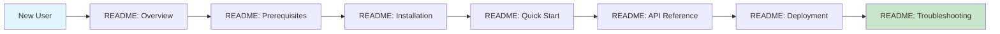
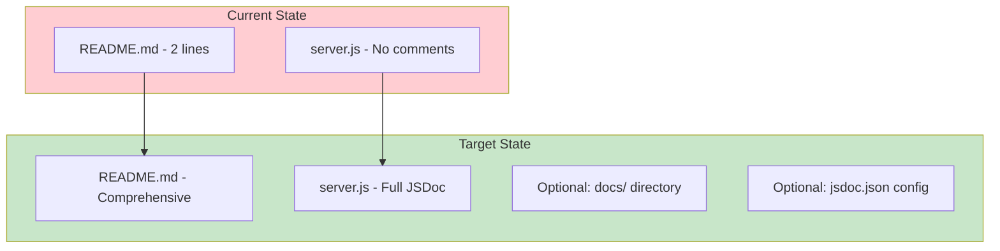
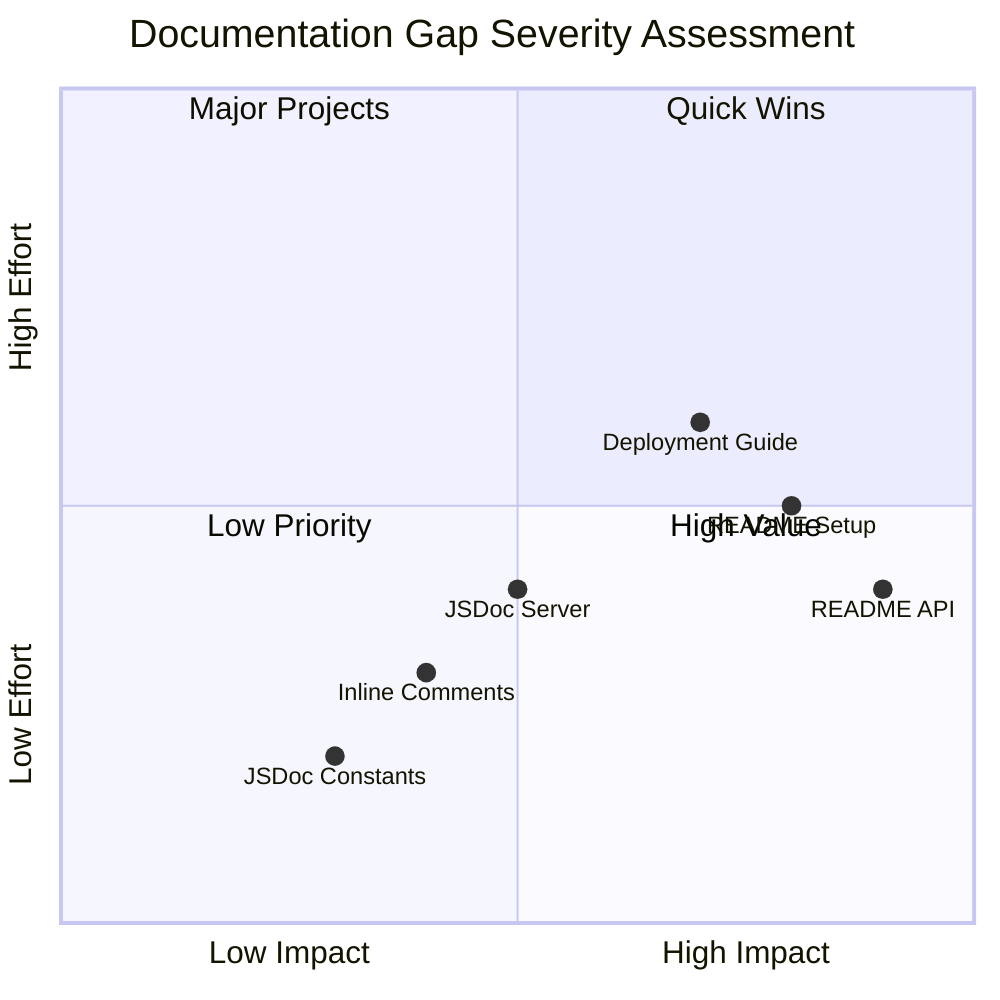
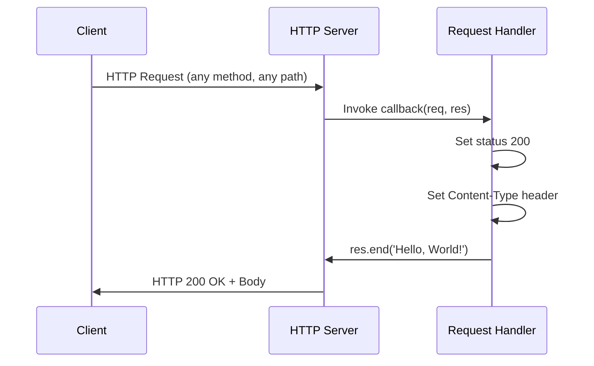
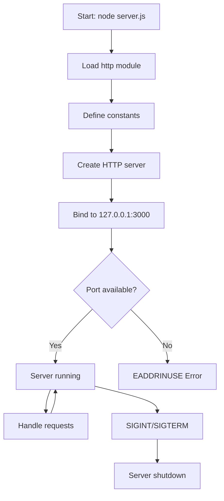
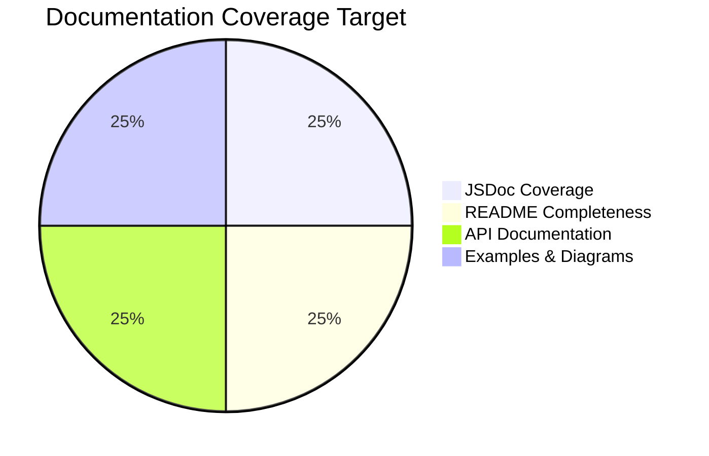
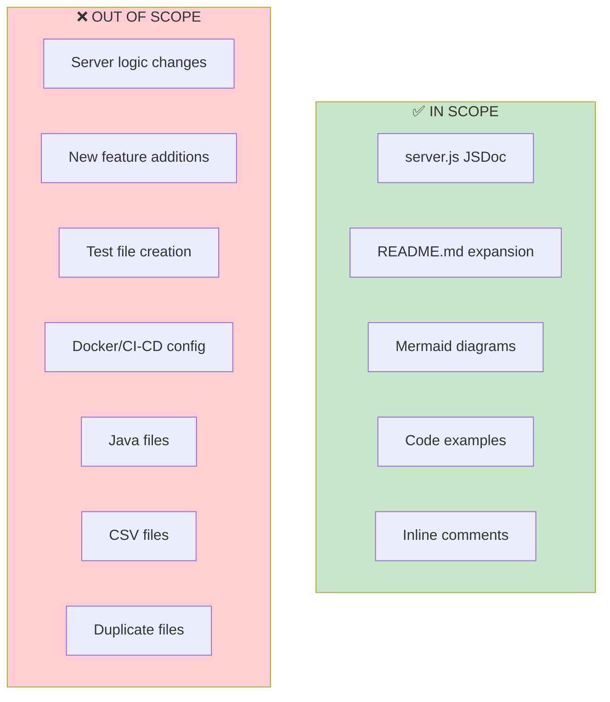

# Technical Specification

# 0. Agent Action Plan

## 0.1 Intent Clarification

### 0.1.1 Core Documentation Objective

Based on the provided requirements, the Blitzy platform understands that the documentation objective is to **transform a minimal, undocumented Node.js HTTP server into a comprehensively documented project** with proper JSDoc annotations and complete README documentation.

| Attribute | Classification |
|-----------|----------------|
| Request Category | Create new documentation + Update existing documentation |
| Documentation Types | API docs, Setup guide, Deployment guide, Inline code comments |
| Primary Target | server.js (JSDoc), README.md (comprehensive expansion) |
| Documentation Framework | JSDoc for inline comments, Markdown for README |

**Documentation Requirements with Enhanced Clarity:**

- **JSDoc Comments for server.js Functions**
  - Add file-level documentation describing the module's purpose
  - Document all constants (`hostname`, `port`) with type annotations
  - Add comprehensive JSDoc blocks for the HTTP server creation
  - Document the request handler callback with parameter types and behavior description
  - Include `@example` blocks demonstrating server usage

- **Comprehensive README Creation**
  - Setup instructions covering Node.js installation and project initialization
  - API documentation describing the HTTP endpoint, request/response format
  - Deployment guide for local and production environments
  - Inline code explanations connecting documentation to source code

- **Implicit Documentation Needs Identified**
  - Environment requirements documentation (Node.js version compatibility)
  - Troubleshooting section for common issues (port conflicts, network binding)
  - Quick start guide for immediate server execution
  - Project structure explanation

### 0.1.2 Special Instructions and Constraints

| Constraint Type | Details |
|-----------------|---------|
| Style Consistency | Follow standard JSDoc annotation patterns for Node.js modules |
| Documentation Coverage | All public code elements must be documented |
| Format Requirements | Markdown for README, JSDoc syntax for inline comments |
| Example Requirement | Include working code examples in documentation |

**Documentation Standards to Apply:**

- JSDoc comments must use `/** ... */` format with proper tag annotations
- README sections should follow a logical progression: overview → setup → usage → API → deployment
- Code examples must be tested and working
- All documentation must reference the actual source code structure

### 0.1.3 Technical Interpretation

These documentation requirements translate to the following technical documentation strategy:

| Requirement | Technical Action |
|-------------|------------------|
| Add JSDoc comments to server.js | Update server.js with `@fileoverview`, `@const`, `@param`, `@returns`, and `@example` annotations |
| Create comprehensive README with setup instructions | Expand README.md with Prerequisites, Installation, and Quick Start sections |
| Add API documentation | Create API Reference section in README.md documenting the HTTP endpoint |
| Add deployment guide | Create Deployment section covering local execution and production considerations |
| Add inline code explanations | Include detailed comments within server.js explaining code logic |

To document the HTTP server module, we will update `server.js` with JSDoc annotations covering the module overview, constants, and server functions.

To create the comprehensive README, we will expand `README.md` with structured sections for setup, API reference, deployment, and troubleshooting.

### 0.1.4 Inferred Documentation Needs

Based on repository analysis, the following implicit documentation needs were identified:

| Source Analysis | Documentation Gap | Required Documentation |
|-----------------|-------------------|------------------------|
| `server.js` uses `http` module | No module documentation | Add `@fileoverview` and `@module` JSDoc tags |
| `server.js` defines constants | Constants undocumented | Add `@const` and `@type` annotations for `hostname`, `port` |
| HTTP server handles all requests identically | Request behavior not documented | Document request handling in both JSDoc and README |
| Project uses CommonJS modules | Module system not documented | Include module information in documentation |
| No `.nvmrc` or engines field | Node.js version compatibility unclear | Document supported Node.js versions in README |
| Localhost-only binding (`127.0.0.1`) | Network behavior not explained | Document network configuration and security implications |

**User Journey Documentation Requirements:**




## 0.2 Documentation Discovery and Analysis

### 0.2.1 Existing Documentation Infrastructure Assessment

Repository analysis reveals a **minimal documentation structure** with virtually no documentation infrastructure in place.

**Search Patterns Employed:**

| Search Pattern | Files Found | Status |
|----------------|-------------|--------|
| `README*` | `README.md` | Minimal (2 lines) |
| `docs/**` | None | No docs directory exists |
| `*.md` | `README.md` | Only README present |
| `*.mdx` | None | No MDX files |
| `*.rst` | None | No RST files |
| `wiki/**` | None | No wiki directory |
| `mkdocs.yml` | None | No MkDocs configuration |
| `docusaurus.config.js` | None | No Docusaurus configuration |
| `sphinx.conf.py` | None | No Sphinx configuration |
| `jsdoc.json` | None | No JSDoc configuration |

**Current Documentation State:**

| Element | Status | Evidence |
|---------|--------|----------|
| Documentation Generator | Not configured | No configuration files found |
| API Documentation Tools | None | No JSDoc, TypeDoc, or similar tools in `package.json` |
| Diagram Tools | None | No Mermaid, PlantUML, or similar configured |
| Documentation Hosting | None | No deployment configuration |

**Existing README.md Content Analysis:**

```
# hao-backprop-test

test project for backprop integration. Do not touch!
```

The current README contains only:
- Project title: `hao-backprop-test`
- Warning message about project purpose
- No setup instructions, API documentation, or deployment guidance

### 0.2.2 Repository Code Analysis for Documentation

**Key Source Files Analyzed:**

| File | Purpose | Documentation Status | Lines of Code |
|------|---------|---------------------|---------------|
| `server.js` | HTTP server implementation | Zero JSDoc comments | 14 lines |
| `server - Copy.js` | Duplicate of server.js | Zero JSDoc comments | 14 lines |
| `package.json` | Node.js package manifest | Basic metadata only | 11 lines |
| `package-lock.json` | npm lockfile | Auto-generated | - |

**server.js Code Elements Requiring Documentation:**

| Element | Type | Line(s) | Documentation Needed |
|---------|------|---------|---------------------|
| Module | CommonJS | 1 | `@fileoverview`, `@module` |
| `hostname` | Constant | 3 | `@const`, `@type` |
| `port` | Constant | 4 | `@const`, `@type` |
| `server` | HTTP Server | 6-10 | `@type`, server behavior |
| Request handler | Callback | 6-9 | `@param`, `@callback` |
| Listen callback | Callback | 12-13 | Startup behavior |

**Public API Surface:**

| API Element | Type | Endpoint | Response |
|-------------|------|----------|----------|
| HTTP Server | Network | `http://127.0.0.1:3000/` | `Hello, World!\n` |
| All HTTP Methods | GET, POST, PUT, DELETE, etc. | Any path | Same response |

### 0.2.3 Web Search Research Conducted

| Research Topic | Key Findings | Source |
|----------------|--------------|--------|
| JSDoc Best Practices | Use `@fileoverview`, `@param`, `@returns`, document as you code | pullrequest.com, jsdoc.app |
| JSDoc for Node.js | CommonJS modules support, `@module` tag usage | jsdoc.app |
| README Best Practices | Progressive disclosure, setup → usage → API → troubleshooting | General standards |
| Node.js HTTP Documentation | Document request/response patterns, server lifecycle | Node.js documentation patterns |

**JSDoc Version Compatibility:**

| JSDoc Version | Node.js Support | Status |
|---------------|-----------------|--------|
| 4.0.5 (Latest) | Node.js 12.0.0+ | Recommended |
| 4.0.x | LTS versions | Compatible |

### 0.2.4 Documentation Infrastructure Recommendations

Based on the analysis, the following documentation infrastructure should be established:



| Infrastructure Element | Current | Recommendation |
|------------------------|---------|----------------|
| Inline Documentation | None | Add JSDoc to server.js |
| Project Documentation | Minimal | Expand README.md comprehensively |
| Documentation Generator | None | Optional: Add JSDoc for HTML generation |
| Configuration | None | Optional: jsdoc.json for consistency |


## 0.3 Documentation Scope Analysis

### 0.3.1 Code-to-Documentation Mapping

**Modules Requiring Documentation:**

| Module | Location | Documentation Status | Documentation Needed |
|--------|----------|---------------------|---------------------|
| HTTP Server Module | `server.js` | Missing | Complete JSDoc annotations |

**Detailed Module Analysis - server.js:**

| Code Element | Line | Type | Current Doc | Required Documentation |
|--------------|------|------|-------------|------------------------|
| `require('http')` | 1 | Import | None | `@requires` tag in file header |
| `hostname` | 3 | `const` | None | `@const {string}` with description |
| `port` | 4 | `const` | None | `@const {number}` with description |
| `server` | 6-10 | `http.Server` | None | `@type {http.Server}` with behavior |
| Request callback | 6-9 | `function` | None | `@param`, `@callback` annotations |
| Listen callback | 12-13 | `function` | None | Startup behavior documentation |

**Public API Elements:**

| Element | Type | Visibility | Current Coverage |
|---------|------|------------|------------------|
| HTTP Endpoint | Network API | Public | 0% documented |
| Response Format | Text/plain | Public | 0% documented |
| Status Code | 200 OK | Public | 0% documented |

**Configuration Options Requiring Documentation:**

| Config Element | File | Current State | Documentation Needed |
|----------------|------|---------------|---------------------|
| `hostname` value | `server.js:3` | Hardcoded `127.0.0.1` | Explain localhost binding |
| `port` value | `server.js:4` | Hardcoded `3000` | Explain default port choice |
| Content-Type | `server.js:8` | Hardcoded `text/plain` | Explain response format |

### 0.3.2 Documentation Gap Analysis

Given the requirements and repository analysis, documentation gaps include:

**Critical Documentation Gaps:**

| Gap Category | Current State | Target State | Priority |
|--------------|---------------|--------------|----------|
| JSDoc Comments | 0 comments | Complete coverage | HIGH |
| Setup Instructions | None | Full prerequisites + steps | HIGH |
| API Documentation | None | Endpoint reference | HIGH |
| Deployment Guide | None | Local + production | HIGH |
| Inline Explanations | None | Code logic explanations | HIGH |

**Undocumented Public APIs:**

| API | Endpoint | Method | Response | Documentation Status |
|-----|----------|--------|----------|---------------------|
| Hello World | `http://127.0.0.1:3000/` | ANY | `Hello, World!\n` | UNDOCUMENTED |
| All paths | `http://127.0.0.1:3000/*` | ANY | `Hello, World!\n` | UNDOCUMENTED |

**Missing User Guides:**

| Guide Type | Current | Needed Content |
|------------|---------|----------------|
| Quick Start | Missing | 3-step startup guide |
| Installation | Missing | Node.js requirements, npm usage |
| Configuration | Missing | Environment variables, port customization |
| Troubleshooting | Missing | Common errors and solutions |

**Missing Architecture Documentation:**

| Element | Current | Needed |
|---------|---------|--------|
| System Overview | Missing | Server purpose and design |
| Request Flow | Missing | Request-to-response diagram |
| Component Interaction | Missing | Module relationships |

### 0.3.3 Features Requiring User Guides

| Feature | Current Coverage | Documentation Gaps |
|---------|------------------|-------------------|
| Server Startup | None | How to start, stop, verify running |
| HTTP Endpoint | None | Endpoint URL, methods, response format |
| Error Handling | None | What happens on port conflict |
| Network Binding | None | Why localhost-only, security implications |

### 0.3.4 Gap Severity Assessment



**Documentation Completeness Target:**

| Category | Current | Target | Gap |
|----------|---------|--------|-----|
| JSDoc Coverage | 0% | 100% | 100% |
| README Sections | 1/8 | 8/8 | 87.5% |
| API Documentation | 0% | 100% | 100% |
| Code Examples | 0 | 3+ | 3+ examples |


## 0.4 Documentation Implementation Design

### 0.4.1 Documentation Structure Planning

**Target README.md Structure:**

```
README.md
├── Project Title & Description
├── Table of Contents
├── Prerequisites
│   └── Node.js requirements
├── Installation
│   ├── Clone repository
│   └── Install dependencies (if any)
├── Quick Start
│   └── Running the server
├── API Reference
│   ├── Endpoint description
│   ├── Request format
│   └── Response format
├── Code Explanation
│   └── Inline logic walkthrough
├── Deployment Guide
│   ├── Local development
│   └── Production considerations
├── Troubleshooting
│   └── Common issues
└── License
```

**Target server.js Documentation Structure:**

```
server.js
├── @fileoverview - Module purpose
├── @module - Module name
├── @author - Author information
├── @requires - http module dependency
├── @const hostname - Server hostname
├── @const port - Server port
├── @type server - HTTP server instance
├── Callback documentation
│   ├── Request handler callback
│   └── Listen callback
└── @example - Usage examples
```

### 0.4.2 Content Generation Strategy

**Information Extraction Approach:**

| Information Source | Extraction Method | Target Documentation |
|-------------------|-------------------|---------------------|
| `server.js:1` | Parse require statement | `@requires` tag |
| `server.js:3-4` | Extract constant values | `@const` annotations |
| `server.js:6-10` | Analyze server creation | Server documentation |
| `server.js:12-14` | Analyze listen callback | Startup documentation |
| `package.json` | Extract metadata | README project info |

**Template Application:**

| Documentation Element | Template Pattern | Application |
|----------------------|------------------|-------------|
| JSDoc File Header | `@fileoverview` + `@module` | Top of server.js |
| Constant Documentation | `@const {type} name - description` | Each constant |
| Function Documentation | `@param` + `@returns` | Callbacks |
| README Sections | Markdown headers with content | README.md |

### 0.4.3 Documentation Standards

**JSDoc Formatting Standards:**

| Standard | Rule | Example |
|----------|------|---------|
| Comment Format | `/** ... */` multiline | All JSDoc blocks |
| Type Annotations | Use JSDoc type syntax | `{string}`, `{number}` |
| Descriptions | Clear, concise prose | First line is summary |
| Examples | Working code snippets | `@example` blocks |
| Source Citations | Reference line numbers | `Source: server.js:3` |

**Markdown Formatting Standards:**

| Element | Format | Usage |
|---------|--------|-------|
| Headings | `# ## ### ####` hierarchy | Section structure |
| Code Blocks | ` ```language ``` ` | Code examples |
| Tables | `| Col | Col |` format | Structured data |
| Lists | `- ` or `1. ` | Steps, features |
| Inline Code | `` `code` `` | Commands, values |

### 0.4.4 Diagram and Visual Strategy

**Mermaid Diagrams to Create:**

| Diagram Type | Purpose | Location |
|--------------|---------|----------|
| Sequence Diagram | Request-response flow | README.md API section |
| Flowchart | Server lifecycle | README.md or JSDoc |

**Request-Response Flow Diagram:**



**Server Lifecycle Diagram:**



### 0.4.5 JSDoc Implementation Design

**File Header Block Design:**

```javascript
/**
 * @fileoverview Simple HTTP server that responds with "Hello, World!"
 * @module server
 * @author hxu
 * @requires http
 * @version 1.0.0
 * @license MIT
 */
```

**Constant Documentation Design:**

```javascript
/**
 * Server hostname - binds to localhost only
 * @const {string}
 * @default '127.0.0.1'
 */
const hostname = '127.0.0.1';
```

**Server Documentation Design:**

```javascript
/**
 * HTTP server instance
 * @type {http.Server}
 */
const server = http.createServer(/* ... */);
```

### 0.4.6 README Section Specifications

| Section | Content Specification | Word Count Target |
|---------|----------------------|-------------------|
| Overview | Project purpose, features | 50-100 words |
| Prerequisites | Node.js version, npm | 30-50 words |
| Installation | Clone, install steps | 50-75 words |
| Quick Start | Run command, verify | 30-50 words |
| API Reference | Endpoint, methods, response | 100-150 words |
| Code Explanation | Logic walkthrough | 100-200 words |
| Deployment | Local, production steps | 100-150 words |
| Troubleshooting | Common errors | 75-100 words |


## 0.5 Documentation File Transformation Mapping

### 0.5.1 File-by-File Documentation Plan

**Documentation Transformation Modes:**
- **CREATE** - Create a new documentation file
- **UPDATE** - Update an existing documentation file
- **DELETE** - Remove an obsolete documentation file
- **REFERENCE** - Use as an example for documentation style and structure

| Target Documentation File | Transformation | Source Code/Docs | Content/Changes |
|---------------------------|----------------|------------------|-----------------|
| `server.js` | UPDATE | `server.js` | Add comprehensive JSDoc comments to all code elements including file header, constants, server creation, and callbacks |
| `README.md` | UPDATE | `README.md`, `server.js`, `package.json` | Complete rewrite with setup instructions, API documentation, deployment guide, and code explanations |

### 0.5.2 server.js JSDoc Update Detail

**File:** `server.js`
**Type:** Source Code with JSDoc Annotations
**Transformation:** UPDATE
**Source:** Current `server.js` (14 lines, no documentation)

**JSDoc Sections to Add:**

| Section | Lines | JSDoc Content |
|---------|-------|---------------|
| File Header | 1-10 (new) | `@fileoverview`, `@module`, `@author`, `@requires`, `@version`, `@license` |
| hostname constant | Before line 3 | `@const {string}` with description and `@default` |
| port constant | Before line 4 | `@const {number}` with description and `@default` |
| server creation | Before line 6 | `@type {http.Server}` with behavior description |
| Request handler | Within line 6-10 | Inline comments explaining status code, header, and response |
| Listen callback | Before line 12 | Inline comments explaining startup behavior |
| Usage example | In file header | `@example` block with curl command |

**Target server.js Structure (with JSDoc):**

```
Lines 1-12:   File header JSDoc block
Lines 13-14:  require statement with @requires
Lines 15-20:  hostname constant with JSDoc
Lines 21-26:  port constant with JSDoc
Lines 27-45:  server creation with JSDoc and inline comments
Lines 46-50:  listen call with inline comments
```

**JSDoc Tags Required:**

| Tag | Usage | Count |
|-----|-------|-------|
| `@fileoverview` | Module description | 1 |
| `@module` | Module name | 1 |
| `@author` | Author info | 1 |
| `@requires` | http dependency | 1 |
| `@version` | Package version | 1 |
| `@license` | MIT license | 1 |
| `@const` | Constants | 2 |
| `@type` | Server type | 1 |
| `@default` | Default values | 2 |
| `@example` | Usage example | 1 |

### 0.5.3 README.md Update Detail

**File:** `README.md`
**Type:** Project Documentation
**Transformation:** UPDATE (Complete Expansion)
**Source:** Current `README.md` (2 lines), `server.js`, `package.json`

**Current Content:**
```
# hao-backprop-test

test project for backprop integration. Do not touch!
```

**Target Content Structure:**

| Section | Heading Level | Content Description |
|---------|---------------|---------------------|
| Title & Badges | H1 | Project name, optional badges |
| Description | Paragraph | What the project does |
| Table of Contents | Links | Navigation to sections |
| Prerequisites | H2 | Node.js version requirements |
| Installation | H2 | Clone and setup steps |
| Quick Start | H2 | How to run the server |
| API Reference | H2 | Endpoint documentation |
| API > Endpoint | H3 | URL, methods, response |
| API > Example | H3 | curl command example |
| Code Explanation | H2 | Inline code walkthrough |
| Code > Server Setup | H3 | Import and constants |
| Code > Request Handling | H3 | Callback explanation |
| Code > Server Start | H3 | Listen explanation |
| Deployment | H2 | Deployment instructions |
| Deployment > Local | H3 | Local development |
| Deployment > Production | H3 | Production considerations |
| Troubleshooting | H2 | Common issues and solutions |
| License | H2 | MIT license information |
| Author | H2 | Author credit |

**README Diagrams to Include:**

| Diagram | Type | Purpose |
|---------|------|---------|
| Request Flow | Mermaid Sequence | Show HTTP request handling |
| Server Lifecycle | Mermaid Flowchart | Show startup process |

**Code Examples to Include:**

| Example | Purpose | Format |
|---------|---------|--------|
| Start server | Show how to run | `node server.js` |
| Test endpoint | Verify server works | `curl http://127.0.0.1:3000` |
| Expected output | Show response | `Hello, World!` |

### 0.5.4 Documentation Configuration Updates

| Configuration File | Action | Purpose |
|-------------------|--------|---------|
| `package.json` | UPDATE (Optional) | Add `jsdoc` script for documentation generation |

**Optional package.json Update:**

```json
{
  "scripts": {
    "docs": "jsdoc server.js -d docs/"
  },
  "devDependencies": {
    "jsdoc": "^4.0.5"
  }
}
```

### 0.5.5 Complete Documentation File List

| File | Action | Priority | Status |
|------|--------|----------|--------|
| `server.js` | UPDATE with JSDoc | HIGH | To be implemented |
| `README.md` | UPDATE (expand) | HIGH | To be implemented |
| `package.json` | UPDATE (optional) | LOW | Optional enhancement |
| `jsdoc.json` | CREATE (optional) | LOW | Optional enhancement |

**No Files to DELETE**

| Scope | Result |
|-------|--------|
| Obsolete documentation | None identified |
| Deprecated docs | None present |
| Duplicate docs | None present |

### 0.5.6 Cross-Documentation Dependencies

| Source Document | Target Document | Dependency Type |
|-----------------|-----------------|-----------------|
| `server.js` JSDoc | `README.md` Code Explanation | Content reference |
| `package.json` metadata | `README.md` Author section | Data source |
| `server.js` constants | `README.md` API Reference | Configuration values |

**Navigation Links Required:**

| From | To | Link Type |
|------|-----|-----------|
| README Table of Contents | All sections | Anchor links |
| README API section | Code Explanation | Cross-reference |
| JSDoc @see tags | README sections | External reference |


## 0.6 Dependency Inventory

### 0.6.1 Documentation Dependencies

**Required Documentation Tools:**

| Registry | Package Name | Version | Purpose |
|----------|--------------|---------|---------|
| npm | jsdoc | 4.0.5 | Generate JSDoc HTML documentation (optional) |

**Development Environment Requirements:**

| Requirement | Version | Purpose |
|-------------|---------|---------|
| Node.js | 12.0.0+ (current: 20.20.0) | Runtime for server and JSDoc |
| npm | 7.0.0+ (current: 11.1.0) | Package management |

**Built-in Dependencies (No Installation Required):**

| Module | Type | Usage |
|--------|------|-------|
| `http` | Node.js Core Module | HTTP server functionality |
| `console` | Node.js Global | Startup logging |

### 0.6.2 Current Project Dependencies

**From package.json Analysis:**

| Category | Dependencies | Count |
|----------|--------------|-------|
| Runtime Dependencies | None declared | 0 |
| Dev Dependencies | None declared | 0 |
| Peer Dependencies | None declared | 0 |

**Package.json Metadata:**

| Field | Value |
|-------|-------|
| name | hello_world |
| version | 1.0.0 |
| description | Hello world in Node.js |
| main | index.js |
| author | hxu |
| license | MIT |

### 0.6.3 Optional Documentation Tool Additions

**If JSDoc Generation is Desired:**

| Registry | Package | Version | Installation Command |
|----------|---------|---------|---------------------|
| npm | jsdoc | ^4.0.5 | `npm install --save-dev jsdoc` |

**If Enhanced Documentation Template is Desired:**

| Registry | Package | Version | Purpose |
|----------|---------|---------|---------|
| npm | docdash | ^2.0.2 | Better JSDoc template |

### 0.6.4 Documentation Reference Updates

**Documentation Files Requiring Link Updates:**

| File | Update Type | Description |
|------|-------------|-------------|
| `README.md` | Add links | Add links to external Node.js documentation |
| `server.js` JSDoc | Add @see tags | Reference Node.js http module docs |

**External Documentation References:**

| Reference | URL | Usage |
|-----------|-----|-------|
| Node.js http module | https://nodejs.org/api/http.html | API reference |
| JSDoc Documentation | https://jsdoc.app/ | JSDoc tag reference |

### 0.6.5 Version Compatibility Matrix

| Component | Minimum Version | Recommended Version | Maximum Tested |
|-----------|-----------------|--------------------|-----------------| 
| Node.js | 12.0.0 | 20.x LTS | 22.x |
| npm | 7.0.0 | 10.x | 11.x |
| JSDoc (optional) | 4.0.0 | 4.0.5 | 4.0.5 |

**JSDoc Node.js Compatibility:**

| JSDoc Version | Node.js Support |
|---------------|-----------------|
| 4.0.x | Node.js 12.0.0 and later |
| 3.x | Node.js 8.0.0 and later |

### 0.6.6 No External API Dependencies

| Category | Status |
|----------|--------|
| External APIs | None |
| Third-party services | None |
| Database connections | None |
| Cloud services | None |

The project is entirely self-contained with only Node.js core module dependencies.


## 0.7 Coverage and Quality Targets

### 0.7.1 Documentation Coverage Metrics

**Current Coverage Analysis:**

| Coverage Category | Current | Target | Gap |
|-------------------|---------|--------|-----|
| JSDoc Comments | 0/5 elements (0%) | 5/5 elements (100%) | 100% |
| README Sections | 1/10 sections (10%) | 10/10 sections (100%) | 90% |
| API Documentation | 0/1 endpoints (0%) | 1/1 endpoints (100%) | 100% |
| Code Examples | 0 examples | 3+ examples | 3+ examples |
| Diagrams | 0 diagrams | 2 diagrams | 2 diagrams |

**JSDoc Coverage Breakdown:**

| Element | Type | Current | Target |
|---------|------|---------|--------|
| File header | `@fileoverview` | ❌ Missing | ✅ Complete |
| hostname constant | `@const` | ❌ Missing | ✅ Complete |
| port constant | `@const` | ❌ Missing | ✅ Complete |
| server instance | `@type` | ❌ Missing | ✅ Complete |
| Inline comments | Comments | ❌ Missing | ✅ Complete |

**README Coverage Breakdown:**

| Section | Current | Target |
|---------|---------|--------|
| Title | ✅ Present | ✅ Enhanced |
| Description | ❌ Missing | ✅ Complete |
| Table of Contents | ❌ Missing | ✅ Complete |
| Prerequisites | ❌ Missing | ✅ Complete |
| Installation | ❌ Missing | ✅ Complete |
| Quick Start | ❌ Missing | ✅ Complete |
| API Reference | ❌ Missing | ✅ Complete |
| Code Explanation | ❌ Missing | ✅ Complete |
| Deployment | ❌ Missing | ✅ Complete |
| Troubleshooting | ❌ Missing | ✅ Complete |

### 0.7.2 Documentation Quality Criteria

**Completeness Requirements:**

| Requirement | Specification | Verification Method |
|-------------|---------------|---------------------|
| All code elements documented | Every constant, function, callback has JSDoc | Manual review |
| README covers all aspects | Setup, API, deployment, troubleshooting | Section checklist |
| Examples are working | All code examples execute correctly | Manual testing |
| Diagrams are accurate | Diagrams match actual code behavior | Code comparison |

**Accuracy Validation:**

| Validation Area | Criteria | Status |
|-----------------|----------|--------|
| JSDoc types match code | `{string}` for strings, `{number}` for numbers | To be verified |
| API documentation matches behavior | Endpoint, response format accurate | To be verified |
| Version numbers correct | Match package.json | To be verified |
| Commands work | All terminal commands execute | To be verified |

**Clarity Standards:**

| Standard | Implementation |
|----------|---------------|
| Technical accuracy | Use correct terminology for Node.js/HTTP concepts |
| Accessible language | Avoid jargon, explain terms when first used |
| Progressive disclosure | Simple → complex ordering |
| Consistent terminology | Same terms throughout documentation |

**Maintainability Requirements:**

| Requirement | Implementation |
|-------------|----------------|
| Source citations | Reference file:line for technical claims |
| Clear structure | Hierarchical headings, logical flow |
| Update-friendly | Modular sections, easy to modify |
| Version tracking | Version info in documentation |

### 0.7.3 Example and Diagram Requirements

**Minimum Examples Required:**

| Example Type | Minimum Count | Purpose |
|--------------|---------------|---------|
| Server startup | 1 | Show how to run the server |
| API testing | 1 | Show how to test the endpoint |
| Response verification | 1 | Show expected output |

**Required Diagrams:**

| Diagram | Type | Content |
|---------|------|---------|
| Request-Response Flow | Mermaid Sequence | Client → Server → Handler → Response |
| Server Lifecycle | Mermaid Flowchart | Startup → Running → Shutdown |

**Code Example Testing:**

| Example | Test Method | Expected Result |
|---------|-------------|-----------------|
| `node server.js` | Execute command | Server starts, logs URL |
| `curl http://127.0.0.1:3000` | Execute command | Returns "Hello, World!" |

### 0.7.4 Quality Metrics Target



**Target Quality Scores:**

| Metric | Target Score | Measurement |
|--------|--------------|-------------|
| Completeness | 100% | All elements documented |
| Accuracy | 100% | All facts verified against code |
| Clarity | High | Readable by junior developers |
| Maintainability | High | Easy to update, well-structured |

### 0.7.5 Validation Checklist

**Pre-Completion Validation:**

- [ ] All JSDoc comments follow standard syntax
- [ ] All JSDoc types are correct
- [ ] README contains all required sections
- [ ] All code examples are tested and working
- [ ] All diagrams render correctly
- [ ] All internal links work
- [ ] Version information is accurate
- [ ] No spelling or grammar errors
- [ ] Consistent formatting throughout


## 0.8 Scope Boundaries

### 0.8.1 Exhaustively In Scope

**Documentation Files to be Modified:**

| File Pattern | Transformation | Priority |
|--------------|----------------|----------|
| `server.js` | UPDATE with JSDoc comments | HIGH |
| `README.md` | UPDATE with comprehensive content | HIGH |

**JSDoc Documentation Elements In Scope:**

| Element | Location | Description |
|---------|----------|-------------|
| File header | `server.js:1-12` (new) | `@fileoverview`, `@module`, `@author`, `@requires`, `@version`, `@license` |
| hostname constant | `server.js` before `const hostname` | `@const {string}` with `@default` |
| port constant | `server.js` before `const port` | `@const {number}` with `@default` |
| server instance | `server.js` before `const server` | `@type {http.Server}` |
| Inline comments | Throughout `server.js` | Code logic explanations |
| Usage example | File header `@example` | curl command demonstration |

**README Sections In Scope:**

| Section | Content Type |
|---------|--------------|
| Title & Description | Project overview |
| Table of Contents | Navigation links |
| Prerequisites | Node.js version requirements |
| Installation | Setup steps |
| Quick Start | How to run |
| API Reference | Endpoint documentation |
| Code Explanation | Inline logic walkthrough |
| Deployment Guide | Local and production deployment |
| Troubleshooting | Common issues |
| License | MIT license info |
| Author | Credit |

**Documentation Assets In Scope:**

| Asset Type | Format | Purpose |
|------------|--------|---------|
| Mermaid sequence diagram | Markdown | Request flow |
| Mermaid flowchart | Markdown | Server lifecycle |
| Code blocks | Markdown | Examples |

### 0.8.2 Explicitly Out of Scope

**Source Code Modifications (Beyond JSDoc):**

| Item | Reason |
|------|--------|
| Changing server logic | Documentation-only task |
| Adding new features | Beyond documentation scope |
| Refactoring code | Not requested |
| Modifying `http.createServer` parameters | Functional change |
| Changing port or hostname values | Configuration change |

**Test File Modifications:**

| Item | Reason |
|------|--------|
| Creating test files | Not requested |
| Modifying test configuration | No tests exist |
| Adding test documentation | No tests to document |

**Deployment Configuration:**

| Item | Reason |
|------|--------|
| Docker configuration | Beyond documentation scope |
| CI/CD pipeline | Not requested |
| Cloud deployment scripts | Not requested |
| Infrastructure as Code | Not applicable |

**Unrelated Documentation:**

| Item | Reason |
|------|--------|
| Java file documentation | Different language, out of scope |
| CSV file documentation | Data file, not code |
| Duplicate files (`* - Copy.*`) | Redundant copies |
| Empty placeholder files | No content to document |

**Files Explicitly Excluded:**

| File | Reason |
|------|--------|
| `LoginTest.java` | Java file, not Node.js |
| `LoginTest - Copy.java` | Duplicate Java file |
| `industry.csv` | Data file |
| `industry - Copy.csv` | Duplicate data file |
| `server - Copy.js` | Duplicate of main server |
| `test.py.txt` | Empty placeholder |
| `test.py - Copy.txt` | Empty placeholder |
| `test.txt.txt` | Empty placeholder |
| `package-lock.json` | Auto-generated file |

### 0.8.3 Scope Boundary Diagram



### 0.8.4 Boundary Decision Rationale

| Boundary | Decision | Rationale |
|----------|----------|-----------|
| JSDoc in server.js | IN SCOPE | Explicitly requested |
| README expansion | IN SCOPE | Explicitly requested |
| Server logic changes | OUT OF SCOPE | Documentation task only |
| New dependencies | OPTIONAL | Only if needed for docs |
| Duplicate files | OUT OF SCOPE | Not primary source files |

### 0.8.5 Optional Enhancements (Low Priority)

| Enhancement | Status | Condition |
|-------------|--------|-----------|
| `jsdoc.json` configuration | OPTIONAL | If HTML generation desired |
| `package.json` docs script | OPTIONAL | If build integration desired |
| Generated HTML documentation | OPTIONAL | Requires JSDoc installation |


## 0.9 Execution Parameters

### 0.9.1 Documentation-Specific Instructions

**Documentation Build Commands:**

| Command | Purpose | When to Use |
|---------|---------|-------------|
| `node server.js` | Verify server works | After documenting |
| `curl http://127.0.0.1:3000` | Test API endpoint | Validate API docs |

**Optional JSDoc Generation (if installed):**

| Command | Purpose |
|---------|---------|
| `npx jsdoc server.js -d docs/` | Generate HTML documentation |
| `npm run docs` | If script added to package.json |

### 0.9.2 Default Documentation Format

| Aspect | Default Value |
|--------|---------------|
| Inline documentation | JSDoc syntax (`/** ... */`) |
| Project documentation | Markdown (`.md`) |
| Diagrams | Mermaid in Markdown |
| Code examples | Fenced code blocks with language |

### 0.9.3 Citation Requirements

**Every technical section must reference source files:**

| Claim Type | Citation Format |
|------------|-----------------|
| Code behavior | `Source: server.js:LINE` |
| Configuration | `Source: server.js:LINE` |
| Package metadata | `Source: package.json` |

**Example Citations:**

```
The server binds to localhost on port 3000.
Source: server.js:3-4
```

### 0.9.4 Style Guide Specifications

**JSDoc Style:**

| Element | Style |
|---------|-------|
| Comment format | `/** ... */` multiline |
| Tag alignment | Aligned at column |
| Description style | Sentence case, period at end |
| Type format | `{TypeName}` |
| Example format | Working code in `@example` |

**README Style:**

| Element | Style |
|---------|-------|
| Headings | Title Case |
| Code inline | Backticks |
| Code blocks | Triple backticks with language |
| Lists | Dashes (`-`) for bullets |
| Tables | Pipe-separated with header |

### 0.9.5 Documentation Validation Commands

| Validation | Command | Expected Result |
|------------|---------|-----------------|
| Server runs | `node server.js &` | "Server running at..." |
| API works | `curl http://127.0.0.1:3000` | "Hello, World!" |
| README renders | View in GitHub/GitLab | Proper formatting |
| JSDoc syntax | `npx jsdoc -c jsdoc.json` | No errors (if JSDoc installed) |

### 0.9.6 Documentation Preview

**Local Preview Methods:**

| Method | Command/Action | Purpose |
|--------|----------------|---------|
| Markdown preview | VS Code preview or similar | View README formatting |
| JSDoc HTML | Open `docs/index.html` | View generated docs |
| GitHub preview | Push and view | Verify rendering |

### 0.9.7 Environment Configuration

**Required Environment:**

| Component | Version | Verification |
|-----------|---------|--------------|
| Node.js | 20.20.0 | `node --version` |
| npm | 11.1.0 | `npm --version` |

**Working Directory:**

```
/tmp/blitzy/29-dec-existing-projects-qa-test-5/QABranch20Jan/
```

### 0.9.8 File Encoding Standards

| Standard | Value |
|----------|-------|
| File encoding | UTF-8 |
| Line endings | LF (Unix) |
| Indentation | 2 spaces (JavaScript), N/A (Markdown) |
| Final newline | Required |

### 0.9.9 Documentation Output Locations

| Documentation Type | Output Location |
|-------------------|-----------------|
| JSDoc comments | `server.js` (inline) |
| README | `README.md` (root) |
| Generated HTML (optional) | `docs/` directory |


## 0.10 Rules for Documentation

### 0.10.1 User-Specified Requirements

Based on the user's request, the following documentation rules apply:

| Rule | Requirement | Implementation |
|------|-------------|----------------|
| JSDoc for server.js | Add JSDoc comments to functions | Comprehensive JSDoc annotations for all code elements |
| Comprehensive README | Create complete project documentation | Full README with all standard sections |
| Setup instructions | Include how to set up the project | Prerequisites, Installation, Quick Start sections |
| API documentation | Document the HTTP endpoint | API Reference section with endpoint details |
| Deployment guide | Include deployment information | Deployment section for local and production |
| Inline code explanations | Explain the code logic | Code Explanation section and inline JSDoc comments |

### 0.10.2 JSDoc Documentation Rules

**Mandatory JSDoc Elements:**

| Element | Rule | Applies To |
|---------|------|------------|
| `@fileoverview` | Required | File header |
| `@module` | Required | Module identification |
| `@author` | Required | Attribution |
| `@requires` | Required | Dependencies |
| `@const` | Required | All constants |
| `@type` | Required | Complex types |
| `@default` | Required | Default values |
| `@example` | Required | At least one usage example |

**JSDoc Formatting Rules:**

| Rule | Specification |
|------|---------------|
| Comment style | Use `/** ... */` format |
| Tag order | `@fileoverview`, `@module`, `@author`, `@requires`, `@version`, `@license` |
| Descriptions | Complete sentences with proper punctuation |
| Types | Use JSDoc type syntax: `{string}`, `{number}`, `{http.Server}` |
| Line length | Reasonable line length for readability |

### 0.10.3 README Documentation Rules

**Mandatory README Sections:**

| Section | Rule | Priority |
|---------|------|----------|
| Project Title | Clear, descriptive title | HIGH |
| Description | What the project does | HIGH |
| Prerequisites | Required software/versions | HIGH |
| Installation | Step-by-step setup | HIGH |
| Quick Start | Fastest way to run | HIGH |
| API Reference | Endpoint documentation | HIGH |
| Code Explanation | Logic walkthrough | HIGH |
| Deployment | How to deploy | HIGH |
| Troubleshooting | Common issues | MEDIUM |
| License | Legal information | MEDIUM |

**README Formatting Rules:**

| Rule | Specification |
|------|---------------|
| Heading hierarchy | Use proper H1 → H2 → H3 progression |
| Code blocks | Use fenced code blocks with language identifier |
| Examples | All examples must be tested and working |
| Links | Use relative links for internal references |
| Tables | Use for structured data presentation |

### 0.10.4 Content Quality Rules

| Rule | Requirement |
|------|-------------|
| Accuracy | All documentation must match actual code behavior |
| Completeness | No placeholder or TODO items in final documentation |
| Clarity | Understandable by developers new to the project |
| Consistency | Same terminology and style throughout |
| Citations | Reference source files for technical claims |

### 0.10.5 Code Example Rules

| Rule | Requirement |
|------|-------------|
| Working examples | All examples must execute without errors |
| Complete examples | Include necessary imports/setup |
| Tested examples | Verify before including in documentation |
| Expected output | Show what the user should see |

### 0.10.6 Diagram Rules

| Rule | Requirement |
|------|-------------|
| Format | Use Mermaid syntax for diagrams |
| Accuracy | Diagrams must reflect actual code flow |
| Simplicity | Clear and easy to understand |
| Labels | All elements must be labeled |

### 0.10.7 Scope Rules

| Rule | Requirement |
|------|-------------|
| Documentation only | Do not modify server logic or features |
| Target files only | Only modify `server.js` and `README.md` |
| No new features | Documentation does not add functionality |
| Preserve behavior | Original code behavior must remain unchanged |

### 0.10.8 Documentation Maintenance Rules

| Rule | Requirement |
|------|-------------|
| Version sync | Documentation version matches package version |
| Update path | Clear process for updating documentation |
| Source links | Link to source code where appropriate |
| Date tracking | Optional: include last updated date |


## 0.11 References

### 0.11.1 Repository Files Searched

**Primary Source Files Analyzed:**

| File Path | Purpose | Lines | Key Information Extracted |
|-----------|---------|-------|---------------------------|
| `server.js` | Main HTTP server | 14 | Server implementation, constants, callbacks |
| `README.md` | Project documentation | 2 | Current minimal documentation state |
| `package.json` | Package manifest | 11 | Package metadata, name, version, author |
| `package-lock.json` | npm lockfile | 12 | Dependency verification (none) |

**Secondary Files Examined:**

| File Path | Purpose | Status |
|-----------|---------|--------|
| `server - Copy.js` | Duplicate server file | Excluded from scope |
| `LoginTest.java` | Java test stub | Out of scope (different language) |
| `LoginTest - Copy.java` | Duplicate Java file | Out of scope |
| `industry.csv` | Reference data | Out of scope (data file) |
| `industry - Copy.csv` | Duplicate data | Out of scope |
| `test.py.txt` | Empty placeholder | Out of scope (empty) |
| `test.py - Copy.txt` | Empty placeholder | Out of scope |
| `test.txt.txt` | Empty placeholder | Out of scope |

### 0.11.2 Technical Specification Sections Referenced

| Section | Content Retrieved | Usage |
|---------|-------------------|-------|
| 1.1 Executive Summary | Project overview, stakeholders, business value | Context understanding |
| 3.2 Programming Languages | JavaScript/Node.js details, version constraints | Runtime documentation |
| 5.2 Component Details | HTTP Server, Request Handler, Startup Logger components | API documentation |
| 8.3 Deployment Environment | Local development, resource requirements | Deployment guide context |

### 0.11.3 External Research Conducted

**Web Searches Performed:**

| Query | Purpose | Key Findings |
|-------|---------|--------------|
| "JSDoc best practices Node.js 2024" | Documentation standards | JSDoc 4.0.5 compatibility, tag usage, ESLint integration |

**Key Sources Referenced:**

| Source | URL | Information Used |
|--------|-----|------------------|
| JSDoc Official | https://jsdoc.app/ | Tag reference, CommonJS module documentation |
| npm JSDoc Package | https://www.npmjs.com/package/jsdoc | Version 4.0.5, Node.js 12+ support |
| PullRequest Blog | https://www.pullrequest.com/blog/leveraging-jsdoc-for-better-code-documentation-in-javascript/ | Best practices, ESLint integration |
| Deno Blog | https://deno.com/blog/document-javascript-package | Documentation strategies |

### 0.11.4 Environment Verification

| Verification | Command | Result |
|--------------|---------|--------|
| Node.js version | `node --version` | v20.20.0 |
| npm version | `npm --version` | 11.1.0 |
| Server functionality | `node server.js` + `curl localhost:3000` | "Hello, World!" |
| JSDoc latest version | `npm view jsdoc version` | 4.0.5 |

### 0.11.5 User Attachments

| Attachment Type | Status |
|-----------------|--------|
| Figma URLs | None provided |
| Image attachments | None provided |
| Template files | None provided |
| Configuration files | None provided |

### 0.11.6 Repository Location

| Attribute | Value |
|-----------|-------|
| Full Path | `/tmp/blitzy/29-dec-existing-projects-qa-test-5/QABranch20Jan/` |
| Git Repository | Yes (`.git` directory present) |
| Branch | QABranch20Jan |

### 0.11.7 Documentation Standards References

| Standard | Source | Application |
|----------|--------|-------------|
| JSDoc 3 Specification | jsdoc.app | JSDoc comment syntax |
| CommonJS Module Documentation | jsdoc.app | Module documentation approach |
| Markdown Specification | CommonMark | README formatting |
| Mermaid Diagram Syntax | mermaid.js.org | Diagram creation |

### 0.11.8 File Transformation Summary

| Source File | Target Output | Transformation Type |
|-------------|---------------|---------------------|
| `server.js` | `server.js` (with JSDoc) | UPDATE |
| `README.md` | `README.md` (comprehensive) | UPDATE |

### 0.11.9 Search Tracking Summary

| Search Type | Count | Purpose |
|-------------|-------|---------|
| Repository folder exploration | 1 | Root directory contents |
| File reads | 4 | server.js, README.md, package.json, package-lock.json |
| Tech spec section retrieval | 4 | Context gathering |
| Web searches | 1 | JSDoc best practices |
| Bash commands | 7 | Environment verification, file discovery |

**Total Repository Analysis Coverage:**

| Category | Explored | Relevant to Task |
|----------|----------|------------------|
| Root directory files | 12 files | 3 files (server.js, README.md, package.json) |
| Subdirectories | None (flat structure) | N/A |
| Documentation files | 1 file | 1 file (README.md) |
| Source code files | 2 files | 1 file (server.js) |


