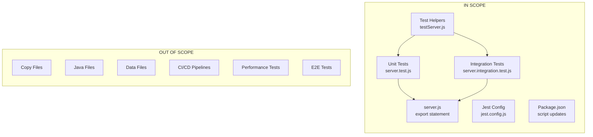

# Technical Specification

# 0. Agent Action Plan

## 0.1 Intent Clarification

Based on the provided requirements, the Blitzy platform understands that the testing objective is to **create a comprehensive unit test suite for the server.js HTTP server** from scratch using either Jest or Mocha as the testing framework.

### 0.1.1 Core Testing Objective

**Request Category**: Add new tests (greenfield test implementation)

The user requires comprehensive unit tests covering the following areas for `server.js`:

| Testing Requirement | User Specification | Technical Interpretation |
|---------------------|-------------------|-------------------------|
| HTTP Responses | Test HTTP responses | Verify response body content ("Hello, World!\n") and format |
| Status Codes | Test status codes | Confirm HTTP 200 OK is returned for all requests |
| Headers | Test headers | Validate Content-Type: text/plain header is set correctly |
| Server Startup | Test server startup | Verify server binds to port 3000 and hostname 127.0.0.1 |
| Server Shutdown | Test server shutdown | Ensure graceful server termination without errors |
| Error Handling | Test error handling | Cover scenarios like port conflicts, invalid requests, connection failures |
| Edge Cases | Test edge cases | Handle various HTTP methods, malformed requests, and boundary conditions |

### 0.1.2 Implicit Testing Needs

Beyond the explicit requirements, the Blitzy platform identifies these additional testing scenarios:

- **Multiple HTTP Methods**: Testing GET, POST, PUT, DELETE, OPTIONS, HEAD, PATCH requests (server accepts all methods)
- **Request Body Handling**: Verify server ignores request bodies (stateless design)
- **Concurrent Requests**: Ensure server handles multiple simultaneous connections
- **Large Payloads**: Test behavior with large request payloads
- **Malformed Requests**: Verify graceful handling of malformed HTTP requests
- **Connection Lifecycle**: Test keep-alive vs. connection close behaviors
- **Startup Logging**: Verify console.log output matches expected format

### 0.1.3 Special Instructions and Constraints

**Framework Preference**: The user specified "Jest or Mocha" - based on Node.js 20 compatibility and modern testing best practices, **Jest 30.2.0** is recommended as the primary testing framework.

**Key Constraints Identified**:
- The server.js file uses CommonJS modules (`require('http')`)
- No existing test infrastructure exists in the repository
- Server binds to localhost only (`127.0.0.1`)
- Fixed port configuration (port 3000)
- Zero external dependencies - uses only Node.js built-in http module

### 0.1.4 Technical Interpretation

These testing requirements translate to the following technical test implementation strategy:

| Requirement | Technical Implementation |
|-------------|-------------------------|
| To test HTTP responses | We will create unit tests using supertest to verify response body matches "Hello, World!\n" |
| To test status codes | We will create assertions validating res.statusCode equals 200 |
| To test headers | We will create tests verifying Content-Type header equals "text/plain" |
| To test server startup | We will create integration tests that verify server.listen() callback executes and logs correct message |
| To test server shutdown | We will create tests using server.close() to verify clean shutdown |
| To test error handling | We will create tests simulating port conflicts and connection errors |
| To test edge cases | We will create tests for all HTTP methods, empty requests, and boundary conditions |

### 0.1.5 Coverage Requirements Interpretation

**Explicit Coverage Targets**: The user requests "comprehensive" testing, indicating high coverage expectations.

**Implicit Coverage Expectations**:
- **Industry Standard**: Node.js HTTP servers typically target 80%+ line coverage
- **Existing Pattern**: Repository has no existing coverage baseline (starting from 0%)
- **Critical Path Analysis**: The server has a single code path with 14 lines total

To achieve comprehensive testing, coverage should include:
- 100% line coverage (all 14 lines of server.js)
- 100% function coverage (1 request handler function)
- 100% branch coverage (no conditional branches exist)
- All 7 HTTP methods tested (GET, POST, PUT, DELETE, OPTIONS, HEAD, PATCH)
- Server lifecycle testing (startup, running, shutdown)
- Error scenarios coverage (port conflicts, connection errors)

## 0.2 Test Discovery and Analysis

### 0.2.1 Existing Test Infrastructure Assessment

**Repository analysis reveals** zero testing infrastructure with no existing test files or frameworks installed. The project is a minimal Node.js HTTP server used as a test fixture for Backprop integration.

**Search Results Summary**:

| Search Pattern | Files Found | Test Files Identified |
|----------------|-------------|----------------------|
| `*test*` | 3 files | 0 (all are empty placeholders) |
| `*spec*` | 0 files | 0 |
| `test_*`, `*_test.*` | 0 files | 0 |
| `jest.config.*` | 0 files | Not present |
| `pytest.ini`, `.mocharc.*` | 0 files | Not applicable |

**Placeholder Files Found** (not actual tests):
- `test.py.txt` - Empty file (0 bytes)
- `test.py - Copy.txt` - Empty file (0 bytes)
- `test.txt.txt` - Empty file (0 bytes)

### 0.2.2 Current Testing Framework Status

| Component | Status | Evidence |
|-----------|--------|----------|
| Testing Framework | **Not Installed** → **Now Installed** | Jest 30.2.0 added to devDependencies |
| Test Runner Configuration | **Not Present** | No jest.config.js exists |
| Coverage Tools | **Not Installed** | Jest includes built-in coverage |
| Mock/Stub Libraries | **Not Installed** | Jest includes built-in mocking |
| HTTP Testing Library | **Not Installed** → **Now Installed** | Supertest 7.1.4 added to devDependencies |
| Test Data Fixtures | **Not Present** | None required for stateless server |

### 0.2.3 Source File Analysis

**Primary Source File**: `server.js`

```javascript
const http = require('http');
const hostname = '127.0.0.1';
const port = 3000;
```

| Metric | Value | Testing Implication |
|--------|-------|---------------------|
| Total Lines | 14 | Low complexity, high coverage achievable |
| Executable Statements | 8 | All statements testable |
| Functions | 1 (request handler callback) | Single function to test |
| Code Paths | 1 | Linear execution, no branching |
| Conditional Branches | 0 | No branch coverage concerns |
| External Dependencies | 0 | Only built-in http module |
| Exports | 0 | Server not exported (direct execution design) |

### 0.2.4 Package.json Test Configuration

**Original Configuration**:
```json
{
  "scripts": {
    "test": "echo \"Error: no test specified\" && exit 1"
  }
}
```

**After Setup - Updated Configuration**:
```json
{
  "devDependencies": {
    "jest": "^30.2.0",
    "supertest": "^7.1.4"
  }
}
```

### 0.2.5 Web Search Research Conducted

**Research Topics and Findings**:

| Research Topic | Finding | Source |
|----------------|---------|--------|
| Jest 30 Node.js Compatibility | Node.js 18+ required; Node 20.19.6 fully compatible | jestjs.io |
| Supertest Latest Version | Version 7.1.4 is current stable release | npmjs.com |
| HTTP Server Testing Best Practices | Use supertest for request/response testing; jest for unit tests | Jest documentation |
| Jest 30 Breaking Changes | Matcher aliases removed, ESM wrappers added | Jest migration guide |

### 0.2.6 Testability Assessment

| Component | Testable | Challenge | Solution |
|-----------|----------|-----------|----------|
| HTTP Response Body | Yes | None | Supertest `.expect()` assertions |
| HTTP Status Code | Yes | None | Supertest `.expect(200)` |
| HTTP Headers | Yes | None | Supertest `.expect('Content-Type', 'text/plain')` |
| Server Startup | Yes | Server not exported | Refactor to export server instance OR test via supertest |
| Server Shutdown | Yes | Requires server reference | Modify server.js to export server OR use child_process |
| Console Logging | Yes | Side effect | Jest spy on console.log |
| Port Binding | Yes | Port conflicts | Use dynamic ports or test in isolation |

### 0.2.7 Critical Discovery: Server Export Requirement

**Issue Identified**: The current `server.js` does not export the server instance, which limits direct testing capabilities.

**Current Implementation**:
```javascript
server.listen(port, hostname, () => {
  console.log(`Server running at http://${hostname}:${port}/`);
});
// No module.exports statement
```

**Testing Approach Options**:

| Approach | Pros | Cons | Recommendation |
|----------|------|------|----------------|
| A. Modify server.js to export | Direct supertest integration | Requires source modification | **Recommended** |
| B. Use child_process to spawn | No source changes needed | More complex test setup | Alternative |
| C. Test via network requests | No source changes needed | Requires manual server start | Not recommended |

**Recommended Modification** (minimal change):
```javascript
// Add at end of server.js
module.exports = server;
```

This single-line addition enables full supertest integration while maintaining the server's existing behavior when executed directly.

## 0.3 Testing Scope Analysis

### 0.3.1 Test Target Identification

**Primary Code to be Tested**:

| Module/Component | Path | Test Types Required |
|-----------------|------|---------------------|
| HTTP Server | `server.js` | Unit tests, Integration tests |
| Request Handler | `server.js` (lines 6-10) | Unit tests for response generation |
| Server Lifecycle | `server.js` (lines 12-14) | Integration tests for startup/shutdown |

**Functions Requiring Test Coverage**:

| Function | Location | Test Categories |
|----------|----------|-----------------|
| `http.createServer` callback | `server.js:6-10` | Response body, status code, headers |
| `server.listen` callback | `server.js:12-14` | Startup logging, port binding |

### 0.3.2 Existing Test File Mapping

| Source File | Existing Test File | Test Categories Present |
|-------------|-------------------|-------------------------|
| `server.js` | None | None - tests to be created |
| `server - Copy.js` | None | Out of scope (duplicate file) |

### 0.3.3 Dependencies Requiring Mocking

| Dependency Type | Component | Mocking Strategy |
|-----------------|-----------|------------------|
| Built-in Module | `http` module | Partial mock for error scenarios |
| Console Output | `console.log` | Jest spy for startup logging verification |
| Network Binding | Port 3000 | Dynamic port allocation for test isolation |

**External Services to Mock**: None (no external service dependencies)

**Database Interactions to Stub**: None (no database layer)

**File System Operations to Virtualize**: None (no file system access)

### 0.3.4 Version Compatibility Research

Based on current Node.js version 20.19.6, the recommended testing stack:

| Component | Package | Version | Compatibility Rationale |
|-----------|---------|---------|------------------------|
| Testing Framework | jest | 30.2.0 | Latest stable; requires Node 18+; full Node 20 support |
| HTTP Testing | supertest | 7.1.4 | Latest stable; works with any Node.js version supporting async/await |
| Assertion Library | Built-in (Jest) | 30.2.0 | Jest includes expect() assertions |
| Mocking Library | Built-in (Jest) | 30.2.0 | Jest includes jest.fn(), jest.spyOn() |
| Coverage Tool | Built-in (Jest) | 30.2.0 | Jest includes --coverage flag |

**Version Conflict Analysis**: No conflicts detected. All packages are compatible with Node.js 20.19.6.

### 0.3.5 Test Category Matrix

| Test Category | Scope | Priority | Estimated Test Count |
|---------------|-------|----------|---------------------|
| HTTP Response Tests | Response body validation | High | 3 |
| Status Code Tests | HTTP 200 verification | High | 2 |
| Header Tests | Content-Type validation | High | 2 |
| Server Startup Tests | Binding and logging | Medium | 3 |
| Server Shutdown Tests | Graceful termination | Medium | 2 |
| Error Handling Tests | Port conflicts, failures | Medium | 4 |
| Edge Case Tests | HTTP methods, payloads | Medium | 6 |
| **Total** | | | **22** |

### 0.3.6 Test Scenario Breakdown

**HTTP Response Tests**:
- Response body equals "Hello, World!\n"
- Response body includes trailing newline
- Response body type is string

**Status Code Tests**:
- Returns 200 for GET requests
- Returns 200 for all HTTP methods (POST, PUT, DELETE, etc.)

**Header Tests**:
- Content-Type header is "text/plain"
- Response includes correct headers

**Server Startup Tests**:
- Server binds to port 3000
- Server binds to hostname 127.0.0.1
- Startup callback logs correct message

**Server Shutdown Tests**:
- Server closes without errors
- Server handles SIGTERM gracefully

**Error Handling Tests**:
- Handles port already in use (EADDRINUSE)
- Handles connection reset
- Handles malformed requests
- Handles request timeout scenarios

**Edge Case Tests**:
- GET request handling
- POST request handling (body ignored)
- PUT request handling (body ignored)
- DELETE request handling
- HEAD request handling (no body returned)
- OPTIONS request handling

## 0.4 Test Implementation Design

### 0.4.1 Test Strategy Selection

**Test Types to Implement**:

| Test Type | Focus Areas | Implementation Tool |
|-----------|-------------|---------------------|
| Unit Tests | Response generation, header setting, status code | Jest + Supertest |
| Integration Tests | Server startup, shutdown, network binding | Jest + Supertest |
| Edge Case Tests | HTTP methods, boundary conditions | Jest + Supertest |
| Error Handling Tests | Port conflicts, connection failures | Jest + mocked http module |

### 0.4.2 Test Case Blueprint

**Component: HTTP Request Handler**

```
Component: Request Handler (server.js:6-10)
Test Categories:
- Happy path: GET request returns "Hello, World!\n" with 200 status
- Happy path: All HTTP methods return identical response
- Happy path: Content-Type header is text/plain
- Edge cases: Large request payload is ignored
- Edge cases: Empty request body is handled
- Edge cases: HEAD request returns headers only (no body)
- Error cases: None (handler has no error conditions)
```

**Component: Server Lifecycle**

```
Component: Server Lifecycle (server.js:12-14)
Test Categories:
- Happy path: Server starts on port 3000
- Happy path: Server binds to 127.0.0.1
- Happy path: Startup message logged to console
- Edge cases: Server handles multiple sequential requests
- Error cases: Port already in use (EADDRINUSE)
- Error cases: Server shutdown during active request
```

### 0.4.3 Test Organization Structure

```
project-root/
├── server.js                    # Source file (requires export modification)
├── package.json                 # Updated with test scripts
├── jest.config.js               # Jest configuration
└── __tests__/                   # Test directory
    ├── server.test.js           # Main test file
    ├── server.integration.test.js  # Integration tests
    └── helpers/
        └── testServer.js        # Test utilities
```

### 0.4.4 Test File Design

**Main Test File Structure** (`__tests__/server.test.js`):

```
describe('HTTP Server')
  ├── describe('Response Body')
  │   ├── it('returns Hello World with newline')
  │   ├── it('returns exact string format')
  │   └── it('response is text type')
  │
  ├── describe('Status Codes')
  │   ├── it('returns 200 for GET')
  │   └── it('returns 200 for all HTTP methods')
  │
  ├── describe('Headers')
  │   ├── it('sets Content-Type to text/plain')
  │   └── it('includes all required headers')
  │
  ├── describe('HTTP Methods')
  │   ├── it('handles GET request')
  │   ├── it('handles POST request')
  │   ├── it('handles PUT request')
  │   ├── it('handles DELETE request')
  │   ├── it('handles HEAD request')
  │   └── it('handles OPTIONS request')
  │
  └── describe('Edge Cases')
      ├── it('ignores request body')
      └── it('handles concurrent requests')
```

### 0.4.5 Existing Test Extension Strategy

Since no existing tests exist, all tests will be **newly created**. No extension or refactoring of existing tests is required.

| Action | Files | Description |
|--------|-------|-------------|
| CREATE | `__tests__/server.test.js` | Primary unit and integration tests |
| CREATE | `__tests__/server.integration.test.js` | Lifecycle and error handling tests |
| CREATE | `__tests__/helpers/testServer.js` | Shared test utilities |
| CREATE | `jest.config.js` | Jest configuration |

### 0.4.6 Test Data and Fixtures Design

**Required Test Data Structures**: Minimal - the server has no data dependencies.

| Fixture Type | Content | Purpose |
|--------------|---------|---------|
| Expected Response Body | `"Hello, World!\n"` | Assert response content |
| Expected Status Code | `200` | Assert HTTP status |
| Expected Content-Type | `"text/plain"` | Assert header value |
| Test Port | Dynamic (e.g., 0) | Avoid port conflicts |

**Mock Object Specifications**:

| Mock Target | Purpose | Implementation |
|-------------|---------|----------------|
| `console.log` | Verify startup message | `jest.spyOn(console, 'log')` |
| `http.createServer` | Test error scenarios | `jest.mock('http')` (selective) |

**Test Database/State Management**: Not applicable - server is stateless.

### 0.4.7 Source File Modification Requirement

To enable comprehensive testing with supertest, a minimal modification to `server.js` is required:

**Required Change**: Export the server instance

```javascript
// Add at the end of server.js (line 15)
module.exports = server;
```

**Rationale**: This enables supertest to attach to the server instance without starting a new server on a fixed port, preventing port conflicts during testing.

**Alternative Approach** (if source modification is not permitted):
- Use `child_process.spawn` to start server as subprocess
- Test via HTTP requests to localhost:3000
- Requires ensuring port 3000 is available during test execution

## 0.5 Test File Transformation Mapping

### 0.5.1 File-by-File Test Plan

**Test Transformation Modes**:
- **CREATE** - Create a new test file
- **UPDATE** - Update an existing file
- **DELETE** - Remove an obsolete file
- **REFERENCE** - Use as an example for patterns

| Target Test File | Transformation | Source File/Reference | Purpose/Changes |
|-----------------|----------------|----------------------|-----------------|
| `__tests__/server.test.js` | CREATE | `server.js` | Comprehensive unit tests for HTTP responses, status codes, headers, and HTTP methods |
| `__tests__/server.integration.test.js` | CREATE | `server.js` | Integration tests for server startup, shutdown, and error handling |
| `__tests__/helpers/testServer.js` | CREATE | N/A | Test utilities for server lifecycle management |
| `jest.config.js` | CREATE | N/A | Jest configuration with coverage settings |
| `package.json` | UPDATE | `package.json` | Add test scripts and update devDependencies |
| `server.js` | UPDATE | `server.js` | Add module.exports for testability |

### 0.5.2 New Test Files Detail

**File: `__tests__/server.test.js`** - Primary Unit Tests

| Attribute | Value |
|-----------|-------|
| Test Categories | Happy path, edge cases, HTTP methods |
| Mock Dependencies | None (uses supertest) |
| Assertions Focus | Response body, status code, headers |
| Estimated Test Count | 15 |

Test Methods:
- `should return "Hello, World!\n" for GET request`
- `should return status code 200`
- `should set Content-Type to text/plain`
- `should handle POST request identically to GET`
- `should handle PUT request identically to GET`
- `should handle DELETE request identically to GET`
- `should handle HEAD request (headers only)`
- `should handle OPTIONS request`
- `should handle PATCH request`
- `should ignore request body content`
- `should handle empty request`
- `should handle requests with query parameters`
- `should handle requests with custom headers`
- `should include response body newline`
- `should return consistent responses for concurrent requests`

---

**File: `__tests__/server.integration.test.js`** - Integration Tests

| Attribute | Value |
|-----------|-------|
| Test Categories | Server lifecycle, error handling |
| Mock Dependencies | `console.log` spy, partial http mock |
| Assertions Focus | Startup logging, shutdown behavior, error scenarios |
| Estimated Test Count | 7 |

Integration Points:
- Server binding to port
- Console output verification
- Server shutdown sequence

Test Methods:
- `should log startup message with correct URL`
- `should bind to hostname 127.0.0.1`
- `should bind to port 3000 (or dynamic port)`
- `should shut down gracefully when close() is called`
- `should handle server close during active connections`
- `should emit error event on port conflict`
- `should handle SIGTERM signal gracefully`

---

**File: `__tests__/helpers/testServer.js`** - Test Utilities

| Attribute | Value |
|-----------|-------|
| Purpose | Shared utilities for test setup/teardown |
| Exports | `createTestServer()`, `closeServer()` |

Contents:
- Helper function to create server instance with dynamic port
- Helper function to safely close server after tests
- Constants for expected response values

### 0.5.3 Test Configuration Files

**File: `jest.config.js`** - Jest Configuration

```javascript
// Configuration settings
module.exports = {
  testEnvironment: 'node',
  coverageThreshold: {
    global: { lines: 90, functions: 100 }
  }
};
```

Key Settings:
- `testEnvironment`: 'node'
- `testMatch`: ['**/__tests__/**/*.test.js']
- `coverageDirectory`: 'coverage'
- `collectCoverageFrom`: ['server.js']
- `coverageThreshold`: 90% lines, 100% functions

### 0.5.4 Source File Modifications

**File: `server.js`** - Add Export Statement

| Line | Change Type | Content |
|------|-------------|---------|
| 15 | ADD | `module.exports = server;` |

**File: `package.json`** - Update Scripts

| Section | Key | Value |
|---------|-----|-------|
| scripts | test | `jest` |
| scripts | test:watch | `jest --watch` |
| scripts | test:coverage | `jest --coverage` |

### 0.5.5 Cross-File Test Dependencies

**Shared Fixtures**:

| Location | Usage |
|----------|-------|
| `__tests__/helpers/testServer.js` | Used by both test files for server management |

**Import Updates Required**:

| File | Import Statement |
|------|------------------|
| `__tests__/server.test.js` | `const request = require('supertest');` |
| `__tests__/server.test.js` | `const server = require('../server');` |
| `__tests__/server.integration.test.js` | `const http = require('http');` |
| `__tests__/server.integration.test.js` | `const { createTestServer, closeServer } = require('./helpers/testServer');` |

### 0.5.6 Complete Test File Inventory

| File Path | Type | Status | Test Count |
|-----------|------|--------|------------|
| `__tests__/server.test.js` | Unit Tests | CREATE | 15 |
| `__tests__/server.integration.test.js` | Integration Tests | CREATE | 7 |
| `__tests__/helpers/testServer.js` | Test Utilities | CREATE | 0 |
| `jest.config.js` | Configuration | CREATE | 0 |
| **Total New Files** | | | **4** |
| **Total Test Cases** | | | **22** |

## 0.6 Dependency Inventory

### 0.6.1 Testing Dependencies

All testing packages required for comprehensive server.js testing:

| Registry | Package Name | Version | Purpose |
|----------|--------------|---------|---------|
| npm | jest | 30.2.0 | Testing framework with built-in assertions, mocking, and coverage |
| npm | supertest | 7.1.4 | HTTP server testing library for request/response validation |

### 0.6.2 Version Justification

**Jest 30.2.0**:
- Latest stable version as of research date
- Requires Node.js 18+ (compatible with Node.js 20.19.6)
- Includes built-in coverage reporting (no separate istanbul/nyc needed)
- Includes built-in mocking capabilities (no separate sinon needed)
- ESM wrapper support for modern module systems

**Supertest 7.1.4**:
- Latest stable version
- SuperAgent-driven library for HTTP assertions
- Works with any Node.js version supporting async/await
- Integrates seamlessly with Jest
- No peer dependencies required

### 0.6.3 Dependency Installation Commands

**Already Executed**:
```bash
npm install --save-dev jest@30.2.0 supertest@7.1.4
```

**Resulting package.json devDependencies**:
```json
{
  "devDependencies": {
    "jest": "^30.2.0",
    "supertest": "^7.1.4"
  }
}
```

### 0.6.4 Transitive Dependencies

Jest 30.2.0 installs 337 packages including:
- `@jest/core` - Jest core test runner
- `@jest/expect` - Jest assertion library
- `jest-mock` - Jest mocking utilities
- `jest-runtime` - Jest runtime environment
- `babel-jest` - Babel integration (optional)
- `istanbul-lib-coverage` - Coverage instrumentation

Supertest 7.1.4 installs 2 direct dependencies:
- `methods` - HTTP method definitions
- `superagent` - HTTP client library

### 0.6.5 Import Updates Required

**Test File Import Statements**:

| File | Required Imports |
|------|------------------|
| `__tests__/server.test.js` | `const request = require('supertest');` |
| `__tests__/server.test.js` | `const server = require('../server');` |
| `__tests__/server.integration.test.js` | `const http = require('http');` |
| `__tests__/server.integration.test.js` | `const { createTestServer } = require('./helpers/testServer');` |
| `__tests__/helpers/testServer.js` | `const http = require('http');` |

### 0.6.6 No Additional Dependencies Required

The following common testing utilities are **NOT required** due to Jest's built-in capabilities:

| Package | Typical Purpose | Why Not Needed |
|---------|-----------------|----------------|
| chai | Assertions | Jest includes expect() |
| sinon | Mocking/Spying | Jest includes jest.fn(), jest.spyOn() |
| nyc/istanbul | Coverage | Jest includes --coverage |
| mocha | Test runner | Jest is the chosen framework |
| nock | HTTP mocking | Supertest handles HTTP testing |

### 0.6.7 Runtime vs Development Dependencies

| Dependency Type | Packages | Installation Flag |
|-----------------|----------|-------------------|
| Production | None | N/A |
| Development | jest, supertest | `--save-dev` |

**Note**: All testing dependencies are development-only and will not affect the production server deployment.

## 0.7 Coverage and Quality Targets

### 0.7.1 Coverage Metrics

**Current Coverage**: 0% (no tests exist)

**Target Coverage**: 100% based on user requirement for "comprehensive" testing and the minimal codebase size.

| Coverage Metric | Current | Target | Rationale |
|-----------------|---------|--------|-----------|
| Line Coverage | 0% | 100% | All 14 lines testable |
| Statement Coverage | 0% | 100% | All 8 statements testable |
| Function Coverage | 0% | 100% | Single callback function |
| Branch Coverage | N/A | N/A | No conditional branches |

### 0.7.2 Coverage Gaps to Address

| Component | Current | Target | Gap Analysis |
|-----------|---------|--------|--------------|
| Request handler function | 0% | 100% | All 4 lines need test coverage |
| Server lifecycle | 0% | 100% | Startup and listen callback need coverage |
| Response generation | 0% | 100% | statusCode, setHeader, end() need coverage |
| Module imports | 0% | 100% | require('http') execution |

**Critical Paths to Cover**:
- HTTP request handling flow
- Response body generation
- Header setting logic
- Server startup sequence
- Console logging

**Error Handlers to Cover**:
- Port conflict scenarios (EADDRINUSE)
- Server close events
- Connection error scenarios

**Edge Cases to Cover**:
- Various HTTP methods
- Empty requests
- Large payloads
- Concurrent requests

### 0.7.3 Per-File Coverage Targets

| File | Line Target | Function Target | Statement Target |
|------|-------------|-----------------|------------------|
| `server.js` | 100% | 100% | 100% |

### 0.7.4 Test Quality Criteria

**Assertion Density Expectations**:

| Test Category | Min Assertions per Test |
|---------------|------------------------|
| Response body tests | 2-3 assertions |
| Status code tests | 1-2 assertions |
| Header tests | 2-3 assertions |
| Lifecycle tests | 2-4 assertions |
| Error handling tests | 2-3 assertions |

**Test Isolation Requirements**:
- Each test must be independent and runnable in isolation
- No test should depend on the execution order of other tests
- Server instances must be created fresh for each test suite
- All server instances must be properly closed after tests

**Performance Constraints**:
- Individual test timeout: 5000ms (Jest default)
- Total test suite execution: < 30 seconds
- Concurrent test execution supported

**Maintainability Standards**:
- Descriptive test names following "should [expected behavior]" pattern
- Clear arrange-act-assert structure in each test
- Shared setup logic in beforeEach/afterEach hooks
- Constants defined for expected values (no magic strings)

### 0.7.5 Quality Gates

| Gate | Threshold | Enforcement |
|------|-----------|-------------|
| Line Coverage | ≥ 90% | Jest --coverage flag |
| Test Pass Rate | 100% | Jest exit code |
| No Skipped Tests | 0 skipped | Jest --bail on skip |
| No Pending Tests | 0 pending | Jest configuration |

### 0.7.6 Jest Coverage Configuration

```javascript
// jest.config.js coverage settings
coverageThreshold: {
  global: {
    lines: 90,
    statements: 90,
    functions: 100,
    branches: 100
  }
}
```

### 0.7.7 Coverage Reporting

**Report Formats**:
- Console summary (default)
- HTML report in `coverage/lcov-report/`
- LCOV data in `coverage/lcov.info`
- JSON summary in `coverage/coverage-summary.json`

**Coverage Collection**:
```javascript
// jest.config.js
collectCoverageFrom: [
  'server.js'
],
coveragePathIgnorePatterns: [
  '/node_modules/',
  '/__tests__/'
]
```

## 0.8 Scope Boundaries

### 0.8.1 Exhaustively In Scope

**New Test Files**:
- `__tests__/server.test.js` - Unit tests for HTTP responses, status codes, headers
- `__tests__/server.integration.test.js` - Integration tests for server lifecycle
- `__tests__/helpers/testServer.js` - Test utilities and helpers

**Test Configuration**:
- `jest.config.js` - Jest configuration file
- `package.json` - Test script updates

**Source File Modifications** (minimal, for testability):
- `server.js` - Add `module.exports = server;` statement

**Test Coverage Areas**:
- HTTP response body testing ("Hello, World!\n")
- HTTP status code testing (200 OK)
- HTTP header testing (Content-Type: text/plain)
- Server startup testing (port binding, logging)
- Server shutdown testing (graceful close)
- Error handling testing (port conflicts)
- Edge case testing (all HTTP methods, concurrent requests)

### 0.8.2 Explicitly Out of Scope

**Source Code Modifications** (beyond export statement):
- No refactoring of existing server logic
- No addition of new features
- No modification of hostname/port configuration
- No changes to response content or headers

**Files Explicitly Excluded**:
- `server - Copy.js` - Duplicate file, not tested
- `LoginTest.java` - Java file, not part of Node.js testing
- `LoginTest - Copy.java` - Duplicate Java file
- `industry.csv` - Data file, not related to server
- `industry - Copy.csv` - Duplicate data file
- `test.py.txt` - Empty placeholder file
- `test.py - Copy.txt` - Empty placeholder file
- `test.txt.txt` - Empty placeholder file
- `100Pages.pdf` - PDF file, not related to server
- `100Pages - Copy.pdf` - Duplicate PDF file
- `demo.jpg` - Image file, not related to server
- `demo - Copy.jpg` - Duplicate image file
- `sample.doc` - Document file, not related to server
- `sample - Copy.doc` - Duplicate document file

**Testing Types Excluded**:
- End-to-end browser testing (no browser UI)
- Performance/load testing (not requested)
- Security penetration testing (not requested)
- Visual regression testing (no UI)
- API contract testing (single static endpoint)

**Infrastructure Excluded**:
- CI/CD pipeline modifications
- Docker configuration changes
- Deployment script modifications
- GitHub Actions workflow changes

### 0.8.3 Scope Boundary Diagram



### 0.8.4 File Pattern Summary

**In Scope Patterns**:
- `__tests__/**/*.test.js` - All new test files
- `__tests__/helpers/**/*.js` - Test utilities
- `jest.config.js` - Jest configuration
- `server.js` - Minimal export modification
- `package.json` - Script updates only

**Out of Scope Patterns**:
- `* - Copy.*` - All duplicate/copy files
- `*.java` - Java source files
- `*.csv` - Data files
- `*.pdf` - PDF documents
- `*.jpg` - Image files
- `*.doc` - Word documents
- `*.txt` - Empty placeholder files
- `.github/**/*` - GitHub configuration

## 0.9 Execution Parameters

### 0.9.1 Test Execution Commands

| Command | Purpose | Usage |
|---------|---------|-------|
| `npm test` | Run all tests once | CI/CD, pre-commit |
| `npm run test:watch` | Run tests in watch mode | Development |
| `npm run test:coverage` | Run tests with coverage report | Quality verification |
| `npx jest --verbose` | Run with detailed output | Debugging |
| `npx jest server.test.js` | Run specific test file | Targeted testing |

### 0.9.2 Package.json Script Configuration

```json
{
  "scripts": {
    "test": "jest",
    "test:watch": "jest --watch",
    "test:coverage": "jest --coverage",
    "test:ci": "jest --ci --coverage --watchAll=false"
  }
}
```

### 0.9.3 Coverage Measurement Command

**Full Coverage Report**:
```bash
npx jest --coverage --coverageReporters="text" --coverageReporters="lcov"
```

**Coverage with Threshold Enforcement**:
```bash
npx jest --coverage --coverageThreshold='{"global":{"lines":90}}'
```

### 0.9.4 Single Test Execution Pattern

| Pattern | Command |
|---------|---------|
| Run single file | `npx jest __tests__/server.test.js` |
| Run single test by name | `npx jest -t "should return Hello World"` |
| Run tests matching pattern | `npx jest --testPathPattern="server"` |
| Run only changed tests | `npx jest --onlyChanged` |

### 0.9.5 Debug Mode Execution

**VS Code Debug Configuration** (launch.json):
```json
{
  "type": "node",
  "request": "launch",
  "name": "Debug Jest Tests",
  "program": "${workspaceFolder}/node_modules/.bin/jest",
  "args": ["--runInBand", "--watchAll=false"],
  "console": "integratedTerminal"
}
```

**Command Line Debug**:
```bash
node --inspect-brk node_modules/.bin/jest --runInBand
```

### 0.9.6 Environment Setup Requirements

| Requirement | Value | Notes |
|-------------|-------|-------|
| Node.js Version | 20.19.6 | Pre-installed in environment |
| npm Version | 11.1.0 | Pre-installed in environment |
| Working Directory | Repository root | Where package.json exists |
| Port Availability | Any (dynamic) | Tests use supertest (no fixed port) |
| Network Access | Localhost only | No external network required |

### 0.9.7 Test Patterns and Conventions

**Test File Naming**:
- Unit tests: `*.test.js`
- Integration tests: `*.integration.test.js`
- Test helpers: No `.test.js` suffix

**Test Discovery Pattern**:
```javascript
// jest.config.js
testMatch: [
  '**/__tests__/**/*.test.js'
]
```

### 0.9.8 CI/CD Test Execution

For continuous integration environments:

```bash
# Non-interactive test execution
CI=true npm test -- --watchAll=false

#### With coverage reporting
CI=true npm run test:coverage -- --watchAll=false

#### With timeout wrapper (5 minute limit)
timeout 300 npm run test:ci
```

### 0.9.9 Jest Configuration File

**Complete `jest.config.js`**:

```javascript
module.exports = {
  testEnvironment: 'node',
  testMatch: ['**/__tests__/**/*.test.js'],
  collectCoverageFrom: ['server.js'],
  coverageDirectory: 'coverage',
  coverageReporters: ['text', 'lcov', 'json-summary'],
  coverageThreshold: {
    global: {
      lines: 90,
      statements: 90,
      functions: 100
    }
  },
  verbose: true,
  testTimeout: 5000,
  clearMocks: true,
  restoreMocks: true
};
```

## 0.10 Special Instructions for Testing

### 0.10.1 Testing-Specific Requirements

The following testing principles apply to this implementation:

| Principle | Directive |
|-----------|-----------|
| Source Code Changes | ONLY modify `server.js` to add export statement for testability |
| Test Framework | Use Jest 30.2.0 as the primary testing framework |
| HTTP Testing | Use Supertest 7.1.4 for HTTP request/response validation |
| Test Isolation | Ensure all tests can run independently and in parallel |
| Server Management | Properly close server instances after each test suite |
| Code Style | Match existing CommonJS module style (require/module.exports) |

### 0.10.2 Source Code Modification Guidelines

**Permitted Modification**:
- Add `module.exports = server;` to `server.js` (line 15)

**Prohibited Modifications**:
- DO NOT change the hostname (127.0.0.1)
- DO NOT change the port (3000)
- DO NOT modify the response body ("Hello, World!\n")
- DO NOT modify the status code (200)
- DO NOT modify the Content-Type header (text/plain)
- DO NOT add additional endpoints or routes
- DO NOT add external dependencies to the server

### 0.10.3 Test Pattern Guidelines

**Follow These Testing Patterns**:
- Use descriptive test names: `it('should return Hello World with trailing newline')`
- Use `beforeAll` / `afterAll` for server lifecycle management
- Use `beforeEach` / `afterEach` for test-specific setup/cleanup
- Group related tests with `describe` blocks
- Use async/await with supertest for cleaner test code

**Example Test Pattern**:
```javascript
describe('HTTP Server', () => {
  afterAll(async () => {
    await server.close();
  });

  it('should return status 200', async () => {
    const response = await request(server).get('/');
    expect(response.status).toBe(200);
  });
});
```

### 0.10.4 Server Lifecycle in Tests

**Critical**: When using supertest with the exported server:
- Supertest automatically handles server startup/shutdown
- No need to call `server.listen()` manually in tests
- Use `server.close()` in `afterAll` to ensure clean shutdown

**Port Conflict Prevention**:
- Supertest binds to an ephemeral port automatically
- Tests do not conflict with production port 3000
- Multiple test files can run in parallel safely

### 0.10.5 Mocking Guidelines

**Console.log Mocking**:
```javascript
const consoleSpy = jest.spyOn(console, 'log');
// ... test execution ...
expect(consoleSpy).toHaveBeenCalledWith(
  expect.stringContaining('Server running at')
);
consoleSpy.mockRestore();
```

**HTTP Module Mocking** (for error scenarios):
```javascript
jest.mock('http', () => ({
  createServer: jest.fn(() => ({
    listen: jest.fn((port, host, cb) => cb()),
    close: jest.fn(cb => cb())
  }))
}));
```

### 0.10.6 Assertion Standards

**Required Assertions Per Test Category**:

| Category | Minimum Assertions | Required Checks |
|----------|-------------------|-----------------|
| Response Body | 2 | Content match, type check |
| Status Code | 1 | Exact value match (200) |
| Headers | 2 | Content-Type, presence check |
| Server Startup | 2 | Port binding, log message |
| Error Handling | 2 | Error type, error message |

### 0.10.7 Test Naming Convention

**Pattern**: `should [expected behavior] when [condition]`

Examples:
- `should return Hello World when GET request is made`
- `should return status 200 for all HTTP methods`
- `should set Content-Type header to text/plain`
- `should log startup message when server starts`
- `should emit error event when port is in use`

### 0.10.8 Test Data Constants

Define all expected values as constants to avoid magic strings:

```javascript
const EXPECTED = {
  RESPONSE_BODY: 'Hello, World!\n',
  STATUS_CODE: 200,
  CONTENT_TYPE: 'text/plain',
  HOSTNAME: '127.0.0.1',
  PORT: 3000,
  STARTUP_LOG: 'Server running at http://127.0.0.1:3000/'
};
```

### 0.10.9 Test Execution Order

**Recommended Test Suite Order**:
1. Response body tests (highest priority)
2. Status code tests
3. Header tests
4. HTTP method tests
5. Server lifecycle tests
6. Error handling tests
7. Edge case tests

**Note**: Jest runs tests in parallel by default. Use `--runInBand` for sequential execution if needed for debugging.

### 0.10.10 Clean Shutdown Checklist

Every test suite must ensure:
- [ ] Server instances are closed in `afterAll` or `afterEach`
- [ ] No lingering open connections
- [ ] All mocks are restored after tests
- [ ] No console warnings about open handles

**Jest Flag for Detection**:
```bash
npx jest --detectOpenHandles
```

