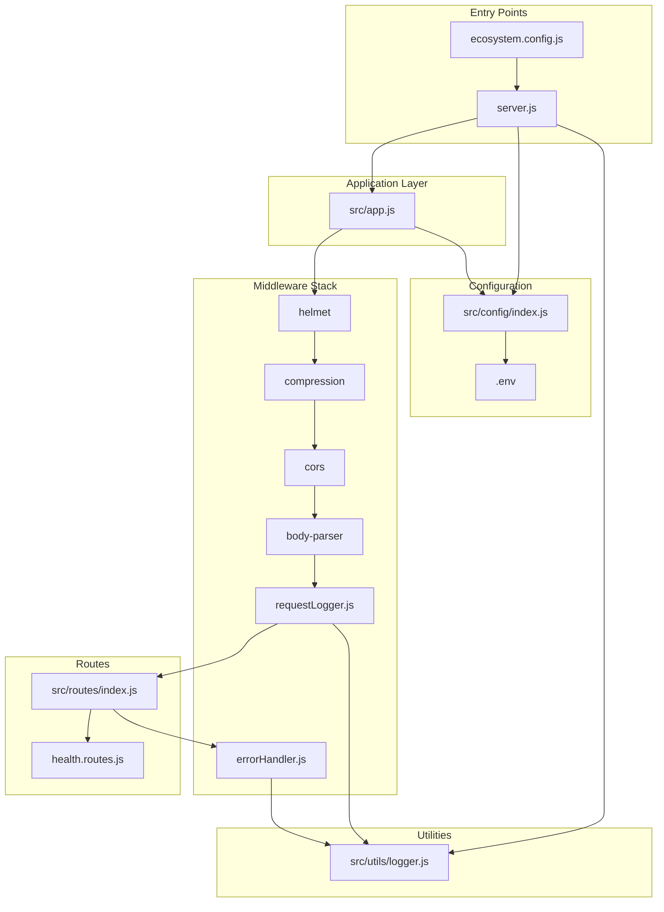

# Technical Specification

# 0. Agent Action Plan

## 0.1 Intent Clarification

### 0.1.1 Core Objective

Based on the provided requirements, the Blitzy platform understands that the objective is to **transform a basic, raw Node.js HTTP server into a production-ready Express.js application** with comprehensive middleware support, structured logging, environment-based configuration, and process management capabilities.

**Primary Requirements (Enhanced Clarity):**

- **Express.js Framework Integration**: Replace the existing raw `http` module implementation with the Express.js framework (v5.x) to enable modern routing patterns, middleware chains, and improved request/response handling
- **Routing Implementation**: Establish a modular routing architecture with separate route handlers for different API endpoints, following RESTful conventions
- **Middleware Stack**: Implement a comprehensive middleware pipeline including security headers, CORS support, request logging, body parsing, response compression, and error handling
- **Environment Configuration**: Create a robust configuration system using environment variables via dotenv, supporting multiple deployment environments (development, staging, production)
- **Logging Infrastructure**: Implement structured logging using Winston for application-level logs and Morgan for HTTP request logging, with support for multiple transports (console, file)
- **Production Deployment Preparation**: Configure PM2 process manager for production deployment with cluster mode, auto-restart capabilities, and ecosystem configuration

**Implicit Requirements Detected:**

- Security hardening through Helmet middleware for HTTP security headers
- Rate limiting to protect against DoS attacks
- Graceful error handling middleware for both synchronous and asynchronous errors
- Health check endpoint for monitoring and load balancer integration
- Proper separation of concerns through modular file structure
- npm scripts for development, testing, and production workflows
- Git-ignored environment files for secret management

**Dependencies and Prerequisites:**

- Node.js v18+ (required by Express.js v5.x)
- npm package manager
- Understanding that the existing `server.js` will be refactored, not preserved

### 0.1.2 Task Categorization

| Aspect | Classification |
|--------|----------------|
| **Primary Task Type** | Configuration / Infrastructure Enhancement |
| **Secondary Aspects** | Refactoring, Documentation, Build/Deploy Setup |
| **Scope Classification** | Cross-cutting change (affects entire application structure) |

**Change Dimensions:**
- Framework migration (raw Node.js → Express.js)
- Architecture establishment (monolithic file → modular structure)
- DevOps configuration (manual execution → PM2 process management)
- Observability setup (console.log → structured logging)

### 0.1.3 Special Instructions and Constraints

**Critical Directives:**

- The README.md states "test project for backprop integration. Do not touch!" - This constraint applies to the README content but does not prevent necessary code modifications for the enhancement task
- Maintain backward compatibility with the existing `/` endpoint returning "Hello, World!"
- The `package.json` currently declares `"main": "index.js"` but the actual entry file is `server.js` - this inconsistency must be resolved
- Preserve the MIT license and author attribution in package.json

**Methodological Requirements:**

- Follow Express.js v5.x best practices including native async/await error handling
- Use ESM (ECMAScript Modules) syntax with CommonJS fallback support
- Follow the separation of concerns principle with thin controllers
- Implement environment-specific configurations without hardcoding values

**Web Search Research Conducted:**

- Express.js v5.x production best practices and migration patterns
- PM2 ecosystem.config.js configuration options and cluster mode setup
- Winston + Morgan logging integration patterns
- Security middleware recommendations (Helmet, CORS, rate-limiting)

### 0.1.4 Technical Interpretation

These requirements translate to the following technical implementation strategy:

**Framework Migration:**
- To achieve Express.js integration, we will replace the raw `http.createServer()` pattern with Express application factory by creating a new `src/app.js` that initializes Express with middleware chains

**Routing Architecture:**
- To achieve modular routing, we will create route handlers in `src/routes/` directory that export Express Router instances, registered with the main app using `app.use()`

**Middleware Implementation:**
- To achieve comprehensive middleware support, we will configure middleware in execution order: security (helmet) → compression → cors → body-parser → request logging (morgan) → routes → error handling

**Configuration System:**
- To achieve environment-based configuration, we will create `src/config/` directory with configuration modules that read from `process.env` after loading `.env` files via dotenv

**Logging Infrastructure:**
- To achieve structured logging, we will create a Winston logger instance in `src/utils/logger.js` and integrate Morgan middleware to stream HTTP logs through Winston

**Production Deployment:**
- To achieve PM2 production readiness, we will create `ecosystem.config.js` at project root with cluster mode, environment-specific configurations, and auto-restart policies

## 0.2 Repository Scope Discovery

### 0.2.1 Comprehensive File Analysis

**Current Repository Structure:**

| File/Directory | Type | Status | Relevance |
|---------------|------|--------|-----------|
| `server.js` | Source | Existing | Primary target for refactoring |
| `package.json` | Config | Existing | Requires dependency additions and script updates |
| `package-lock.json` | Config | Existing | Will be regenerated after npm install |
| `README.md` | Documentation | Existing | Out of scope (do not touch constraint) |
| `LoginTest.java` | Source | Existing | Unrelated - Java test file |
| `industry.csv` | Data | Existing | Unrelated - data file |
| `server - Copy.js` | Artifact | Existing | Cleanup candidate |
| `industry - Copy.csv` | Artifact | Existing | Cleanup candidate |
| `.git/` | Directory | Existing | Version control - preserve |

**Files to be Created (New Project Structure):**

```
project-root/
├── src/
│   ├── app.js                    # Express application factory
│   ├── server.js                 # Server entry point
│   ├── config/
│   │   ├── index.js              # Configuration aggregator
│   │   └── environments.js       # Environment-specific settings
│   ├── routes/
│   │   ├── index.js              # Route aggregator
│   │   └── health.routes.js      # Health check endpoints
│   ├── middleware/
│   │   ├── errorHandler.js       # Central error handling
│   │   └── requestLogger.js      # Morgan + Winston integration
│   └── utils/
│       └── logger.js             # Winston logger configuration
├── logs/                         # Log file directory (gitignored)
├── .env.example                  # Environment variable template
├── .env                          # Local environment (gitignored)
├── .gitignore                    # Git ignore patterns
├── ecosystem.config.js           # PM2 configuration
├── package.json                  # Updated with dependencies
└── README.md                     # (unchanged - do not touch)
```

**Search Patterns Evaluated:**

| Pattern Category | Patterns Used | Files Found |
|-----------------|---------------|-------------|
| Configuration | `**/*.json`, `**/*.yaml`, `.env*` | `package.json`, `package-lock.json` |
| Source Code | `**/*.js`, `src/**/*.*` | `server.js` |
| Documentation | `**/*.md`, `README*` | `README.md` |
| Build/Deploy | `ecosystem.config.js`, `Dockerfile*` | None (to be created) |
| Scripts | `scripts/**/*.*` | None |
| Tests | `**/*test*.*`, `**/*spec*.*` | `LoginTest.java` (unrelated) |

### 0.2.2 Web Search Research Conducted

**Research Areas and Findings:**

| Research Topic | Key Findings |
|---------------|--------------|
| Express.js v5 Best Practices | Native async/await support, automatic promise rejection handling, dropped support for Node.js < v18, updated path-to-regexp for security |
| PM2 Production Deployment | Ecosystem file configuration, cluster mode for multi-core utilization, environment variable management, log rotation with pm2-logrotate |
| Winston + Morgan Integration | Morgan streams to Winston transports, JSON structured logging, custom formats for production |
| Security Middleware | Helmet for HTTP headers, express-rate-limit for DoS protection, CORS for cross-origin requests |
| Environment Configuration | dotenv for .env file loading, never commit secrets, use .env.example for templates |

### 0.2.3 Existing Infrastructure Assessment

**Current Project Structure Assessment:**

| Aspect | Current State | Required Changes |
|--------|--------------|------------------|
| Project Organization | Single file (`server.js`) | Modular `src/` directory structure |
| Build Configuration | None | npm scripts for dev/prod workflows |
| Deployment Configuration | None | PM2 ecosystem.config.js |
| Testing Infrastructure | None (error stub only) | Out of scope for current task |
| Documentation System | README.md | Unchanged per constraint |
| Dependencies | None declared | Express.js + middleware stack |

**Existing Patterns to Preserve:**

- MIT License
- Author attribution ("hxu")
- Base "Hello, World!" response behavior at root endpoint
- Port 3000 as default (now configurable via environment)

**Existing Code Analysis (`server.js`):**

```javascript
// Current implementation - raw Node.js HTTP
const http = require('http');
const hostname = '127.0.0.1';  // Hardcoded - will be configurable
const port = 3000;              // Hardcoded - will be configurable
const server = http.createServer((req, res) => {
  res.statusCode = 200;
  res.setHeader('Content-Type', 'text/plain');
  res.end('Hello, World!\n');
});
```

**Issues Identified:**

- Hardcoded `hostname` should default to `0.0.0.0` for container deployments
- Hardcoded `port` should read from `process.env.PORT`
- No routing beyond single endpoint
- No middleware capabilities
- No logging beyond startup message
- `package.json` main field points to non-existent `index.js`

## 0.3 File Transformation Mapping

### 0.3.1 File-by-File Execution Plan

| Target File | Transformation | Source/Reference | Purpose/Changes |
|-------------|----------------|------------------|-----------------|
| `package.json` | UPDATE | `package.json` | Add Express.js and middleware dependencies, update scripts, fix main entry point |
| `server.js` | UPDATE | `server.js` | Refactor to import from `src/app.js`, configure graceful shutdown, PM2 compatibility |
| `src/app.js` | CREATE | Express.js patterns | Create Express application factory with middleware chain configuration |
| `src/server.js` | CREATE | `server.js` | Alternative entry point for src/ structure (optional migration path) |
| `src/config/index.js` | CREATE | dotenv patterns | Configuration aggregator loading environment variables |
| `src/config/environments.js` | CREATE | Best practices | Environment-specific settings (dev, staging, prod) |
| `src/routes/index.js` | CREATE | Express Router patterns | Route aggregator mounting all route modules |
| `src/routes/health.routes.js` | CREATE | Health check patterns | Health and readiness endpoints for monitoring |
| `src/middleware/errorHandler.js` | CREATE | Express v5 async patterns | Central error handling middleware with proper error responses |
| `src/middleware/requestLogger.js` | CREATE | Morgan + Winston patterns | HTTP request logging middleware configuration |
| `src/utils/logger.js` | CREATE | Winston best practices | Winston logger factory with console and file transports |
| `.env.example` | CREATE | dotenv patterns | Template for environment variables with placeholders |
| `.env` | CREATE | `.env.example` | Local development environment variables (gitignored) |
| `.gitignore` | CREATE | Node.js patterns | Ignore node_modules, logs, .env, IDE files |
| `ecosystem.config.js` | CREATE | PM2 documentation | PM2 process manager configuration with cluster mode |
| `logs/.gitkeep` | CREATE | Convention | Empty file to ensure logs directory is tracked |

### 0.3.2 New Files Detail

**`src/app.js`** - Express Application Factory
- Content type: Source code (JavaScript)
- Based on: Express.js v5 application patterns
- Key sections/functions:
  - Import Express and middleware dependencies
  - Create Express application instance
  - Configure middleware chain (security → parsing → logging → routes → errors)
  - Export app instance for testing and server usage

**`src/config/index.js`** - Configuration Module
- Content type: Configuration (JavaScript)
- Based on: dotenv + Node.js best practices
- Key sections/functions:
  - Load .env file via dotenv.config()
  - Export configuration object with PORT, NODE_ENV, LOG_LEVEL
  - Provide defaults for missing environment variables

**`src/routes/index.js`** - Route Aggregator
- Content type: Source code (JavaScript)
- Based on: Express Router patterns
- Key sections/functions:
  - Import all route modules
  - Mount routes on Express Router
  - Export configured router

**`src/routes/health.routes.js`** - Health Check Routes
- Content type: Source code (JavaScript)
- Based on: Kubernetes health check patterns
- Key sections/functions:
  - GET /health - Basic health check
  - GET /health/ready - Readiness probe
  - GET /health/live - Liveness probe

**`src/middleware/errorHandler.js`** - Error Handler
- Content type: Source code (JavaScript)
- Based on: Express v5 error handling patterns
- Key sections/functions:
  - Global error handling middleware
  - Differentiate operational vs programmer errors
  - Structured error response format

**`src/middleware/requestLogger.js`** - Request Logger
- Content type: Source code (JavaScript)
- Based on: Morgan + Winston integration
- Key sections/functions:
  - Morgan format configuration
  - Winston stream integration
  - Skip logic for health checks (optional)

**`src/utils/logger.js`** - Winston Logger
- Content type: Source code (JavaScript)
- Based on: Winston v3 configuration patterns
- Key sections/functions:
  - Logger factory with configurable transports
  - Console transport with colorized output (dev)
  - File transports for combined and error logs (prod)
  - JSON format for production, simple format for development

**`ecosystem.config.js`** - PM2 Configuration
- Content type: Configuration (JavaScript)
- Based on: PM2 ecosystem file documentation
- Key sections/functions:
  - apps array with application definition
  - Cluster mode with max instances
  - Environment variable configurations
  - Log file paths and rotation settings

### 0.3.3 Files to Modify Detail

**`package.json`** - Package Configuration
- Sections to update:
  - `main`: Change from "index.js" to "server.js"
  - `scripts`: Add "start", "dev", "pm2:start", "pm2:stop" commands
  - `dependencies`: Add Express.js and production middleware
  - `devDependencies`: Add development tools (nodemon)
  - `engines`: Specify Node.js version requirement (>=18.0.0)
- Content to add:
  - Express.js v5.x dependency
  - Middleware dependencies (morgan, helmet, cors, compression, etc.)
  - PM2 as optional dependency
  - npm scripts for various run modes
- Content to remove: None
- Refactoring needed: None

**`server.js`** - Server Entry Point
- Sections to update: Entire file content
- Content to add:
  - Import app from src/app.js
  - Import config from src/config
  - Graceful shutdown handlers
  - PM2 cluster compatibility
- Content to remove:
  - Raw http module usage
  - Hardcoded hostname and port
  - Inline request handler
- Refactoring needed: Complete rewrite maintaining backwards-compatible behavior

### 0.3.4 Configuration and Documentation Updates

**Configuration Changes:**

| Config File | Settings to Update | Impact |
|-------------|-------------------|--------|
| `package.json` | Add dependencies, scripts, engines | Enables Express.js application execution |
| `.env` | PORT, NODE_ENV, LOG_LEVEL | Runtime behavior configuration |
| `ecosystem.config.js` | instances, exec_mode, env_* | PM2 process management |

**Documentation Updates:**

| Doc File | Sections to Update |
|----------|-------------------|
| `README.md` | Out of scope (do not touch) |
| `.env.example` | New file - self-documenting |

### 0.3.5 Cross-File Dependencies

**Import/Reference Updates Required:**

```
server.js
├── imports → src/app.js
├── imports → src/config/index.js
└── imports → src/utils/logger.js

src/app.js
├── imports → src/config/index.js
├── imports → src/routes/index.js
├── imports → src/middleware/errorHandler.js
├── imports → src/middleware/requestLogger.js
└── imports → src/utils/logger.js

src/middleware/requestLogger.js
└── imports → src/utils/logger.js

src/routes/index.js
└── imports → src/routes/health.routes.js
```

**Configuration Sync Requirements:**
- `.env` values must align with `src/config/index.js` expected variables
- `ecosystem.config.js` env_* blocks must match application configuration expectations
- `package.json` scripts must reference correct entry points

## 0.4 Dependency Inventory

### 0.4.1 Key Private and Public Packages

**Production Dependencies:**

| Registry | Package Name | Version | Purpose |
|----------|--------------|---------|---------|
| npm | express | ^5.2.1 | Web application framework with routing and middleware support |
| npm | dotenv | ^17.2.3 | Environment variable loading from .env files |
| npm | morgan | ^1.10.1 | HTTP request logging middleware |
| npm | winston | ^3.19.0 | Flexible logging library with multiple transports |
| npm | helmet | ^8.1.0 | Security middleware for HTTP headers |
| npm | cors | ^2.8.5 | Cross-Origin Resource Sharing middleware |
| npm | compression | ^1.8.1 | Response compression middleware (gzip/deflate) |
| npm | express-rate-limit | ^8.2.1 | Rate limiting middleware for DoS protection |

**Development Dependencies:**

| Registry | Package Name | Version | Purpose |
|----------|--------------|---------|---------|
| npm | nodemon | ^3.1.9 | Auto-restart server on file changes during development |

**Global/CLI Tools (Optional, Recommended):**

| Registry | Package Name | Version | Purpose |
|----------|--------------|---------|---------|
| npm | pm2 | ^6.0.14 | Production process manager with clustering |

### 0.4.2 Dependency Updates

**New Dependencies to Add:**

| Package | Version | Reason for Addition |
|---------|---------|---------------------|
| express | ^5.2.1 | Core web framework replacing raw http module |
| dotenv | ^17.2.3 | Required for environment-based configuration |
| morgan | ^1.10.1 | HTTP request logging as specified in requirements |
| winston | ^3.19.0 | Application-level structured logging |
| helmet | ^8.1.0 | Security best practice for Express applications |
| cors | ^2.8.5 | Enable cross-origin requests for API usage |
| compression | ^1.8.1 | Performance optimization through response compression |
| express-rate-limit | ^8.2.1 | Production security against abuse |
| nodemon | ^3.1.9 | Development workflow improvement (devDep) |

**Dependencies to Update:** N/A (no existing dependencies)

**Dependencies to Remove:** N/A (no existing dependencies)

### 0.4.3 Import/Reference Updates

**Files Requiring Import Updates:**

| File | Import Changes |
|------|----------------|
| `server.js` | Add imports for app, config, logger |
| `src/app.js` | Import express, helmet, cors, compression, routes, middleware |
| `src/config/index.js` | Import dotenv |
| `src/middleware/requestLogger.js` | Import morgan, logger |
| `src/utils/logger.js` | Import winston |
| `src/routes/*.js` | Import express.Router |

**Import Transformation Rules:**

```javascript
// Pattern: CommonJS (for maximum compatibility)
const express = require('express');
const { config } = require('dotenv');

// Alternative: ESM (if type: "module" in package.json)
import express from 'express';
import { config } from 'dotenv';
```

**Recommended Approach:** Use CommonJS for initial implementation to ensure maximum compatibility with PM2 and existing Node.js ecosystem. ESM migration can be a future enhancement.

### 0.4.4 Package Version Rationale

| Package | Version Choice Rationale |
|---------|-------------------------|
| express@5.2.1 | Latest stable v5 release with native async/await support and security improvements |
| winston@3.19.0 | Latest v3 release with modern transport system and format options |
| helmet@8.1.0 | Latest version with updated security defaults |
| dotenv@17.2.3 | Latest version with improved parsing and multi-file support |
| pm2@6.0.14 | Latest version with improved cluster mode and monitoring |

### 0.4.5 Version Compatibility Matrix

| Node.js Version | Express 5.x | Winston 3.x | PM2 6.x |
|-----------------|-------------|-------------|---------|
| 18.x LTS | ✅ Supported | ✅ Supported | ✅ Supported |
| 20.x LTS | ✅ Supported | ✅ Supported | ✅ Supported |
| 22.x | ✅ Supported | ✅ Supported | ✅ Supported |
| &lt; 18.x | ❌ Not Supported | ✅ Supported | ✅ Supported |

**Minimum Node.js Requirement:** v18.0.0 (enforced by Express.js v5.x)

## 0.5 Implementation Design

### 0.5.1 Technical Approach

**Primary Objectives with Implementation Approach:**

| Objective | Implementation Approach |
|-----------|------------------------|
| Express.js Integration | Create `src/app.js` as application factory, configure middleware chain, export app instance |
| Routing Implementation | Create `src/routes/` directory with Express Router modules, implement route aggregator pattern |
| Middleware Stack | Configure middleware in order: security → compression → cors → body-parsing → logging → routes → error-handling |
| Environment Configuration | Create `src/config/` with dotenv integration, export typed configuration object |
| Logging Infrastructure | Create Winston logger in `src/utils/logger.js`, integrate Morgan middleware streaming to Winston |
| Production Deployment | Create `ecosystem.config.js` with cluster mode, env-specific settings, restart policies |

**Rationale for Technical Decisions:**

- **Express v5.x over v4.x**: Native async/await error handling eliminates need for try/catch wrappers in route handlers
- **Winston over console.log**: Structured logging with multiple transports enables production debugging and log aggregation
- **PM2 over systemd**: PM2 provides Node.js-native clustering, monitoring dashboard, and ecosystem file portability
- **Modular structure over monolithic**: Enables testing isolation, code navigation, and future feature additions

**Logical Implementation Flow:**

```
1. Foundation Setup
   └── Update package.json with dependencies and scripts
   └── Create .env.example and .env files
   └── Create .gitignore for Node.js project

2. Configuration Layer
   └── Create src/config/index.js loading environment variables
   └── Create src/config/environments.js for env-specific settings

3. Utility Layer
   └── Create src/utils/logger.js with Winston configuration
   └── Configure console and file transports

4. Middleware Layer
   └── Create src/middleware/requestLogger.js (Morgan integration)
   └── Create src/middleware/errorHandler.js (error handling)

5. Route Layer
   └── Create src/routes/health.routes.js (health endpoints)
   └── Create src/routes/index.js (route aggregator)

6. Application Layer
   └── Create src/app.js (Express application factory)
   └── Configure middleware chain in correct order

7. Server Layer
   └── Update server.js to use Express app
   └── Add graceful shutdown handlers

8. Deployment Layer
   └── Create ecosystem.config.js for PM2
   └── Configure cluster mode and environments
```

### 0.5.2 Component Impact Analysis

**Direct Modifications Required:**

| Component | Modification | Capability Enabled |
|-----------|-------------|-------------------|
| `server.js` | Complete rewrite | Express.js integration, graceful shutdown, PM2 compatibility |
| `package.json` | Add dependencies and scripts | npm-based dependency management and run commands |

**Indirect Impacts and Dependencies:**

| Component | Impact | Reason |
|-----------|--------|--------|
| Application startup | Changed behavior | Now loads configuration and initializes middleware |
| Request handling | Enhanced behavior | Passes through middleware chain before routes |
| Error responses | Changed format | Structured JSON error responses instead of raw text |
| Log output | Changed format | Structured JSON logs instead of console.log |

**New Components Introduction:**

| Component | Type | Responsibility | Rationale |
|-----------|------|----------------|-----------|
| `src/app.js` | Application Factory | Express initialization, middleware configuration | Separates app creation from server startup for testing |
| `src/config/` | Configuration Module | Environment variable management | Centralizes configuration, prevents hardcoding |
| `src/routes/` | Route Modules | HTTP endpoint handlers | Modular route organization, separation of concerns |
| `src/middleware/` | Middleware Functions | Cross-cutting concerns | Reusable request/response processing |
| `src/utils/logger.js` | Utility Module | Logging abstraction | Consistent logging across application |
| `ecosystem.config.js` | PM2 Configuration | Process management | Production deployment automation |

### 0.5.3 Component Architecture Diagram



### 0.5.4 Middleware Chain Order

The middleware must be configured in a specific order for correct behavior:

```
Request Flow:
┌─────────────────────────────────────────────────────────────┐
│ 1. helmet()           - Set security headers                │
│ 2. compression()      - Compress responses                  │
│ 3. cors()             - Handle CORS preflight               │
│ 4. express.json()     - Parse JSON request bodies           │
│ 5. express.urlencoded() - Parse URL-encoded bodies          │
│ 6. rateLimit()        - Apply rate limiting                 │
│ 7. morgan()           - Log incoming requests               │
│ 8. routes             - Route to handlers                   │
│ 9. 404 handler        - Handle unmatched routes             │
│ 10. errorHandler      - Handle errors                       │
└─────────────────────────────────────────────────────────────┘
```

### 0.5.5 Critical Implementation Details

**Design Patterns Employed:**

- **Factory Pattern**: `createApp()` function in `src/app.js` for creating configured Express instances
- **Module Pattern**: Each route file exports a configured Router instance
- **Middleware Pattern**: Express middleware chain for cross-cutting concerns
- **Configuration Pattern**: Centralized configuration with environment variable fallbacks

**Key Algorithms/Approaches:**

- **Graceful Shutdown**: Listen for SIGTERM/SIGINT signals, stop accepting new connections, allow in-flight requests to complete, then exit
- **Request Correlation**: Morgan generates request IDs for log correlation (optional enhancement)
- **Error Classification**: Differentiate between operational errors (expected) and programmer errors (bugs)

**Integration Strategies:**

- Morgan streams logs to Winston using custom `stream` option
- Express v5 native promise rejection handling eliminates need for async wrapper utilities
- PM2 cluster mode handles worker process management transparently

**Data Flow:**

```
HTTP Request
    │
    ▼
┌─────────────┐    ┌─────────────┐    ┌─────────────┐
│  Security   │───▶│  Parsing    │───▶│  Logging    │
│  Middleware │    │  Middleware │    │  Middleware │
└─────────────┘    └─────────────┘    └─────────────┘
                                             │
                                             ▼
┌─────────────┐    ┌─────────────┐    ┌─────────────┐
│   Error     │◀───│    Route    │◀───│   Route     │
│   Handler   │    │   Handler   │    │   Matching  │
└─────────────┘    └─────────────┘    └─────────────┘
                          │
                          ▼
                   HTTP Response
```

**Error Handling Strategy:**

- Synchronous errors: Caught by Express automatically
- Async errors (Express v5): Automatically passed to error middleware via rejected promises
- Unhandled rejections: Process-level handler for logging before graceful shutdown
- Uncaught exceptions: Process-level handler, log and exit (PM2 will restart)

**Performance Considerations:**

- Enable gzip compression for responses > 1KB
- Use PM2 cluster mode to utilize all CPU cores
- Configure rate limiting to prevent resource exhaustion
- Set appropriate `max_memory_restart` in PM2 for memory leak protection

**Security Considerations:**

- Helmet sets secure HTTP headers (CSP, X-Frame-Options, etc.)
- Rate limiting prevents DoS attacks
- CORS configured with explicit allowed origins in production
- Environment variables for secrets, never in code
- .env files git-ignored to prevent credential leakage

## 0.6 Scope Boundaries

### 0.6.1 Exhaustively In Scope

**Source Code Changes:**

| Pattern | Description |
|---------|-------------|
| `server.js` | Root entry point refactoring |
| `src/**/*.js` | All new source files in src directory |
| `src/app.js` | Express application factory |
| `src/config/*.js` | Configuration modules |
| `src/routes/*.js` | Route handler modules |
| `src/middleware/*.js` | Middleware function modules |
| `src/utils/*.js` | Utility modules (logger) |

**Configuration Updates:**

| Pattern | Description |
|---------|-------------|
| `package.json` | Dependency management and scripts |
| `package-lock.json` | Lock file regeneration |
| `.env` | Local environment variables |
| `.env.example` | Environment variable template |
| `.gitignore` | Git ignore patterns |
| `ecosystem.config.js` | PM2 process manager configuration |

**Documentation Updates:**

| Pattern | Description |
|---------|-------------|
| `.env.example` | Self-documenting environment template |
| Code comments | Inline documentation in source files |

**Build/Deployment:**

| Pattern | Description |
|---------|-------------|
| `ecosystem.config.js` | PM2 configuration |
| `package.json` scripts | npm run commands |

**Directory Creation:**

| Directory | Purpose |
|-----------|---------|
| `src/` | Source code root |
| `src/config/` | Configuration modules |
| `src/routes/` | Route handlers |
| `src/middleware/` | Middleware functions |
| `src/utils/` | Utility modules |
| `logs/` | Log file output directory |

### 0.6.2 Explicitly Out of Scope

**Related Features NOT Included:**

| Feature | Reason |
|---------|--------|
| Database integration | Not specified in requirements |
| Authentication/Authorization | Not specified in requirements |
| API versioning | Not specified in requirements |
| OpenAPI/Swagger documentation | Not specified in requirements |
| WebSocket support | Not specified in requirements |
| Session management | Not specified in requirements |
| Template rendering | Not specified in requirements |

**Performance Optimizations Beyond Requirements:**

| Optimization | Reason Excluded |
|--------------|-----------------|
| Redis caching | Not specified in requirements |
| CDN integration | Not specified in requirements |
| Database connection pooling | No database in scope |
| Response caching headers | Can be added later |

**Refactoring NOT Part of Current Request:**

| Item | Reason Excluded |
|------|-----------------|
| TypeScript migration | Not specified (CommonJS maintained) |
| ESM module migration | Not specified (CommonJS maintained) |
| Monorepo structure | Single application only |
| Microservices split | Not specified in requirements |

**Additional Tooling NOT Mentioned:**

| Tool | Reason Excluded |
|------|-----------------|
| Docker/Containerization | Not specified in requirements |
| CI/CD pipelines | Not specified in requirements |
| Testing framework setup | Not specified in requirements |
| Linting (ESLint) | Not specified in requirements |
| Code formatting (Prettier) | Not specified in requirements |

**Future Enhancements NOT Part of Current Request:**

| Enhancement | Reason Excluded |
|-------------|-----------------|
| APM integration (DataDog, New Relic) | Not specified in requirements |
| Cloud logging (CloudWatch, etc.) | Not specified in requirements |
| Metrics/Prometheus | Not specified in requirements |
| A/B testing infrastructure | Not specified in requirements |

**Files Explicitly Unchanged:**

| File | Reason |
|------|--------|
| `README.md` | Explicit "do not touch" constraint |
| `LoginTest.java` | Unrelated to Node.js project |
| `industry.csv` | Unrelated data file |
| `*.Copy.*` files | Cleanup recommended but not required |

### 0.6.3 Scope Decision Matrix

| Item | In Scope | Out of Scope | Decision Rationale |
|------|----------|--------------|-------------------|
| Express.js framework | ✅ | | Explicitly requested |
| Routing | ✅ | | Explicitly requested |
| Middleware | ✅ | | Explicitly requested |
| Environment config | ✅ | | Explicitly requested |
| Logging | ✅ | | Explicitly requested |
| PM2 deployment | ✅ | | Explicitly requested |
| Database | | ✅ | Not mentioned |
| Authentication | | ✅ | Not mentioned |
| Testing | | ✅ | Not mentioned |
| Docker | | ✅ | Not mentioned |
| TypeScript | | ✅ | Not mentioned |

### 0.6.4 Boundary Clarifications

**Preserved Behaviors:**

- Root endpoint (`/`) must continue to return "Hello, World!\n" with `text/plain` content type
- Default port remains 3000 (now configurable via PORT environment variable)
- MIT license and author attribution preserved

**Changed Behaviors:**

- Server binding address changes from `127.0.0.1` to `0.0.0.0` (configurable via HOST)
- HTTP responses include additional security headers from Helmet
- All HTTP requests are logged via Morgan
- Error responses return JSON format instead of raw text

**New Behaviors:**

- `/health` endpoint returns health status
- Environment-based configuration via .env files
- Structured JSON logging to console and files
- PM2 cluster mode for production deployment
- Graceful shutdown on SIGTERM/SIGINT signals

## 0.7 Execution Parameters

### 0.7.1 Special Execution Instructions

**Process-Specific Requirements:**

| Requirement | Instruction |
|-------------|-------------|
| Node.js Version | Must use Node.js v18.0.0 or higher (required by Express v5.x) |
| Package Manager | Use npm (package-lock.json present in repository) |
| Entry Point | Root `server.js` remains primary entry point |
| Module System | CommonJS (require/module.exports) for PM2 compatibility |

**Tools/Platforms Required:**

| Tool | Version | Purpose |
|------|---------|---------|
| Node.js | ≥18.0.0 | Runtime environment |
| npm | ≥8.0.0 | Package management |
| PM2 | ≥6.0.0 | Production process management (optional for dev) |

**Quality/Style Requirements:**

- Follow Express.js v5 patterns for async route handlers (no explicit try/catch needed)
- Use consistent 2-space indentation
- Include JSDoc comments for exported functions
- Use descriptive variable names following camelCase convention

**Deployment Considerations:**

| Environment | Deployment Method |
|-------------|------------------|
| Development | `npm run dev` (nodemon) |
| Production | `npm run pm2:start` (PM2 cluster mode) |

### 0.7.2 Constraints and Boundaries

**Technical Constraints:**

| Constraint | Specification |
|------------|---------------|
| Node.js Version | Minimum v18.0.0 (Express v5 requirement) |
| Module System | CommonJS (for PM2 ecosystem.config.js compatibility) |
| Entry Point | Must maintain `server.js` as entry point |
| Port | Configurable via PORT env var, default 3000 |
| Host | Configurable via HOST env var, default 0.0.0.0 |

**Process Constraints:**

| What Should Be Done | What Should NOT Be Done |
|--------------------|------------------------|
| Create modular src/ directory structure | Modify README.md content |
| Update package.json with dependencies | Remove existing files unnecessarily |
| Configure PM2 for production | Add unnecessary complexity |
| Implement comprehensive logging | Implement features not specified |

**Output Constraints:**

| Output Type | Constraint |
|-------------|-----------|
| Root endpoint response | Must return "Hello, World!\n" (unchanged) |
| Root endpoint content-type | Must remain "text/plain" |
| Log format (dev) | Human-readable with colors |
| Log format (prod) | JSON structured format |
| Error responses | JSON format with message and status |

**Compatibility Requirements:**

| Requirement | Specification |
|-------------|---------------|
| Backward Compatibility | Existing `/` endpoint behavior preserved |
| PM2 Compatibility | ecosystem.config.js with CommonJS exports |
| Cloud Platform Compatibility | Binds to 0.0.0.0 for container deployments |
| Health Check Compatibility | Standard `/health` endpoint for load balancers |

### 0.7.3 Environment Variables Specification

| Variable | Required | Default | Description |
|----------|----------|---------|-------------|
| `PORT` | No | 3000 | HTTP server listening port |
| `HOST` | No | 0.0.0.0 | HTTP server binding address |
| `NODE_ENV` | No | development | Environment mode (development/production) |
| `LOG_LEVEL` | No | info | Minimum log level (error/warn/info/http/debug) |

### 0.7.4 npm Scripts Specification

| Script | Command | Purpose |
|--------|---------|---------|
| `start` | `node server.js` | Start server in production mode |
| `dev` | `nodemon server.js` | Start server with auto-reload |
| `pm2:start` | `pm2 start ecosystem.config.js --env production` | Start with PM2 cluster mode |
| `pm2:stop` | `pm2 stop ecosystem.config.js` | Stop PM2 processes |
| `pm2:restart` | `pm2 restart ecosystem.config.js` | Restart PM2 processes |
| `pm2:logs` | `pm2 logs` | View PM2 log output |
| `pm2:monit` | `pm2 monit` | Open PM2 monitoring dashboard |

## 0.8 Rules

### 0.8.1 User-Specified Rules

**Explicit Constraints from Repository:**

| Rule | Source | Enforcement |
|------|--------|-------------|
| Do not modify README.md | README.md: "test project for backprop integration. Do not touch!" | README.md file remains unchanged |

### 0.8.2 Implicit Rules Derived from Context

**Behavioral Preservation Rules:**

| Rule | Rationale |
|------|-----------|
| Maintain `/` endpoint returning "Hello, World!\n" | Backward compatibility with existing behavior |
| Preserve `text/plain` content type for root response | Exact response format preservation |
| Keep default port as 3000 | Consistent with existing configuration |
| Maintain MIT license | Legal compliance |
| Preserve author attribution | Credit preservation |

**Code Organization Rules:**

| Rule | Rationale |
|------|-----------|
| Use CommonJS module syntax | PM2 ecosystem.config.js compatibility |
| Place all application code in `src/` directory | Separation from configuration files |
| Export reusable components as modules | Enable testing and composition |
| Use environment variables for all configuration | Security and flexibility |

**Security Rules:**

| Rule | Rationale |
|------|-----------|
| Never commit `.env` files to version control | Prevent secret exposure |
| Always provide `.env.example` template | Enable developer onboarding |
| Use Helmet middleware for security headers | Industry best practice |
| Configure CORS explicitly in production | Prevent unauthorized access |

**Logging Rules:**

| Rule | Rationale |
|------|-----------|
| Log all HTTP requests via Morgan | Observability requirement |
| Use Winston for application logging | Structured logging support |
| JSON format for production logs | Log aggregation compatibility |
| Human-readable format for development | Developer experience |

**PM2 Deployment Rules:**

| Rule | Rationale |
|------|-----------|
| Use cluster mode in production | Multi-core utilization |
| Configure auto-restart on failure | High availability |
| Set environment-specific variables | Environment isolation |
| Configure memory limits | Prevent memory leaks |

### 0.8.3 Best Practice Rules Applied

**Express.js v5 Patterns:**

| Rule | Implementation |
|------|----------------|
| Use native async/await in route handlers | No try/catch wrappers required |
| Register error handler as last middleware | After routes, before 404 handler |
| Use Router for modular routes | Each route file exports Router instance |

**Configuration Management:**

| Rule | Implementation |
|------|----------------|
| Load dotenv early in application startup | First import in server.js |
| Provide defaults for all environment variables | `process.env.VAR || 'default'` |
| Validate required configuration at startup | Throw on missing required vars |

**Error Handling:**

| Rule | Implementation |
|------|----------------|
| Distinguish operational vs programmer errors | Different handling strategies |
| Return consistent error response format | `{ error: { message, status } }` |
| Log all errors with stack traces | Winston error transport |

### 0.8.4 Quality Gates

**Pre-Implementation Verification:**

- [ ] Node.js version ≥ 18.0.0 confirmed
- [ ] npm available for package management
- [ ] All dependencies have compatible versions

**Post-Implementation Verification:**

- [ ] `npm start` successfully starts server
- [ ] GET `/` returns "Hello, World!\n"
- [ ] GET `/health` returns health status
- [ ] Logs appear in console and log files
- [ ] `npm run pm2:start` launches cluster
- [ ] Graceful shutdown works on SIGTERM

## 0.9 References

### 0.9.1 Repository Files Analyzed

**Files Retrieved and Analyzed:**

| File Path | Analysis Purpose | Key Findings |
|-----------|------------------|--------------|
| `server.js` | Current implementation analysis | Raw Node.js HTTP server, hardcoded port 3000, single endpoint |
| `package.json` | Dependency and configuration analysis | No dependencies, main points to non-existent index.js |
| `package-lock.json` | Lock file verification | Empty dependencies, confirms fresh project |
| `README.md` | Constraint identification | Contains "do not touch" directive |

**Repository Structure Explored:**

| Path | Type | Contents |
|------|------|----------|
| `/` (root) | Directory | server.js, package.json, README.md, Java/CSV artifacts |
| `.git/` | Directory | Git version control (preserved) |

### 0.9.2 External Research Sources

**Express.js Documentation:**

| Source | Information Retrieved |
|--------|----------------------|
| expressjs.com/en/advanced/best-practice-performance.html | Production performance best practices, PM2 integration patterns |
| expressjs.com/2025/03/31/v5-1-latest-release.html | Express 5.1 release notes, LTS timeline |
| github.com/expressjs/express/releases | Version history, breaking changes in v5 |

**PM2 Documentation:**

| Source | Information Retrieved |
|--------|----------------------|
| pm2.keymetrics.io/docs/usage/application-declaration/ | Ecosystem file configuration syntax |
| pm2.keymetrics.io/docs/usage/deployment/ | Deployment configuration patterns |
| pm2.io/docs/runtime/best-practices/environment-variables/ | Environment variable management |

**Package Registries:**

| Source | Information Retrieved |
|--------|----------------------|
| npmjs.com/package/express | Express v5.2.1 (latest) |
| npmjs.com/package/pm2 | PM2 v6.0.14 (latest) |
| npmjs.com/package/winston | Winston v3.19.0 (latest) |
| npmjs.com/package/morgan | Morgan v1.10.1 (latest) |
| npmjs.com/package/dotenv | dotenv v17.2.3 (latest) |
| npmjs.com/package/helmet | Helmet v8.1.0 (latest) |
| npmjs.com/package/cors | CORS v2.8.5 (latest) |
| npmjs.com/package/compression | Compression v1.8.1 (latest) |
| npmjs.com/package/express-rate-limit | express-rate-limit v8.2.1 (latest) |

**Best Practices Resources:**

| Source | Information Retrieved |
|--------|----------------------|
| github.com/goldbergyoni/nodebestpractices | Node.js best practices compilation |
| Medium articles on Express.js 2025 patterns | Modern folder structure, security middleware |
| betterstack.com/community/guides | Winston + Morgan integration patterns |

### 0.9.3 User-Provided Attachments

**Attachments Analysis:**

| Attachment | Status |
|------------|--------|
| Figma URLs | None provided |
| Additional files | None provided |
| Configuration files | None provided |

### 0.9.4 Technical Specification Cross-References

**Related Sections (if applicable):**

| Section | Relevance |
|---------|-----------|
| 3. Technology Stack | Package versions and runtime requirements |
| 5. System Architecture | Application structure and component design |
| 8. Infrastructure | PM2 deployment configuration |

### 0.9.5 Version Information

| Item | Version | Verification Date |
|------|---------|-------------------|
| Express.js | 5.2.1 | January 2026 |
| PM2 | 6.0.14 | January 2026 |
| Winston | 3.19.0 | January 2026 |
| Morgan | 1.10.1 | January 2026 |
| Node.js (installed) | v20.19.6 | January 2026 |
| dotenv | 17.2.3 | January 2026 |
| helmet | 8.1.0 | January 2026 |
| cors | 2.8.5 | January 2026 |
| compression | 1.8.1 | January 2026 |
| express-rate-limit | 8.2.1 | January 2026 |

### 0.9.6 Bash Commands Executed

| Command | Purpose | Result |
|---------|---------|--------|
| `find / -name ".blitzyignore"` | Check for ignore files | No files found |
| `ls -la` | List all files including hidden | Confirmed .git directory, no .nvmrc |
| `node --version` | Verify Node.js installation | v20.19.6 (compatible) |
| `npm view [package] version` | Get latest package versions | All versions retrieved successfully |

