# Technical Specification

# 0. Agent Action Plan

## 0.1 Intent Clarification

### 0.1.1 Core Documentation Objective

Based on the provided requirements, the Blitzy platform understands that the documentation objective is to **create comprehensive project documentation** for the `hello_world` Node.js HTTP server test project. This task encompasses both inline code documentation (JSDoc comments) and standalone documentation files (README, API docs, deployment guide).

**Documentation Request Category**: Create new documentation + Update existing documentation

**Documentation Types Required**:
- API documentation (JSDoc inline comments)
- User guide (README with setup instructions)
- Technical reference (API documentation)
- Operations guide (Deployment guide)
- Code explanations (Inline comments)

**Requirement Analysis**:

| User Requirement | Enhanced Clarity | Documentation Type |
|------------------|------------------|-------------------|
| Add JSDoc comments to server.js functions | Document all functions, constants, and the HTTP server callback with proper JSDoc annotations including @description, @param, @returns, @example | API Documentation (Inline) |
| Create comprehensive README | Create a professional README.md with project overview, badges, table of contents, and all standard sections | User Guide |
| Setup instructions | Document Node.js requirements, installation steps, npm commands, and environment verification | Getting Started Guide |
| API documentation | Document the HTTP server endpoints, request/response formats, status codes, and usage examples | API Reference |
| Deployment guide | Document production deployment considerations, environment configuration, process management, and monitoring | Operations Guide |
| Inline code explanations | Add explanatory comments throughout server.js for code clarity and maintainability | Code Comments |

**Implicit Documentation Needs Identified**:
- Configuration documentation (hostname, port constants)
- Prerequisites documentation (Node.js version requirements)
- Usage examples with curl/browser access
- Troubleshooting section for common issues
- Project structure overview
- License information display

### 0.1.2 Special Instructions and Constraints

**Critical Directives**:
- The project README.md currently contains only 2 lines with a warning: "test project for backprop integration. Do not touch!"
- This documentation update represents a controlled enhancement to the test project
- Documentation should preserve the project's test fixture nature while providing comprehensive coverage
- No external dependencies should be added to package.json for documentation generation

**Template Requirements**:
- Standard JSDoc annotation format with `/** ... */` syntax
- Markdown format for README and documentation files
- Consistent code example formatting with syntax highlighting

**Style Preferences**:
- Clear, concise technical language
- Progressive disclosure (simple → complex)
- Working code examples throughout
- Consistent terminology aligned with Node.js conventions

**Web Search Research Conducted**:
- <cite index="11-1">JSDoc latest version is 4.0.5</cite> which will be used as the documentation tool reference
- <cite index="7-1,7-2">"JSDoc comments should generally be placed immediately before the code being documented. Each comment must start with a /** sequence in order to be recognized by the JSDoc parser."</cite>
- <cite index="1-17,1-18">"Document as You Code: Make documentation a part of your development process, not an afterthought. This ensures your documentation stays up-to-date with your codebase."</cite>
- <cite index="4-12">"While a good README answers 'why should I use your package?', good documentation should answer 'how can I use your package?'."</cite>

### 0.1.3 Technical Interpretation

These documentation requirements translate to the following technical documentation strategy:

| Requirement | Technical Action | Target File(s) |
|-------------|------------------|----------------|
| JSDoc comments for server.js | Add @file, @module, @description, @constant, @function, @param, @returns, @example annotations | server.js |
| Comprehensive README | Replace minimal README.md with full documentation structure including TOC, badges, sections | README.md |
| Setup instructions | Create detailed getting-started section with prerequisites, installation, verification steps | README.md |
| API documentation | Document HTTP endpoint behavior, request/response, headers, status codes | README.md (API section) |
| Deployment guide | Create deployment section with production considerations, PM2, Docker options | README.md (Deployment section) |
| Inline code explanations | Add line-by-line comments explaining each code block's purpose | server.js |

**Documentation Strategy**:
- To document the HTTP server module, we will add JSDoc file-level and function-level annotations to `server.js`
- To provide comprehensive README, we will create a structured Markdown document with all standard sections
- To explain setup, we will document Node.js prerequisites, npm commands, and server startup verification
- To document the API, we will describe the single GET endpoint with request/response examples
- To create deployment guide, we will document production deployment options including process managers and containerization
- To add inline explanations, we will annotate each code block with purpose and implementation notes

### 0.1.4 Inferred Documentation Needs

**Based on Code Analysis**:
- `server.js` contains the HTTP server implementation but lacks any JSDoc comments
- The `http.createServer()` callback function needs parameter documentation for `req` and `res`
- Constants `hostname` and `port` need `@constant` documentation with type and purpose
- The `server` variable needs documentation as the HTTP server instance

**Based on Structure**:
- The project has no `docs/` directory - documentation will be consolidated in README.md
- No existing documentation generator configuration (no jsdoc.json, mkdocs.yml, etc.)
- Package.json lacks documentation-related scripts that should be added

**Based on Dependencies**:
- Zero external dependencies means documentation focuses solely on built-in `http` module usage
- Node.js core module documentation links should be referenced

**Based on User Journey**:
- New developers need: prerequisites → installation → running → testing
- API consumers need: endpoint documentation → request format → response format
- Operations teams need: deployment options → monitoring → troubleshooting

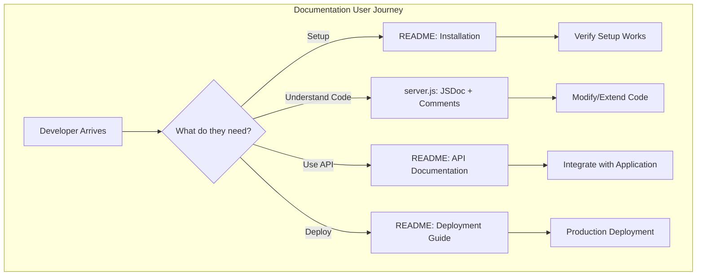

## 0.2 Documentation Discovery and Analysis

### 0.2.1 Existing Documentation Infrastructure Assessment

**Repository Analysis Findings**:

Repository analysis reveals a **minimal documentation infrastructure** with a single 2-line README.md file and zero documentation tooling configuration. The project currently has:
- No documentation generator (JSDoc, Sphinx, etc.)
- No documentation configuration files
- No dedicated documentation directory
- No inline JSDoc comments in source code

**Search Patterns Employed**:

| Pattern | Files Found | Status |
|---------|-------------|--------|
| README* | README.md | Minimal content (2 lines) |
| docs/** | None | Directory does not exist |
| *.md | README.md | Only file |
| *.mdx | None | Not used |
| *.rst | None | Not used |
| wiki/** | None | Not present |
| jsdoc.json | None | Not configured |
| .jsdoc.json | None | Not configured |
| mkdocs.yml | None | Not used |
| docusaurus.config.js | None | Not used |
| sphinx.conf.py | None | Not used |

**Current Documentation State**:

| Component | Current State | Assessment |
|-----------|---------------|------------|
| README.md | 2 lines: "# hao-backprop-test\ntest project for backprop integration. Do not touch!" | Needs complete replacement |
| server.js comments | Zero JSDoc annotations, zero inline comments | Needs full documentation |
| API documentation | None | Needs creation |
| Deployment documentation | None | Needs creation |
| package.json scripts | No documentation scripts | Needs "docs" script if JSDoc generation desired |

**Documentation Framework Assessment**:

| Aspect | Current | Recommended |
|--------|---------|-------------|
| Documentation Generator | None | JSDoc 4.0.5 (optional for HTML generation) |
| Configuration Location | N/A | jsdoc.json (if HTML docs needed) |
| API Documentation Tools | None | JSDoc inline annotations |
| Diagram Tools | None | Mermaid (for README diagrams) |
| Documentation Hosting | None | GitHub Pages (optional) |

### 0.2.2 Repository Code Analysis for Documentation

**Search Patterns Used for Code to Document**:

| Pattern | Target | Files Found |
|---------|--------|-------------|
| `*.js` | JavaScript files | server.js, server - Copy.js |
| `http.createServer` | HTTP server implementation | server.js:6-10 |
| `module.exports` / `exports` | Public module API | None (direct execution) |
| `const`/`let`/`var` declarations | Configuration constants | server.js:3-4 |
| Function definitions | Callback functions | server.js:6-10 (inline callback) |

**Key Directories Examined**:

| Directory | Contents | Documentation Relevance |
|-----------|----------|------------------------|
| `/` (root) | server.js, package.json, README.md | Primary documentation targets |
| `.git/` | Git version control | Not relevant |
| No `src/` | N/A | Flat structure project |
| No `lib/` | N/A | No library code |
| No `test/` | N/A | No test files (package.json confirms) |

**Source Code Documentation Analysis - server.js**:

```
Source: server.js (14 lines)
├── Line 1: require('http') - Module import, needs @requires
├── Lines 3-4: hostname/port constants - Need @constant documentation
├── Lines 6-10: createServer callback - Needs @callback/@function documentation
│   ├── req parameter - Needs @param {http.IncomingMessage}
│   └── res parameter - Needs @param {http.ServerResponse}
├── Lines 12-14: server.listen - Needs inline explanation
└── Console.log - Server startup message documentation
```

**Related Documentation Found**:
- package.json provides project metadata (name, version, description, author, license)
- No existing API documentation or usage examples
- No deployment or configuration documentation

### 0.2.3 Web Search Research Conducted

**Research Areas and Findings**:

| Research Topic | Key Findings | Application |
|----------------|--------------|-------------|
| JSDoc Best Practices | <cite index="1-19,1-20">"Be Descriptive but Concise: While it's important to be thorough, avoid overly verbose descriptions. Aim to provide clear, succinct explanations."</cite> | Apply to all JSDoc comments |
| JSDoc Tags | @file, @module, @constant, @param, @returns, @example, @see are essential tags | Use all relevant tags in server.js |
| README Structure | Project overview, installation, usage, API, deployment sections are standard | Structure README comprehensively |
| Node.js HTTP Module Docs | Core module documentation patterns | Reference official docs in JSDoc @see tags |
| Documentation Templates | docdash template recommended for JSDoc HTML output | Consider for future documentation generation |

**JSDoc Version Compatibility**:
- <cite index="11-5,11-6">"JSDoc supports stable versions of Node.js 12.0.0 and later. You can install JSDoc globally or in your project's node_modules folder."</cite>
- Current project Node.js compatibility: v20.20.0 ✓ (exceeds minimum requirement)

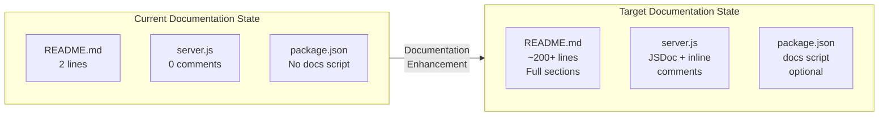

## 0.3 Documentation Scope Analysis

### 0.3.1 Code-to-Documentation Mapping

**Modules Requiring Documentation**:

| Module | Location | Public APIs | Current Documentation | Documentation Needed |
|--------|----------|-------------|----------------------|---------------------|
| HTTP Server Module | server.js | http.createServer callback | Missing | File-level JSDoc, function JSDoc, inline comments |
| Configuration | server.js:3-4 | hostname, port constants | Missing | @constant JSDoc annotations |
| Server Instance | server.js:6 | server variable | Missing | @type annotation |

**Detailed Module Analysis - server.js**:

```
Module: server.js
├── Public APIs:
│   ├── None (script designed for direct execution)
│   └── Server responds to all HTTP requests on port 3000
├── Current Documentation: Missing (0 comments)
├── Documentation Needed:
│   ├── @file - File-level description
│   ├── @module - Module identification
│   ├── @requires - http module dependency
│   ├── @constant hostname - Server hostname configuration
│   ├── @constant port - Server port configuration
│   ├── @type server - HTTP server instance
│   ├── Request handler callback documentation
│   │   ├── @param {http.IncomingMessage} req
│   │   └── @param {http.ServerResponse} res
│   ├── @example - Usage example
│   └── Inline comments for each code block
```

**Configuration Options Requiring Documentation**:

| Config Option | Location | Current Status | Documentation Needed |
|---------------|----------|----------------|---------------------|
| hostname | server.js:3 | `const hostname = '127.0.0.1'` | @constant with type {string}, description, localhost explanation |
| port | server.js:4 | `const port = 3000` | @constant with type {number}, description, port selection rationale |

**Features Requiring User Guides**:

| Feature | Current Coverage | Documentation Gaps |
|---------|-----------------|-------------------|
| Server Startup | None | Prerequisites, installation, run command, verification |
| HTTP Response | None | Endpoint documentation, response format, headers |
| Server Configuration | None | How to change hostname/port, environment variables (optional enhancement) |
| Error Handling | None | Common errors, troubleshooting steps |
| Deployment | None | Production deployment options, process managers, Docker |

### 0.3.2 Documentation Gap Analysis

Based on the requirements and repository analysis, documentation gaps include:

**Undocumented Public APIs**:

| API Element | Type | Gap Description |
|-------------|------|-----------------|
| HTTP GET / | Endpoint | No API documentation for the server's single endpoint |
| Request handler | Callback | No JSDoc for the createServer callback function |
| Response format | Output | No documentation of Content-Type, status code, body format |

**Missing User Guides**:

| Guide Type | Priority | Content Required |
|------------|----------|------------------|
| Quick Start | High | Installation and first run in under 5 minutes |
| Setup Instructions | High | Prerequisites, npm install, node server.js |
| API Reference | High | Endpoint documentation with examples |
| Deployment Guide | Medium | Production deployment strategies |
| Troubleshooting | Medium | Common issues and solutions |
| Contributing | Low | How to contribute (optional for test project) |

**Incomplete Architecture Documentation**:

| Area | Current State | Required Documentation |
|------|---------------|----------------------|
| System Overview | None | How the HTTP server works, request flow |
| Code Structure | None | File organization, module responsibilities |
| Data Flow | None | Request → Response lifecycle |

**Outdated Documentation**:

| File | Issue | Action Required |
|------|-------|-----------------|
| README.md | Contains only project name and warning | Complete replacement with comprehensive documentation |

### 0.3.3 Documentation Element Inventory

**Complete Inventory of Required Documentation Elements**:

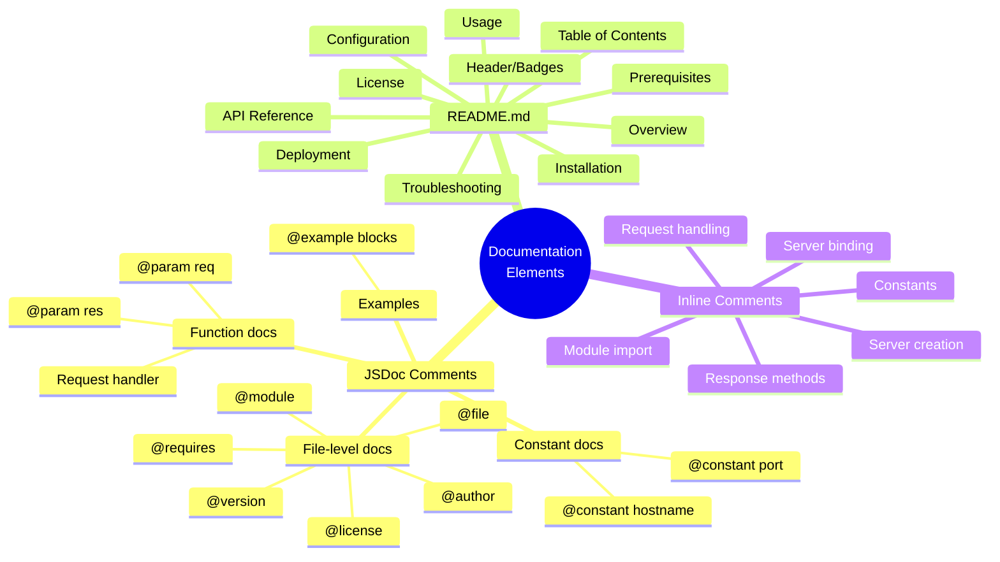

**Documentation Coverage Matrix**:

| Source File | Element | JSDoc Required | Inline Comment Required | README Section Required |
|-------------|---------|----------------|------------------------|------------------------|
| server.js:1 | `require('http')` | @requires | Yes - explain module import | Prerequisites |
| server.js:3 | `hostname` | @constant | Yes - explain localhost binding | Configuration |
| server.js:4 | `port` | @constant | Yes - explain port selection | Configuration |
| server.js:6-10 | `createServer callback` | @callback, @param x2 | Yes - explain request handling | API Reference |
| server.js:7 | `res.statusCode` | None | Yes - explain status code | API Reference |
| server.js:8 | `res.setHeader` | None | Yes - explain Content-Type | API Reference |
| server.js:9 | `res.end` | None | Yes - explain response body | API Reference |
| server.js:12-14 | `server.listen` | None | Yes - explain server binding | Usage |
| server.js:13 | `console.log` | None | Yes - explain startup message | Usage |

## 0.4 Documentation Implementation Design

### 0.4.1 Documentation Structure Planning

**Documentation Hierarchy**:

Since this is a minimal single-file project, documentation will follow a consolidated structure rather than a multi-directory documentation site:

```
Project Root/
├── README.md                    # Comprehensive documentation (all sections)
│   ├── Project Overview         # What the project is
│   ├── Quick Start              # 5-minute setup
│   ├── Prerequisites            # Node.js requirements
│   ├── Installation             # npm install steps
│   ├── Usage                    # How to run the server
│   ├── API Reference            # Endpoint documentation
│   ├── Configuration            # hostname/port settings
│   ├── Deployment               # Production deployment guide
│   ├── Troubleshooting          # Common issues
│   └── License                  # MIT license info
├── server.js                    # Source with JSDoc + inline comments
│   ├── File-level JSDoc block   # @file, @module, @requires
│   ├── Constant documentation   # @constant for hostname, port
│   ├── Server creation docs     # Request handler documentation
│   └── Inline explanations      # Line-by-line comments
└── package.json                 # Optional docs script addition
```

**README.md Detailed Structure**:

```
# Project Structure for README.md

#### Header Section

- Project title with badges (Node.js, npm, License)
- One-line description
- Status badges (optional)

#### Table of Contents

- Linked navigation to all sections

#### Overview

- Project purpose (Backprop integration test)
- Key features (minimal HTTP server)
- Technology stack (Node.js, http module)

#### Quick Start

- 3-step quick start guide
- Command examples

#### Prerequisites

- Node.js version requirements
- npm version requirements
- Verification commands

#### Installation

- Clone/download instructions
- npm install command
- Verification step

#### Usage

- Start server command
- Expected output
- Access instructions

#### API Reference

- Endpoint documentation
- Request/response format
- Status codes
- cURL examples

#### Configuration

- hostname constant
- port constant
- Modification instructions

#### Deployment

- Production considerations
- Process manager options (PM2)
- Docker containerization
- Reverse proxy setup

#### Troubleshooting

- Common issues and solutions
- Port conflicts
- Node.js version issues

#### License

- MIT license statement
```

### 0.4.2 Content Generation Strategy

**Information Extraction Approach**:

| Information Source | Extraction Method | Target Documentation |
|-------------------|-------------------|---------------------|
| server.js:1 | Parse require statement | Prerequisites, @requires tag |
| server.js:3-4 | Extract constant values | Configuration section, @constant tags |
| server.js:6-10 | Analyze callback signature | API Reference, @param tags |
| server.js:7-9 | Extract response details | API Reference (status, headers, body) |
| server.js:12-14 | Parse listen parameters | Usage section, inline comments |
| package.json | Extract metadata | Overview, License, version info |

**JSDoc Template for server.js**:

```javascript
/**
 * @file Hello World HTTP Server
 * @module server
 * @description [Description of the server module]
 * @requires http
 * @author hxu
 * @license MIT
 * @version 1.0.0
 */

/**
 * @constant {string} hostname
 * @description [Description of hostname]
 * @default '127.0.0.1'
 */

/**
 * @constant {number} port  
 * @description [Description of port]
 * @default 3000
 */

/**
 * HTTP Server instance
 * @type {http.Server}
 */

// Request handler callback documentation
/**
 * @param {http.IncomingMessage} req
 * @param {http.ServerResponse} res
 */
```

**Documentation Standards**:

| Standard | Specification | Example |
|----------|---------------|---------|
| JSDoc Format | `/** ... */` multi-line blocks | File-level, constant, function docs |
| Inline Comments | `//` single-line comments | Code explanation within blocks |
| Markdown Headers | # through #### | README structure |
| Code Examples | Triple backticks with language | \`\`\`javascript ... \`\`\` |
| Tables | Pipe-delimited markdown | Configuration, API reference |
| Links | `[text](url)` | External references |

### 0.4.3 Diagram and Visual Strategy

**Mermaid Diagrams to Create**:

| Diagram Type | Purpose | Location |
|--------------|---------|----------|
| Sequence Diagram | Request/Response flow | README.md - API Reference |
| Flowchart | Server startup process | README.md - Usage |
| Architecture Diagram | Simple system overview | README.md - Overview |

**Request/Response Flow Diagram**:

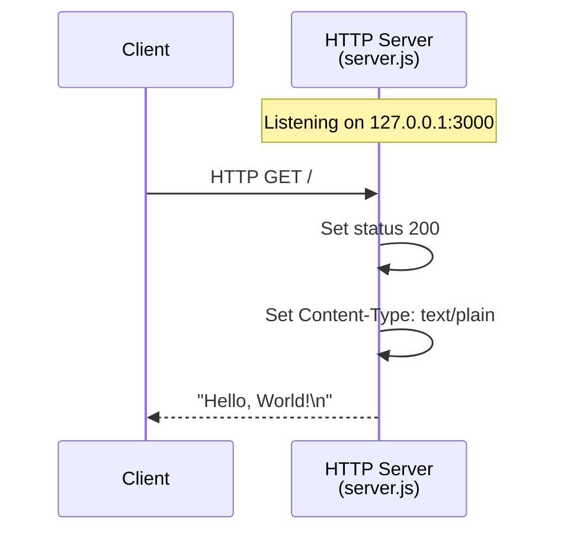

**Server Startup Flow**:

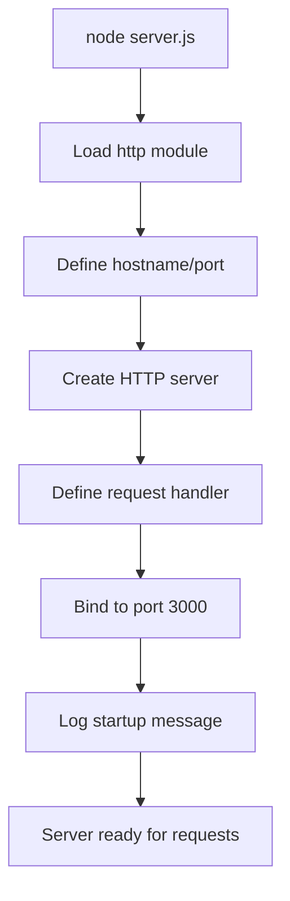

### 0.4.4 Source Citation Standards

All documentation must include source citations for traceability:

| Citation Type | Format | Example |
|---------------|--------|---------|
| File Reference | `Source: /path/to/file.js` | Source: server.js |
| Line Reference | `Source: /path/to/file.js:LineNumber` | Source: server.js:6-10 |
| External Reference | `See: [URL]` | See: https://nodejs.org/api/http.html |
| Package Reference | `Package: name@version` | Package: hello_world@1.0.0 |

**Source Citations for This Documentation**:

| Documentation Element | Primary Source | Supporting Sources |
|----------------------|----------------|-------------------|
| Server implementation | server.js | Node.js http module docs |
| Project metadata | package.json | README.md (project name) |
| Configuration values | server.js:3-4 | None |
| Request handler | server.js:6-10 | http.IncomingMessage, http.ServerResponse docs |
| License | package.json | MIT license text |

## 0.5 Documentation File Transformation Mapping

### 0.5.1 File-by-File Documentation Plan

**Documentation Transformation Modes**:
- **CREATE** - Create a new documentation file
- **UPDATE** - Update an existing documentation file  
- **DELETE** - Remove an obsolete documentation file
- **REFERENCE** - Use as an example for documentation style and structure

**Complete Documentation Transformation Map**:

| Target Documentation File | Transformation | Source Code/Docs | Content/Changes |
|---------------------------|----------------|------------------|-----------------|
| server.js | UPDATE | server.js | Add comprehensive JSDoc comments (@file, @module, @requires, @constant, @param) and inline code explanations for every line |
| README.md | UPDATE | README.md, server.js, package.json | Complete replacement with comprehensive documentation including Overview, Quick Start, Prerequisites, Installation, Usage, API Reference, Configuration, Deployment, Troubleshooting, License sections |
| package.json | UPDATE | package.json | Add optional "docs" script for JSDoc HTML generation: `"docs": "jsdoc server.js -d docs"` |
| jsdoc.json | CREATE | N/A | Create JSDoc configuration file for consistent documentation generation (optional) |

### 0.5.2 New Documentation Files Detail

**File: jsdoc.json (Optional)**

```
File: jsdoc.json
Type: Configuration
Source Code: N/A (new configuration)
Purpose: JSDoc generator configuration for HTML documentation output
Sections:
    - source: Include patterns for JavaScript files
    - opts: Output destination and template settings
    - plugins: Markdown plugin for enhanced formatting
    - templates: Default configuration options
Key Configuration:
    {
      "source": {
        "include": ["server.js"],
        "includePattern": ".+\\.js$"
      },
      "opts": {
        "destination": "./docs/",
        "readme": "./README.md"
      }
    }
Note: This file is optional - JSDoc comments provide value without HTML generation
```

### 0.5.3 Documentation Files to Update Detail

**File: server.js - Add JSDoc Comments and Inline Explanations**

| Line(s) | Current Content | Documentation to Add |
|---------|-----------------|---------------------|
| 1 (before) | N/A | File-level JSDoc block: @file, @module, @description, @requires, @author, @license, @version |
| 1 | `const http = require('http');` | Inline comment: Import Node.js built-in HTTP module |
| 3 | `const hostname = '127.0.0.1';` | JSDoc @constant block + inline comment explaining localhost binding |
| 4 | `const port = 3000;` | JSDoc @constant block + inline comment explaining port selection |
| 6 | `const server = http.createServer((req, res) => {` | JSDoc block for server instance + callback documentation with @param tags |
| 7 | `res.statusCode = 200;` | Inline comment: Set HTTP success status code |
| 8 | `res.setHeader('Content-Type', 'text/plain');` | Inline comment: Set response content type header |
| 9 | `res.end('Hello, World!\n');` | Inline comment: Send response body and end request |
| 10 | `});` | Inline comment: End of request handler callback |
| 12 | `server.listen(port, hostname, () => {` | Inline comment: Start listening for connections |
| 13 | `console.log(\`Server running...\`);` | Inline comment: Log server startup confirmation |
| 14 | `});` | Inline comment: End of listen callback |

**Expected server.js After Documentation**:

```javascript
// Line count increase: 14 → ~45 lines (with documentation)
// JSDoc blocks: 4 (file-level, hostname, port, server/callback)
// Inline comments: 10+ (every code line explained)
```

**File: README.md - Complete Replacement**

| Section | Content Type | Source | Details |
|---------|--------------|--------|---------|
| Title & Badges | Header | package.json | Project name, version, license badge, Node.js badge |
| Table of Contents | Navigation | Generated | Links to all sections |
| Overview | Description | package.json, README.md | Project purpose, features, tech stack |
| Quick Start | Guide | server.js | 3-step quick start with commands |
| Prerequisites | Requirements | N/A | Node.js 12+, npm 7+, verification commands |
| Installation | Guide | package.json | git clone, npm install steps |
| Usage | Guide | server.js:12-14 | node server.js command, expected output, access URL |
| API Reference | Documentation | server.js:6-10 | Endpoint, method, request, response, status codes, examples |
| Configuration | Reference | server.js:3-4 | hostname and port constants, modification instructions |
| Deployment | Guide | N/A | Production considerations, PM2, Docker, nginx |
| Troubleshooting | Support | N/A | Common issues (port conflicts, Node version, EADDRINUSE) |
| License | Legal | package.json | MIT license statement |

**README.md Transformation Summary**:

| Metric | Before | After |
|--------|--------|-------|
| Lines | 2 | ~200+ |
| Sections | 0 | 12 |
| Code Examples | 0 | 5+ |
| Diagrams | 0 | 2 (Mermaid) |
| Tables | 0 | 3+ |
| Links | 0 | 5+ |

**File: package.json - Add Documentation Script (Optional)**

| Field | Current | Proposed Addition |
|-------|---------|-------------------|
| scripts.docs | N/A | `"docs": "jsdoc server.js -d docs -R README.md"` |
| scripts.docs:open | N/A | `"docs:open": "npm run docs && open docs/index.html"` (macOS) |

### 0.5.4 Documentation Configuration Updates

**No existing documentation configuration files require updates** (none exist).

**New Configuration (Optional)**:

| File | Purpose | Priority |
|------|---------|----------|
| jsdoc.json | JSDoc generator settings | Low (optional) |
| .jsdocrc | Alternative JSDoc config | Low (optional) |

### 0.5.5 Cross-Documentation Dependencies

**Shared Content/Includes**:

| Content | Used In | Consistency Requirement |
|---------|---------|------------------------|
| Project name (hello_world) | README.md, package.json, server.js JSDoc | Must match package.json |
| Version (1.0.0) | README.md, package.json, server.js JSDoc | Must match package.json |
| License (MIT) | README.md, package.json, server.js JSDoc | Must match package.json |
| Author (hxu) | README.md, package.json, server.js JSDoc | Must match package.json |
| hostname (127.0.0.1) | README.md, server.js | Must match server.js:3 |
| port (3000) | README.md, server.js | Must match server.js:4 |

**Navigation Links Between Documents**:

| From | To | Link Purpose |
|------|---|--------------|
| README.md | Node.js http docs | External reference |
| README.md | server.js (GitHub) | Source code link |
| server.js JSDoc @see | Node.js http.createServer | API documentation reference |
| server.js JSDoc @see | Node.js http.IncomingMessage | Type reference |
| server.js JSDoc @see | Node.js http.ServerResponse | Type reference |

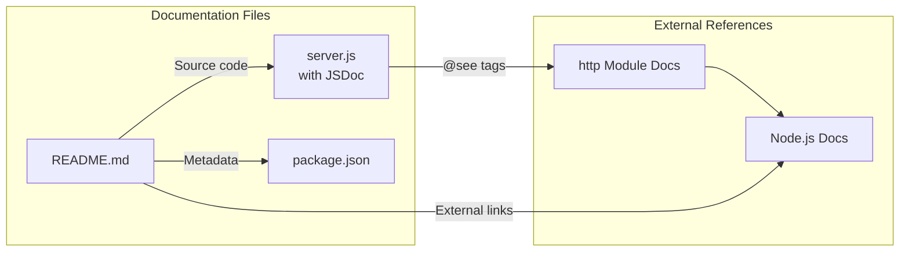

## 0.6 Dependency Inventory

### 0.6.1 Documentation Dependencies

**Primary Documentation Tools**:

| Registry | Package Name | Version | Purpose |
|----------|--------------|---------|---------|
| npm | jsdoc | 4.0.5 | JavaScript API documentation generator - generates HTML docs from JSDoc comments |
| npm | docdash | 2.0.2 | Clean, responsive JSDoc template with navigation and syntax highlighting (optional) |
| Built-in | Markdown | N/A | README.md formatting - no package required |
| Built-in | Mermaid | N/A | Diagrams rendered by GitHub/documentation platforms |

**Note**: All documentation tools are **optional** for this project. JSDoc comments provide value directly in the source code and are recognized by IDEs like VS Code without requiring HTML generation. The packages above are only needed if HTML documentation generation is desired.

**Current Project Dependencies (from package.json)**:

| Dependency Type | Count | Status |
|-----------------|-------|--------|
| dependencies | 0 | Zero dependencies - no changes needed |
| devDependencies | 0 | Optional: Add jsdoc for HTML generation |
| peerDependencies | 0 | None |
| optionalDependencies | 0 | None |

**Optional devDependencies for Documentation Generation**:

If HTML documentation generation is desired, the following devDependencies can be added:

| Registry | Package Name | Version | Purpose | Required |
|----------|--------------|---------|---------|----------|
| npm | jsdoc | ^4.0.5 | Generate HTML documentation from JSDoc comments | Optional |
| npm | docdash | ^2.0.2 | Modern JSDoc template | Optional |
| npm | jsdoc-to-markdown | ^8.0.1 | Generate Markdown from JSDoc (alternative) | Optional |

**Runtime Requirements**:

| Requirement | Version | Source | Documentation |
|-------------|---------|--------|--------------|
| Node.js | ≥12.0.0 | JSDoc requirement | Prerequisites section |
| Node.js | ≥20.x | Current environment | Compatible |
| npm | ≥7.0.0 | lockfileVersion 3 | Prerequisites section |

### 0.6.2 Documentation Reference Updates

**Documentation Files Requiring Link Updates**: None (new documentation)

**External Documentation Links to Include**:

| Link Target | URL | Used In |
|-------------|-----|---------|
| Node.js Documentation | https://nodejs.org/docs/ | README.md Prerequisites |
| Node.js http Module | https://nodejs.org/api/http.html | README.md API Reference, server.js @see |
| http.createServer | https://nodejs.org/api/http.html#httpcreateserveroptions-requestlistener | server.js @see |
| http.IncomingMessage | https://nodejs.org/api/http.html#class-httpincomingmessage | server.js @see |
| http.ServerResponse | https://nodejs.org/api/http.html#class-httpserverresponse | server.js @see |
| npm Documentation | https://docs.npmjs.com/ | README.md Installation |
| JSDoc Documentation | https://jsdoc.app/ | README.md (optional reference) |
| MIT License | https://opensource.org/licenses/MIT | README.md License |

### 0.6.3 Version Compatibility Matrix

| Component | Minimum Version | Recommended Version | Maximum Tested |
|-----------|-----------------|---------------------|----------------|
| Node.js | 12.0.0 | 20.x LTS | 20.20.0 |
| npm | 7.0.0 | 10.x+ | 11.1.0 |
| JSDoc (if used) | 4.0.0 | 4.0.5 | 4.0.5 |

**Documentation Generation Commands** (if JSDoc is installed):

```bash
# Generate HTML documentation

npx jsdoc server.js -d docs -R README.md

#### With docdash template

npx jsdoc server.js -d docs -R README.md -t node_modules/docdash

#### Using package.json scripts (if added)

npm run docs
```

### 0.6.4 Zero-Dependency Documentation Strategy

Given the project's explicit **zero-dependency philosophy** (confirmed by package.json and package-lock.json analysis), the recommended approach is:

**Primary Approach (No New Dependencies)**:
- Add JSDoc comments directly to server.js - works without any packages
- Update README.md with comprehensive Markdown documentation
- Diagrams use Mermaid syntax - rendered natively by GitHub

**Benefits**:
- Maintains project's minimal footprint
- No npm install changes required
- IDE integration (VS Code, WebStorm) automatically parses JSDoc
- GitHub renders Mermaid diagrams without external tools

**Secondary Approach (Optional Enhancement)**:
- Add jsdoc as devDependency for HTML documentation generation
- Add documentation build scripts to package.json
- Suitable if standalone HTML documentation site is desired

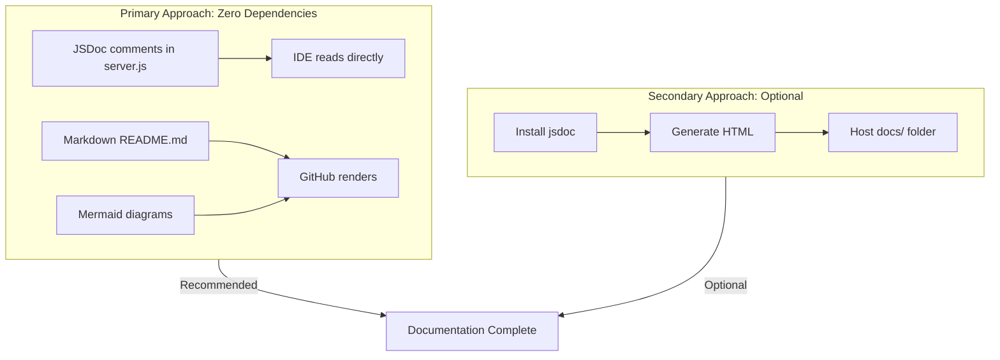

## 0.7 Coverage and Quality Targets

### 0.7.1 Documentation Coverage Metrics

**Current Coverage Analysis**:

| Coverage Category | Documented | Total | Percentage |
|-------------------|------------|-------|------------|
| Public APIs (HTTP endpoints) | 0 | 1 | 0% |
| Constants documented | 0 | 2 | 0% |
| Functions documented | 0 | 1 | 0% |
| File-level documentation | 0 | 1 | 0% |
| README sections | 1 (minimal) | 12 (target) | 8% |
| Inline code comments | 0 | 14 lines | 0% |

**Target Coverage**: 100% based on comprehensive documentation requirement

**Coverage Targets by Category**:

| Category | Current | Target | Gap |
|----------|---------|--------|-----|
| server.js JSDoc coverage | 0% | 100% | All constants, functions, file-level docs |
| server.js inline comments | 0% | 100% | Every code block explained |
| README.md sections | 8% | 100% | 11 new sections required |
| API documentation | 0% | 100% | Endpoint, request, response, examples |
| Configuration documentation | 0% | 100% | hostname, port, modification guide |
| Deployment documentation | 0% | 100% | Production deployment guide |

**Detailed Coverage Breakdown**:

| Source Element | Coverage Target | Specific Requirements |
|----------------|-----------------|----------------------|
| server.js file | 100% | @file, @module, @requires, @author, @license, @version |
| hostname constant | 100% | @constant, @type, @description, @default |
| port constant | 100% | @constant, @type, @description, @default |
| createServer callback | 100% | Function description, @param req, @param res |
| HTTP response handling | 100% | Inline comments for statusCode, setHeader, end |
| server.listen call | 100% | Inline comment explaining binding |
| Console output | 100% | Inline comment explaining startup message |

### 0.7.2 Documentation Quality Criteria

**Completeness Requirements**:

| Requirement | Criteria | Validation Method |
|-------------|----------|-------------------|
| All public APIs documented | HTTP endpoint has description, parameters, response | Manual review |
| All constants documented | @constant tag with type, description, default value | JSDoc parser validation |
| All functions documented | Function purpose, @param for each parameter | JSDoc parser validation |
| User guides complete | Setup, usage, and troubleshooting sections present | Section checklist |
| Examples included | At least 1 example per major feature | Example count |

**Accuracy Validation**:

| Validation Area | Method | Acceptance Criteria |
|-----------------|--------|---------------------|
| Code examples | Manual execution | All examples must run without errors |
| API documentation | Compare with server.js | Response format, status codes match implementation |
| Configuration values | Compare with server.js:3-4 | hostname='127.0.0.1', port=3000 |
| Package metadata | Compare with package.json | name, version, author, license match |
| Node.js version requirements | Test execution | Server runs on documented Node.js versions |

**Clarity Standards**:

| Standard | Specification | Example |
|----------|---------------|---------|
| Technical accuracy | Use correct terminology | "HTTP server" not "web server" |
| Accessible language | Explain technical concepts | "localhost (127.0.0.1) - the local computer" |
| Progressive disclosure | Simple → Complex | Quick Start before detailed Deployment |
| Consistent terminology | Same terms throughout | "server" not alternating with "service" |
| Actionable instructions | Step-by-step commands | "Run: `node server.js`" |

**Maintainability Standards**:

| Standard | Implementation | Purpose |
|----------|----------------|---------|
| Source citations | `Source: server.js:6` | Traceability to source code |
| Version tagging | @version in JSDoc | Track documentation version |
| Clear structure | Consistent heading levels | Easy navigation and updates |
| Modular sections | Independent README sections | Update individual sections |

### 0.7.3 Example and Diagram Requirements

**Minimum Examples per Feature**:

| Feature | Minimum Examples | Example Types |
|---------|------------------|---------------|
| Server startup | 2 | Command line, expected output |
| HTTP endpoint | 3 | cURL, browser, Node.js fetch |
| Configuration | 1 | How to change port/hostname |
| Deployment | 2 | PM2, Docker |
| Troubleshooting | 3 | Common error scenarios |

**Required Diagrams**:

| Diagram | Type | Location | Purpose |
|---------|------|----------|---------|
| Request/Response Flow | Sequence | README.md API Reference | Show HTTP request lifecycle |
| Server Startup Flow | Flowchart | README.md Usage | Show initialization process |
| Architecture Overview | Simple Block | README.md Overview | Show system components |

**Code Example Validation**:

| Example | Validation Method | Expected Result |
|---------|-------------------|-----------------|
| `node server.js` | Execute command | "Server running at http://127.0.0.1:3000/" |
| `curl http://127.0.0.1:3000` | Execute with server running | "Hello, World!" |
| Browser access | Navigate to URL | Display "Hello, World!" |

### 0.7.4 Quality Assurance Checklist

**Pre-Completion Checklist**:

| Category | Checkpoint | Status Target |
|----------|------------|---------------|
| **JSDoc** | @file block present | ✓ Required |
| **JSDoc** | All constants have @constant | ✓ Required |
| **JSDoc** | Request handler has @param tags | ✓ Required |
| **JSDoc** | @example block included | ✓ Required |
| **Inline** | Every code line has explanation | ✓ Required |
| **README** | All 12 sections present | ✓ Required |
| **README** | Table of Contents complete | ✓ Required |
| **README** | All code examples tested | ✓ Required |
| **README** | Mermaid diagrams render correctly | ✓ Required |
| **Consistency** | Metadata matches package.json | ✓ Required |
| **Accuracy** | Configuration values match server.js | ✓ Required |
| **Links** | All external links valid | ✓ Required |

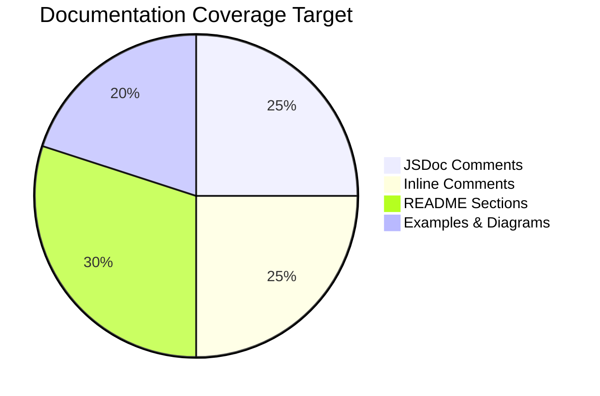

## 0.8 Scope Boundaries

### 0.8.1 Exhaustively In Scope

**Documentation Files to Create/Update**:

| Target | Transformation | Description |
|--------|----------------|-------------|
| server.js | UPDATE | Add JSDoc comments and inline code explanations |
| README.md | UPDATE | Complete replacement with comprehensive documentation |
| package.json | UPDATE (Optional) | Add documentation scripts |
| jsdoc.json | CREATE (Optional) | JSDoc configuration file |

**Documentation Content In Scope**:

| Content Category | Specific Elements |
|------------------|-------------------|
| **JSDoc Annotations** | @file, @module, @description, @requires, @author, @license, @version, @constant, @type, @param, @returns, @example, @see |
| **Inline Comments** | Module import explanation, constant explanations, server creation explanation, request handler explanations, response method explanations, listen callback explanation |
| **README Sections** | Header/badges, Table of Contents, Overview, Quick Start, Prerequisites, Installation, Usage, API Reference, Configuration, Deployment, Troubleshooting, License |
| **Code Examples** | Server start command, cURL requests, browser access, PM2 deployment, Docker deployment |
| **Diagrams** | Request/response sequence diagram, server startup flowchart |

**File Patterns In Scope**:

| Pattern | Purpose |
|---------|---------|
| server.js | Primary source file requiring JSDoc + inline comments |
| README.md | Primary documentation file |
| package.json | Optional script additions only |
| jsdoc.json | Optional configuration (if HTML generation desired) |
| *.md | Any new Markdown documentation files |

**Documentation Assets In Scope**:

| Asset Type | Scope |
|------------|-------|
| Mermaid diagrams | Embedded in README.md |
| Code snippets | Embedded in README.md and server.js |
| Tables | Embedded in README.md |
| Badges | Header of README.md |

### 0.8.2 Explicitly Out of Scope

**Source Code Modifications NOT In Scope**:

| Exclusion | Reason |
|-----------|--------|
| Adding new functionality to server.js | Documentation task only |
| Refactoring server.js logic | Documentation task only |
| Fixing package.json main entry (index.js → server.js) | Out of scope for documentation |
| Adding test files | Documentation task only |
| Adding .gitignore or other config files | Not documentation |

**Files Explicitly Out of Scope**:

| File | Reason |
|------|--------|
| server - Copy.js | Duplicate/backup file, not a documentation target |
| LoginTest.java | Java file, not relevant to Node.js documentation |
| LoginTest - Copy.java | Duplicate Java file |
| industry.csv | Data file, not relevant to documentation task |
| industry - Copy.csv | Duplicate data file |
| test.py.txt, test.py - Copy.txt, test.txt.txt | Empty placeholder files |
| *.pdf, *.jpg, *.doc | Binary files, not documentation scope |
| .git/** | Git version control, not documentation |

**Documentation NOT In Scope**:

| Exclusion | Reason |
|-----------|--------|
| Generating HTML documentation site | Optional enhancement, not required |
| Setting up documentation hosting (GitHub Pages) | Beyond documentation content creation |
| Creating automated documentation CI/CD | Beyond documentation content creation |
| Documenting Java test files | Different language, not in scope |
| Documenting CSV data file | Reference data, not code documentation |
| Creating API specification (OpenAPI/Swagger) | Beyond scope for simple HTTP server |

**Feature Additions NOT In Scope**:

| Exclusion | Reason |
|-----------|--------|
| Adding routing to server.js | Would require code changes |
| Adding request logging | Would require code changes |
| Adding error handling middleware | Would require code changes |
| Adding environment variable support | Would require code changes |
| Adding HTTPS/TLS support | Would require code changes |

### 0.8.3 Scope Boundary Diagram

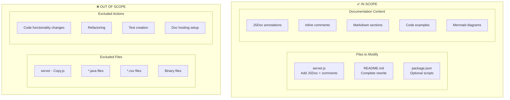

### 0.8.4 Scope Decision Matrix

| Item | In Scope? | Rationale |
|------|-----------|-----------|
| JSDoc comments for server.js | ✅ Yes | Explicitly requested |
| Inline code explanations | ✅ Yes | Explicitly requested |
| README with setup instructions | ✅ Yes | Explicitly requested |
| API documentation | ✅ Yes | Explicitly requested |
| Deployment guide | ✅ Yes | Explicitly requested |
| package.json docs script | ⚠️ Optional | Enhances workflow but not required |
| jsdoc.json configuration | ⚠️ Optional | Only if HTML generation desired |
| HTML documentation generation | ❌ No | Not requested, optional enhancement |
| Source code functionality changes | ❌ No | Documentation task only |
| Documenting duplicate files | ❌ No | Not primary source files |
| Documenting non-JS files | ❌ No | Outside JavaScript documentation scope |
| CI/CD for documentation | ❌ No | Beyond content creation scope |

## 0.9 Execution Parameters

### 0.9.1 Documentation-Specific Instructions

**Documentation Build Commands**:

| Command | Purpose | When to Use |
|---------|---------|-------------|
| `node server.js` | Verify server works for documentation accuracy | Before finalizing examples |
| `curl http://127.0.0.1:3000` | Test endpoint for API documentation | Verify response format |
| `npx jsdoc server.js -d docs` | Generate HTML documentation (optional) | If HTML docs desired |
| `npx jsdoc server.js -d docs -R README.md` | Generate HTML with README (optional) | Include README in HTML docs |

**Documentation Preview Commands**:

| Command | Purpose | Platform |
|---------|---------|----------|
| `cat README.md` | View Markdown source | All |
| `grip README.md` | Preview GitHub-flavored Markdown | Requires grip installed |
| `open docs/index.html` | Open generated HTML docs | macOS |
| `xdg-open docs/index.html` | Open generated HTML docs | Linux |
| `start docs/index.html` | Open generated HTML docs | Windows |

**Diagram Generation**:
- No generation command needed - Mermaid diagrams are embedded directly in README.md
- GitHub and documentation platforms render Mermaid automatically
- For local preview: use VS Code with Mermaid extension or online Mermaid live editor

**Documentation Validation Commands**:

| Command | Purpose | Expected Result |
|---------|---------|-----------------|
| `node --check server.js` | Verify JS syntax after adding comments | No output (success) |
| `npx jsdoc -X server.js` | Validate JSDoc parsing (outputs JSON) | Valid JSON output |
| `grep -c "@" server.js` | Count JSDoc annotations | Should be >10 |

### 0.9.2 Default Documentation Format

**Primary Format Specifications**:

| Aspect | Format | Rationale |
|--------|--------|-----------|
| Documentation files | Markdown (.md) | Universal compatibility, GitHub native |
| Inline documentation | JSDoc comments | IDE integration, industry standard |
| Diagrams | Mermaid | GitHub native rendering, no external tools |
| Code examples | Fenced code blocks | Syntax highlighting support |
| Tables | Markdown tables | Clean presentation |

**JSDoc Style Guide**:

```javascript
// File-level documentation
/**
 * @file Brief description of file purpose
 * @module moduleName
 * @requires dependency
 * @author Author Name
 * @license MIT
 * @version 1.0.0
 */

// Constant documentation
/**
 * Brief description of the constant
 * @constant {type}
 * @default defaultValue
 */
const CONSTANT_NAME = value;

// Function documentation
/**
 * Brief description of what the function does
 * @param {type} paramName - Description of parameter
 * @returns {type} Description of return value
 * @example
 * // Example usage
 * functionName(arg);
 */
```

**Markdown Style Guide**:

```
# Main Title (H1 - once per document)

#### Section Header (H2)

#### Subsection Header (H3)

- Bullet points for lists
1. Numbered lists for sequences

| Column 1 | Column 2 |
|----------|----------|
| Data     | Data     |

\`\`\`javascript
// Code blocks with language
\`\`\`

\`\`\`mermaid
graph LR
    A --> B
\`\`\`
```

### 0.9.3 Citation Requirements

**Citation Format**:

| Citation Type | Format | Example |
|---------------|--------|---------|
| Source file | `Source: filename:line` | Source: server.js:6 |
| File range | `Source: filename:start-end` | Source: server.js:6-10 |
| Package reference | `Package: name@version` | Package: hello_world@1.0.0 |
| External reference | `See: URL` | See: https://nodejs.org/api/http.html |
| JSDoc @see tag | `@see {@link URL}` | @see {@link https://nodejs.org/api/http.html} |

**Required Citations in Documentation**:

| Documentation Element | Required Citation |
|----------------------|-------------------|
| Server implementation description | Source: server.js |
| Configuration values | Source: server.js:3-4 |
| API response format | Source: server.js:7-9 |
| Project metadata | Source: package.json |
| Node.js http module | See: https://nodejs.org/api/http.html |

### 0.9.4 Documentation Workflow

**Recommended Implementation Order**:

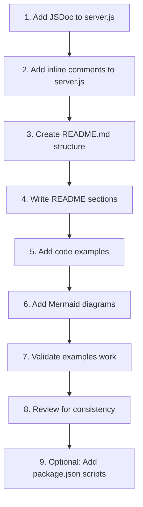

**Step-by-Step Instructions**:

| Step | Action | Files Modified |
|------|--------|----------------|
| 1 | Add file-level JSDoc block | server.js |
| 2 | Add @constant JSDoc for hostname and port | server.js |
| 3 | Add callback/function JSDoc documentation | server.js |
| 4 | Add inline comments for every code line | server.js |
| 5 | Create README.md with full section structure | README.md |
| 6 | Write Overview, Quick Start, Prerequisites | README.md |
| 7 | Write Installation, Usage, API Reference | README.md |
| 8 | Write Configuration, Deployment, Troubleshooting | README.md |
| 9 | Add Mermaid diagrams | README.md |
| 10 | Test all code examples | Manual verification |
| 11 | Add optional docs script | package.json |
| 12 | Final consistency review | All files |

## 0.10 Rules for Documentation

### 0.10.1 User-Specified Documentation Rules

Based on the user's requirements, the following documentation rules apply:

**Explicit Requirements**:

| Rule | Requirement | Implementation |
|------|-------------|----------------|
| JSDoc Comments | Add JSDoc comments to server.js functions | Every function, constant, and module must have JSDoc |
| Comprehensive README | Create comprehensive README | Include all 12 standard sections |
| Setup Instructions | Include setup instructions | Prerequisites, installation, verification steps |
| API Documentation | Include API documentation | Endpoint, request, response, examples |
| Deployment Guide | Include deployment guide | Production deployment options |
| Inline Code Explanations | Include inline code explanations | Comment every code block |

### 0.10.2 Derived Documentation Standards

**JSDoc Standards**:

| Standard | Rule | Rationale |
|----------|------|-----------|
| File-level docs | Every JavaScript file MUST have @file, @module | Establishes file purpose |
| Constants | Every constant MUST have @constant with @type and @default | Clarifies configuration |
| Functions | Every function MUST have description, @param for each parameter | API clarity |
| Examples | At least one @example block per documented function | Demonstrates usage |
| References | Use @see for external documentation links | Connects to authoritative sources |

**README Standards**:

| Standard | Rule | Rationale |
|----------|------|-----------|
| Structure | MUST include Table of Contents | Easy navigation |
| Quick Start | MUST be under 5 steps | Immediate usability |
| Examples | MUST include working code examples | Verifiable instructions |
| Diagrams | MUST include visual representations | Enhanced understanding |
| Troubleshooting | MUST address common issues | User support |

**Inline Comment Standards**:

| Standard | Rule | Rationale |
|----------|------|-----------|
| Coverage | Every code block MUST have explanation | Complete understanding |
| Clarity | Comments MUST explain "why", not just "what" | Deeper insight |
| Accuracy | Comments MUST match code behavior | Trustworthy documentation |
| Conciseness | Comments SHOULD be one line where possible | Readability |

### 0.10.3 Quality Enforcement Rules

**Must-Have Rules**:

| Category | Rule | Validation |
|----------|------|------------|
| **Completeness** | All public APIs documented | JSDoc parser success |
| **Completeness** | All README sections present | Section checklist |
| **Accuracy** | Code examples must execute successfully | Manual testing |
| **Accuracy** | Configuration values match source code | Comparison check |
| **Consistency** | Metadata matches package.json | Comparison check |
| **Consistency** | Terminology consistent throughout | Manual review |

**Prohibited Actions**:

| Prohibition | Reason |
|-------------|--------|
| Do NOT modify server.js functionality | Documentation task only |
| Do NOT add runtime dependencies | Maintain zero-dependency philosophy |
| Do NOT remove existing code | Only add documentation |
| Do NOT use placeholder text | All content must be complete |
| Do NOT leave sections as "TODO" | All sections fully written |

### 0.10.4 Format and Style Rules

**Markdown Formatting**:

| Rule | Specification |
|------|---------------|
| Headers | Use # for H1 (once), ## for sections, ### for subsections |
| Code blocks | Use triple backticks with language identifier |
| Tables | Use pipe-delimited tables for structured data |
| Lists | Use - for unordered, 1. for ordered lists |
| Links | Use `[text](url)` format |
| Emphasis | Use **bold** for important terms, `code` for inline code |

**JSDoc Formatting**:

| Rule | Specification |
|------|---------------|
| Block start | `/**` on its own line |
| Description | First line(s) after opening |
| Tags | One tag per line, @tag followed by space |
| Block end | ` */` on its own line |
| Placement | Immediately before documented element |

**Code Example Formatting**:

| Rule | Specification |
|------|---------------|
| Language tag | Always specify language after opening backticks |
| Comments | Include explanatory comments within examples |
| Complete | Examples should be runnable as-is |
| Output | Show expected output in comments or separate block |

### 0.10.5 Maintenance and Traceability Rules

**Traceability Requirements**:

| Requirement | Implementation |
|-------------|----------------|
| Source citations | Every technical claim cites source file and line |
| Version tracking | @version tag in JSDoc matches package.json |
| Author attribution | @author tag matches package.json author |
| License declaration | @license tag matches package.json license |

**Future Maintenance Considerations**:

| Consideration | Implementation |
|---------------|----------------|
| Update triggers | Document when updates needed (code changes) |
| Section independence | Each section updatable independently |
| Example validation | Include commands to verify examples |
| Link checking | Use relative links where possible |

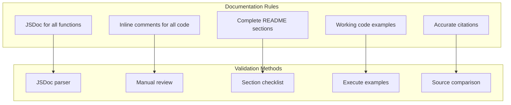

## 0.11 References

### 0.11.1 Repository Files Analyzed

**Primary Source Files**:

| File Path | Purpose | Key Information Extracted |
|-----------|---------|---------------------------|
| server.js | Main HTTP server implementation | 14 lines, creates http.Server, listens on 127.0.0.1:3000, returns "Hello, World!" |
| README.md | Current documentation | 2 lines only: "# hao-backprop-test" and warning message |
| package.json | Package configuration | name: hello_world, version: 1.0.0, author: hxu, license: MIT, zero dependencies |
| package-lock.json | Dependency lock file | lockfileVersion: 3, confirms zero dependencies |

**Secondary Files Examined**:

| File Path | Purpose | Relevance |
|-----------|---------|-----------|
| server - Copy.js | Backup of server.js | Confirmed identical content, excluded from documentation scope |
| LoginTest.java | Java test stub | Out of scope - different language |
| LoginTest - Copy.java | Duplicate Java file | Out of scope |
| industry.csv | Reference data | Out of scope - data file |
| industry - Copy.csv | Duplicate data | Out of scope |
| test.py.txt | Empty placeholder | Out of scope |
| test.py - Copy.txt | Empty placeholder | Out of scope |
| test.txt.txt | Empty placeholder | Out of scope |

**Directories Searched**:

| Directory | Contents Found | Documentation Relevance |
|-----------|----------------|------------------------|
| / (repository root) | All project files | Primary documentation targets |
| .git/ | Git version control | Not relevant to documentation content |

### 0.11.2 External Research Sources

**Web Search Research Conducted**:

| Topic | Source | Key Findings |
|-------|--------|--------------|
| JSDoc Latest Version | npmjs.com/package/jsdoc | Version 4.0.5, supports Node.js 12+ |
| JSDoc Best Practices | pullrequest.com | Document as you code, be descriptive but concise |
| JSDoc Official Docs | jsdoc.app | Comment format /** */, tag syntax, getting started |
| README Best Practices | deno.com/blog | README answers "why", docs answer "how" |
| JSDoc Configuration | dev.to | Configuration file options, exclude patterns |

**External Documentation References**:

| Reference | URL | Purpose |
|-----------|-----|---------|
| Node.js http Module | https://nodejs.org/api/http.html | Official API documentation reference |
| http.createServer | https://nodejs.org/api/http.html#httpcreateserveroptions-requestlistener | Function documentation |
| http.IncomingMessage | https://nodejs.org/api/http.html#class-httpincomingmessage | Request object type |
| http.ServerResponse | https://nodejs.org/api/http.html#class-httpserverresponse | Response object type |
| JSDoc Documentation | https://jsdoc.app/ | Official JSDoc reference |
| MIT License | https://opensource.org/licenses/MIT | License text reference |
| npm Documentation | https://docs.npmjs.com/ | Package management reference |

### 0.11.3 Technical Specification Sections Consulted

| Section | Information Retrieved |
|---------|----------------------|
| 1.1 Executive Summary | Project overview, stakeholders, purpose as Backprop test harness |
| 1.3 Scope | In-scope elements, out-of-scope elements, implementation boundaries |
| 3.3 Frameworks & Libraries | Zero framework usage confirmed, http module only |
| package.json Specification | Full package.json field analysis, zero dependencies confirmed |

### 0.11.4 Attachments and User-Provided Materials

**User-Provided Attachments**: None

**User-Provided Figma URLs**: None

**User-Provided Templates**: None

**User-Provided Examples**: None

### 0.11.5 Tool Versions and Environment

**Development Environment**:

| Component | Version | Source |
|-----------|---------|--------|
| Node.js | v20.20.0 | Runtime environment |
| npm | v11.1.0 | Package manager |

**Recommended Documentation Tools**:

| Tool | Version | Purpose | Required |
|------|---------|---------|----------|
| JSDoc | 4.0.5 | Documentation generator | Optional |
| docdash | 2.0.2 | JSDoc template | Optional |
| Mermaid | (embedded) | Diagram rendering | No install needed |

### 0.11.6 Search Tracking Summary

**Repository Search Summary**:

| Search # | Tool Used | Target | Purpose |
|----------|-----------|--------|---------|
| 1 | bash | .blitzyignore | Check for ignored files |
| 2 | get_source_folder_contents | / (root) | Discover repository structure |
| 3 | read_file | server.js | Analyze source code for documentation |
| 4 | read_file | README.md | Assess current documentation state |
| 5 | read_file | package.json | Extract project metadata |
| 6 | read_file | package-lock.json | Verify dependencies |
| 7 | web_search | JSDoc best practices | Research documentation standards |
| 8 | web_search | JSDoc npm version | Identify current version |
| 9 | get_tech_spec_section | 3.3 Frameworks | Framework analysis |
| 10 | get_tech_spec_section | 1.3 Scope | Scope boundaries |
| 11 | get_tech_spec_section | 1.1 Executive Summary | Project overview |
| 12 | get_tech_spec_section | package.json Specification | Package details |

**Files Retrieved**:
- server.js (14 lines)
- README.md (2 lines)
- package.json (11 lines)
- package-lock.json (13 lines)

**Folders Retrieved**:
- Repository root (12 children)

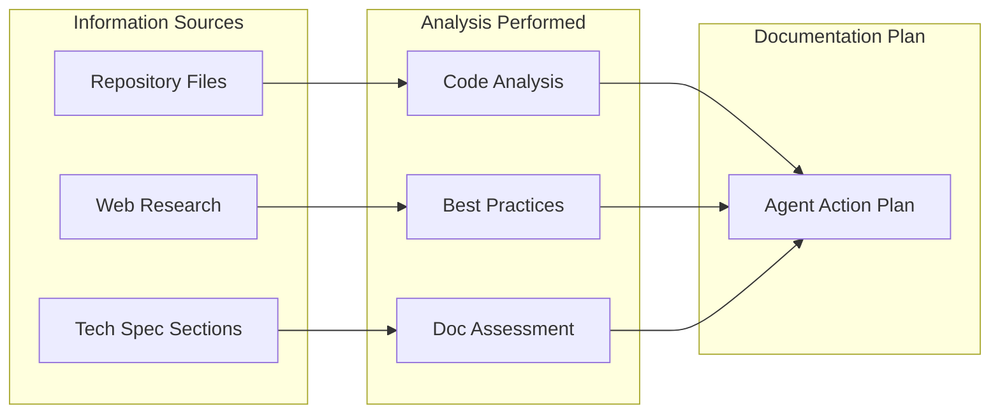

