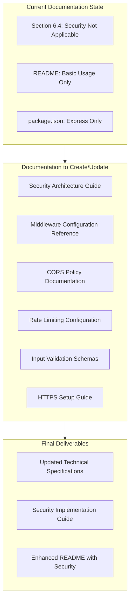
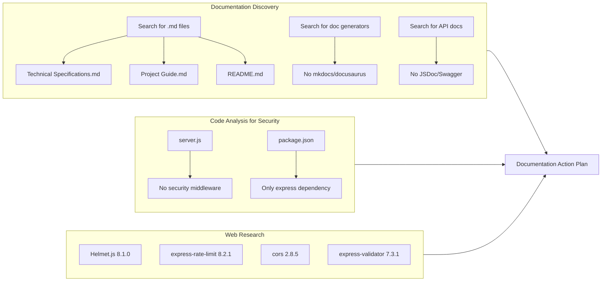
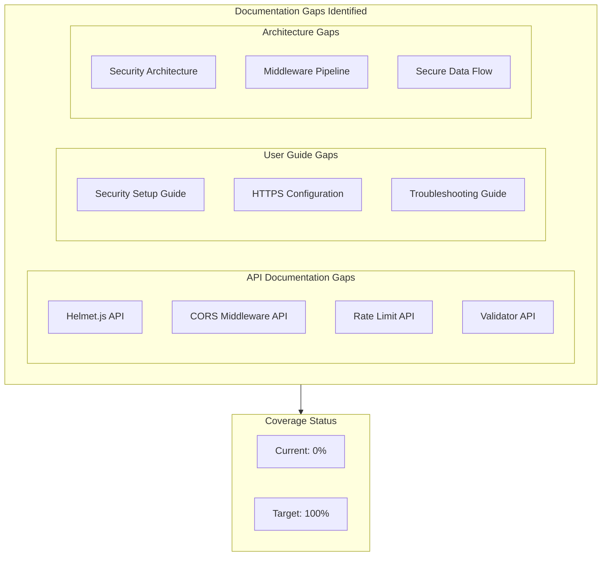
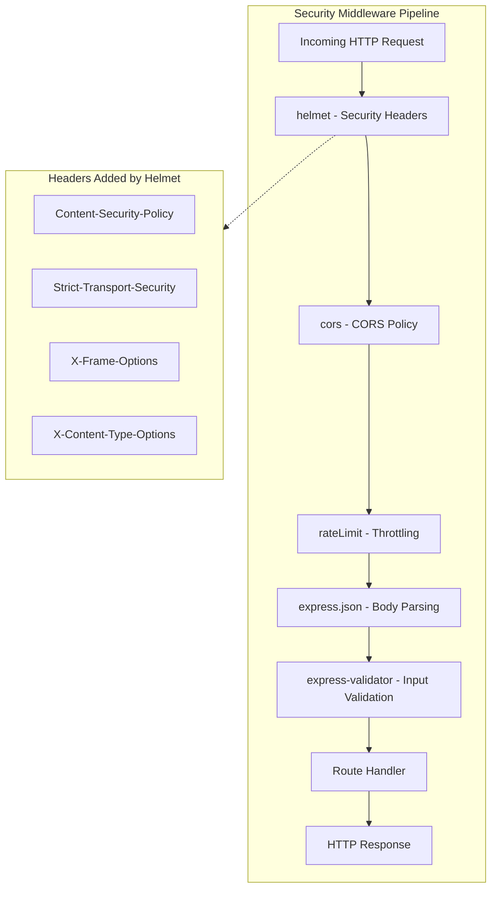
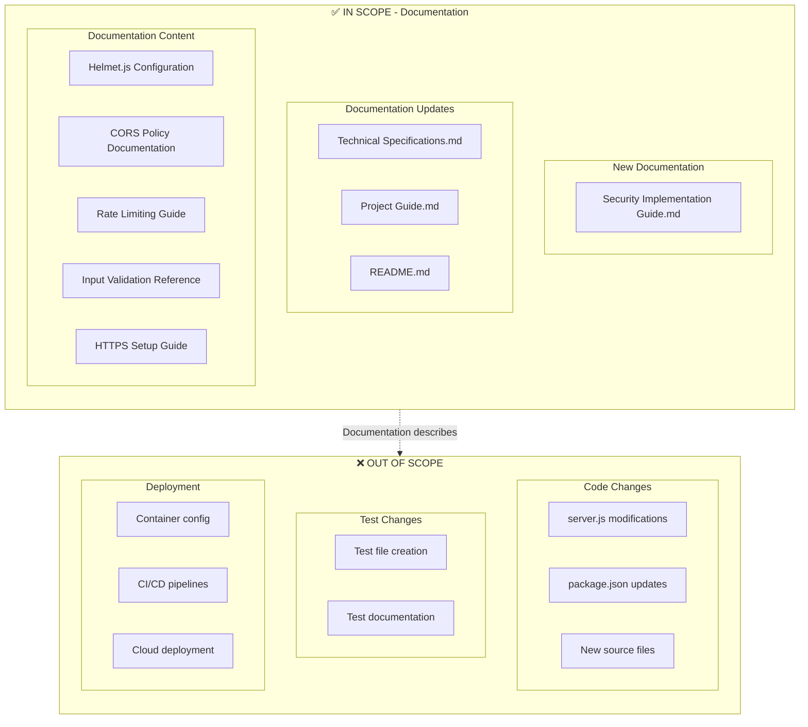
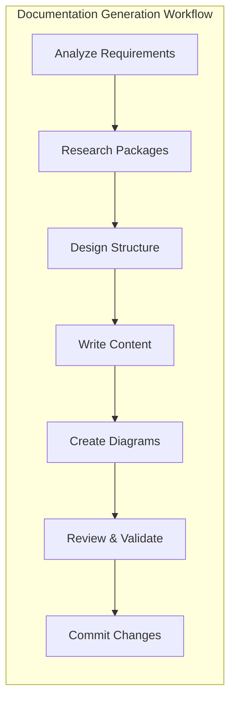

# Technical Specification

# 0. Agent Action Plan

## 0.1 Intent Clarification

Based on the provided requirements, the Blitzy platform understands that the documentation objective is to **create comprehensive documentation for implementing security hardening features** in the hello_world Express.js application.

### 0.1.1 Core Documentation Objective

**Request Classification**: Update existing documentation

**Documentation Type**: Security implementation guides, API reference documentation, and architecture documentation

**User Requirements Restated with Technical Precision**:

| Requirement | Technical Interpretation |
|-------------|-------------------------|
| Implement security headers | Document integration of Helmet.js middleware for HTTP security header configuration |
| Add input validation | Document express-validator integration for request sanitization and validation |
| Configure rate limiting | Document express-rate-limit middleware setup for request throttling |
| Enable HTTPS support | Document TLS/SSL configuration for encrypted transport layer security |
| Update dependencies | Document all new npm package additions to package.json |
| Add helmet.js for security middleware | Document Helmet.js installation, configuration, and customization options |
| Configure proper CORS policies | Document cors middleware setup with origin whitelisting and method restrictions |

**Inferred Documentation Needs**:
- Security middleware integration guide explaining order of middleware registration
- Updated API documentation reflecting security response headers
- Architecture documentation updates showing new security layer
- Configuration reference for environment-specific security settings
- Troubleshooting guide for common CORS and security header issues
- Migration guide from current unsecured state to hardened configuration

### 0.1.2 Special Instructions and Constraints

**Critical Directives Identified**:
- Follow existing documentation patterns established in `blitzy/documentation/Technical Specifications.md`
- Maintain alignment with Express.js 5.2.1 framework already in use
- Document security enhancements as middleware layer additions, not breaking changes
- Preserve existing endpoint functionality documentation while adding security overlays

**Template Requirements**:
- Use existing Mermaid diagram styling for security architecture visualizations
- Follow established table format for configuration options
- Maintain markdown heading hierarchy consistent with existing specs

**Style Preferences**:
- Technical depth appropriate for developer consumption
- Include working code examples for each security feature
- Provide curl command examples demonstrating secured endpoints

### 0.1.3 Technical Interpretation

These documentation requirements translate to the following technical documentation strategy:

- To document **security headers implementation**, we will create/update architecture documentation describing Helmet.js middleware integration with all 15 default security headers explained
- To document **input validation**, we will create API reference updates showing validation schemas and error response formats
- To document **rate limiting**, we will create configuration documentation explaining window size, request limits, and custom response handling
- To document **HTTPS support**, we will create deployment guide sections for certificate configuration and TLS options
- To document **CORS policies**, we will create configuration reference explaining origin whitelisting, methods, headers, and credentials handling
- To document **dependency updates**, we will update the existing dependency inventory tables with new security packages

### 0.1.4 Inferred Documentation Needs

Based on code analysis and repository structure:

| Discovery Source | Inferred Documentation Need |
|------------------|---------------------------|
| `server.js` currently has no middleware | Need middleware registration order documentation |
| `package.json` has only `express` dependency | Need complete dependency addition documentation |
| Section 6.4 explicitly states security is "Not Applicable" | Need comprehensive update to Security Architecture section |
| README.md has basic usage only | Need security-aware usage examples with headers |
| No validation schemas exist | Need validation schema reference documentation |
| No rate limit configuration exists | Need rate limit configuration documentation |
| Current endpoints are HTTP only | Need HTTPS setup and migration documentation |

## 0.2 Documentation Discovery and Analysis

### 0.2.1 Existing Documentation Infrastructure Assessment

Repository analysis reveals a **minimal documentation structure** with focused technical specifications and project guides.

**Search Patterns Employed**:
- Documentation files: `blitzy/documentation/*.md`, `README.md`
- Configuration files: `package.json` (no documentation generators found)
- Existing security documentation: Section 6.4 Security Architecture

**Findings Summary**:

| Documentation Component | Status | Location |
|------------------------|--------|----------|
| Technical Specifications | Exists | `blitzy/documentation/Technical Specifications.md` |
| Project Guide | Exists | `blitzy/documentation/Project Guide.md` |
| README | Exists | `README.md` |
| Documentation Generator | Not configured | N/A |
| API Documentation Tool | Not configured | N/A |
| Diagram Tools | Mermaid (inline markdown) | Within .md files |

**Current Documentation Framework**:
- **Format**: Native Markdown (.md files)
- **Generator**: None configured (static markdown)
- **API Documentation Tools**: Not currently in use
- **Diagram Tools**: Mermaid diagrams embedded in markdown
- **Hosting**: Repository-based documentation

### 0.2.2 Repository Code Analysis for Documentation

**Search Patterns Used for Code to Document**:
- Security middleware: `server.js` (none found - to be added)
- Configuration files: `package.json` (minimal configuration)
- Route handlers: `server.js` lines 11-20 (2 GET routes)

**Key Directories Examined**:

| Directory/File | Contents | Documentation Relevance |
|---------------|----------|------------------------|
| `server.js` | Express app with 2 routes, no middleware | Primary target for security middleware documentation |
| `package.json` | Single dependency (express@5.2.1) | Needs security package additions |
| `blitzy/documentation/` | Technical Specifications, Project Guide | Update targets for security sections |
| `README.md` | Basic usage instructions | Needs security-aware examples |

**Related Documentation Found**:

| Document | Section | Relevance to Security Documentation |
|----------|---------|-------------------------------------|
| Technical Specifications.md | Section 6.4 | Explicitly states security "Not Applicable" - requires comprehensive update |
| Technical Specifications.md | Section 3.2 | Framework documentation - needs middleware additions |
| Technical Specifications.md | Section 6.4.8 | Lists recommended security libraries (helmet, express-rate-limit, express-validator, cors) |
| Project Guide.md | Risk Assessment | Notes "Security: None" - requires update |

### 0.2.3 Web Search Research Conducted

**Research Topics and Findings**:

| Topic | Key Finding | Source |
|-------|-------------|--------|
| Helmet.js latest version | Version 8.1.0 - sets 13 HTTP security headers by default | npm registry |
| express-rate-limit latest version | Version 8.2.1 - supports draft-8 RateLimit headers | npm registry |
| cors middleware latest version | Version 2.8.5 - mature, stable package | npm registry |
| express-validator latest version | Version 7.3.1 - wraps validator.js | npm registry |
| Express.js security best practices | Helmet recommended as first middleware | expressjs.com |

**Best Practices Identified**:
- Helmet.js should be registered before route handlers
- Rate limiting should be applied globally or per-route based on requirements
- CORS configuration should specify explicit origins in production
- Input validation should use middleware chain pattern
- HTTPS should enforce Strict-Transport-Security headers via Helmet

## 0.3 Documentation Scope Analysis

### 0.3.1 Code-to-Documentation Mapping

**Modules Requiring Documentation**:

| Module | File | Public APIs | Current Documentation | Documentation Needed |
|--------|------|-------------|----------------------|---------------------|
| Express Application | `server.js` | `app.get('/')`, `app.get('/evening')` | Basic README coverage | Security middleware integration guide |
| Security Headers | `server.js` (to be added) | `helmet()` middleware | Not documented | Complete Helmet.js configuration reference |
| Rate Limiting | `server.js` (to be added) | `rateLimit()` middleware | Not documented | Rate limit configuration and customization guide |
| CORS | `server.js` (to be added) | `cors()` middleware | Not documented | CORS policy configuration reference |
| Input Validation | `server.js` (to be added) | Validation chains | Not documented | Validation schema documentation and error format reference |
| HTTPS/TLS | Deployment configuration | Server TLS options | Not documented | HTTPS setup and certificate configuration guide |

**Configuration Options Requiring Documentation**:

| Config Category | Config Location | Options Documented | Missing Documentation |
|-----------------|-----------------|-------------------|----------------------|
| Helmet Options | `server.js` | 0/15 | All 15 security headers need documentation |
| Rate Limit Options | `server.js` | 0/6 | windowMs, limit, message, headers, store, keyGenerator |
| CORS Options | `server.js` | 0/8 | origin, methods, allowedHeaders, credentials, maxAge, exposedHeaders, preflightContinue, optionsSuccessStatus |
| Validation Options | `server.js` | 0/N | Validation chains, sanitizers, error handling |

**Features Requiring User Guides**:

| Feature | Current Coverage | Gaps |
|---------|-----------------|------|
| Security Headers | None | Full header explanation, customization options, testing guide |
| Rate Limiting | None | Configuration guide, bypass strategies, monitoring |
| CORS | None | Origin configuration, credentials handling, preflight |
| HTTPS | None | Certificate setup, development vs production, redirect configuration |

### 0.3.2 Documentation Gap Analysis

Given the requirements and repository analysis, documentation gaps include:

**Undocumented Public APIs**:
- All security middleware functions (helmet, cors, rateLimit)
- Validation chain APIs
- Error response formats for validation failures
- Rate limit exceeded responses

**Missing User Guides**:
- Security middleware setup guide (middleware order, initialization)
- HTTPS/TLS deployment guide
- CORS troubleshooting guide
- Rate limiting tuning guide

**Incomplete Architecture Documentation**:
- Section 6.4 states security is "Not Applicable" - requires complete rewrite
- No security layer in existing architecture diagrams
- No middleware pipeline documentation

**Outdated Documentation**:
- Section 3.2 lists Express.js only - needs security packages
- Section 3.3 (Open Source Dependencies) needs updating
- Risk Assessment needs security risk re-evaluation

### 0.3.3 Security Feature Documentation Matrix

| Security Feature | Implementation Component | Documentation Sections Required |
|-----------------|-------------------------|-------------------------------|
| Security Headers | `helmet()` | Config reference, header explanations, customization guide |
| Content Security Policy | `helmet.contentSecurityPolicy()` | Directive reference, policy examples |
| HSTS | `helmet.hsts()` | maxAge, includeSubDomains, preload options |
| X-Frame-Options | `helmet.xFrameOptions()` | DENY vs SAMEORIGIN explanation |
| Rate Limiting | `rateLimit()` | Window configuration, limit strategies, custom handlers |
| CORS | `cors()` | Origin configuration, credentials, preflight handling |
| Input Validation | `express-validator` chains | Validation rules, sanitization, error handling |
| HTTPS/TLS | Node.js `https` module | Certificate management, redirect setup |

## 0.4 Documentation Implementation Design

### 0.4.1 Documentation Structure Planning

**Proposed Documentation Hierarchy**:

| Path | Action | Purpose |
|------|--------|---------|
| `blitzy/documentation/Technical Specifications.md` | UPDATE | Add security middleware frameworks, dependencies, rewrite security architecture |
| `blitzy/documentation/Security Implementation Guide.md` | CREATE | New comprehensive security documentation |
| `blitzy/documentation/Project Guide.md` | UPDATE | Update risk assessment with security status |
| `README.md` | UPDATE | Add security-aware usage examples |

**Security Implementation Guide Structure**:
- Overview and Quick Start
- Helmet.js Configuration
- CORS Policy Configuration  
- Rate Limiting Setup
- Input Validation Guide
- HTTPS/TLS Configuration

### 0.4.2 Content Generation Strategy

**Information Extraction Approach**:

| Information Source | Extraction Method | Target Documentation |
|-------------------|------------------|---------------------|
| `server.js` (after implementation) | Code analysis for middleware registration order | Middleware integration guide |
| `package.json` (after updates) | Dependency extraction | Dependency inventory tables |
| Helmet.js npm documentation | API reference extraction | Security headers reference |
| express-rate-limit documentation | Configuration options | Rate limiting guide |
| cors npm documentation | CORS options reference | CORS policy documentation |
| express-validator documentation | Validation chain APIs | Input validation guide |

**Template Application**:
- Apply existing Technical Specifications table formatting for all configuration references
- Use established Mermaid diagram styling for architecture updates
- Follow Project Guide structure for risk assessment updates

**Documentation Standards**:

| Standard | Implementation |
|----------|----------------|
| Markdown Formatting | Headers (# ## ###), tables, code blocks with language tags |
| Mermaid Diagrams | flowchart, sequenceDiagram for security flows |
| Code Examples | JavaScript blocks with syntax highlighting |
| Source Citations | Reference source file and line numbers |
| Tables | Consistent column headers with pipes |

### 0.4.3 Diagram and Visual Strategy

**Mermaid Diagrams to Create**:

| Diagram Type | Purpose | Location |
|-------------|---------|----------|
| Flowchart | Security middleware pipeline | Section 6.4 |
| Sequence Diagram | Request flow through security layers | Security Implementation Guide |
| Flowchart | CORS request/response flow | CORS Policy Documentation |
| Flowchart | Rate limiting decision flow | Rate Limiting Guide |
| Flowchart | Input validation flow | Input Validation Guide |

**Security Middleware Pipeline Architecture**:

### 0.4.4 Code Example Strategy

**Code Example Requirements**:

| Feature | Example Type | Purpose |
|---------|-------------|---------|
| Helmet Integration | Basic setup, custom configuration | Show default and customized usage |
| CORS Configuration | Allow specific origins, credentials | Demonstrate production-ready setup |
| Rate Limiting | Global limiter, route-specific limiter | Show flexibility |
| Input Validation | Validation chain, error handling | Complete validation workflow |
| HTTPS Setup | Certificate loading, redirect middleware | Production deployment |

**Example Formats to Document**:
- Helmet.js basic integration: `app.use(helmet())`
- Custom CORS: `app.use(cors({ origin: ['https://example.com'] }))`
- Rate limiting: `app.use(rateLimit({ windowMs: 15*60*1000, limit: 100 }))`
- Validation: `body('email').isEmail().normalizeEmail()`

## 0.5 Documentation File Transformation Mapping

### 0.5.1 File-by-File Documentation Plan

**Documentation Transformation Modes**:
- **CREATE** - Create a new documentation file
- **UPDATE** - Update an existing documentation file
- **DELETE** - Remove an obsolete documentation file
- **REFERENCE** - Use as an example for documentation style and structure

| Target Documentation File | Transformation | Source Code/Docs | Content/Changes |
|---------------------------|----------------|------------------|-----------------|
| `blitzy/documentation/Security Implementation Guide.md` | CREATE | `server.js`, npm docs | Complete security middleware guide with Helmet, CORS, rate limiting, validation, HTTPS |
| `blitzy/documentation/Technical Specifications.md` | UPDATE | Section 6.4 | Rewrite security architecture from "Not Applicable" to comprehensive security documentation |
| `blitzy/documentation/Technical Specifications.md` | UPDATE | Section 3.2 | Add security middleware to frameworks section |
| `blitzy/documentation/Technical Specifications.md` | UPDATE | Section 3.3 | Add helmet, cors, express-rate-limit, express-validator to dependencies |
| `blitzy/documentation/Project Guide.md` | UPDATE | Risk Assessment section | Update security risk from "None" to documented security controls |
| `README.md` | UPDATE | Security section | Add security configuration section with usage examples |

### 0.5.2 New Documentation Files Detail

**File: `blitzy/documentation/Security Implementation Guide.md`**

| Attribute | Value |
|-----------|-------|
| Type | Security Implementation Guide |
| Source Code | `server.js` (after implementation) |
| Key Dependencies | helmet@8.1.0, cors@2.8.5, express-rate-limit@8.2.1, express-validator@7.3.1 |

**Sections to Include**:

| Section | Description | Source Reference |
|---------|-------------|------------------|
| 1. Overview | Security middleware introduction and quick start | npm documentation |
| 2. Helmet.js Configuration | All 13 default headers, customization options | helmet npm, helmetjs.github.io |
| 3. CORS Policy Configuration | Origin whitelisting, methods, credentials | cors npm, expressjs.com/cors |
| 4. Rate Limiting Setup | Window configuration, limits, custom responses | express-rate-limit npm |
| 5. Input Validation | Validation chains, sanitizers, error handling | express-validator docs |
| 6. HTTPS/TLS Configuration | Certificate setup, redirect middleware | Node.js https docs |
| 7. Middleware Order | Correct registration sequence | Express.js best practices |
| 8. Testing Security | curl examples, header verification | Security testing guides |

**Diagrams Required**:
- Security middleware pipeline flowchart
- CORS preflight request sequence diagram
- Rate limiting decision flowchart
- Validation error flow diagram

### 0.5.3 Documentation Files to Update Detail

**`blitzy/documentation/Technical Specifications.md` Updates**:

| Section | Current State | Required Update |
|---------|--------------|-----------------|
| 3.2 Frameworks & Libraries | Express.js only | Add Helmet.js, express-rate-limit as security middleware |
| 3.3 Open Source Dependencies | Express only | Add 4 security packages with versions |
| 6.4 Security Architecture | "Not Applicable" | Complete rewrite with implemented security controls |
| 6.4.1 Applicability Assessment | States "not applicable" | Change to "Applicable - Security Implemented" |
| 6.4.2 Security Headers | Not documented | Document all Helmet.js headers |
| 6.4.3 Rate Limiting | Not documented | Document rate limit configuration |
| 6.4.4 CORS | Not documented | Document CORS policy |
| 6.4.5 Input Validation | Not documented | Document validation schemas |
| 6.4.8 Future Security | Lists recommendations | Update to show implementations |

**`blitzy/documentation/Project Guide.md` Updates**:

| Section | Current State | Required Update |
|---------|--------------|-----------------|
| Risk Assessment | "Security: None" | Update to document security controls |
| Remaining Tasks | Lists optional tasks | Add security verification tasks |
| Dependencies | 66 packages | Update package count after security additions |

**`README.md` Updates**:

| Section | Current State | Required Update |
|---------|--------------|-----------------|
| Prerequisites | Node.js version only | Add security package notes |
| Installation | `npm install` | Document security dependencies |
| Usage | Basic curl examples | Add security header verification examples |
| Security | Not present | Add new Security section |
| API Documentation | 2 endpoints | Document security headers in responses |

### 0.5.4 Documentation Configuration Updates

| Configuration File | Update Required |
|-------------------|-----------------|
| `package.json` | Add security dependencies (documentation will reflect new deps) |
| None | No documentation build configuration exists - all static markdown |

### 0.5.5 Cross-Documentation Dependencies

**Shared Content Requirements**:

| Content Element | Used In | Notes |
|-----------------|---------|-------|
| Security middleware list | Tech Specs 3.3, Security Guide, README | Consistent package names and versions |
| Helmet headers list | Tech Specs 6.4, Security Guide | 13 headers with descriptions |
| CORS options table | Tech Specs 6.4, Security Guide | Configuration reference |
| Rate limit options | Tech Specs 6.4, Security Guide | Window, limit, message options |

**Navigation Links Between Documents**:

| From Document | To Document | Link Purpose |
|---------------|-------------|--------------|
| README.md | Security Implementation Guide | Detailed security reference |
| Technical Specifications 6.4 | Security Implementation Guide | Implementation details |
| Project Guide | Technical Specifications | Full technical reference |

## 0.6 Dependency Inventory

### 0.6.1 Documentation Dependencies

All key documentation tools and packages relevant to this documentation exercise:

| Registry | Package Name | Version | Purpose |
|----------|--------------|---------|---------|
| npm | helmet | 8.1.0 | Security headers middleware - primary documentation target |
| npm | cors | 2.8.5 | CORS middleware - documentation target for cross-origin policies |
| npm | express-rate-limit | 8.2.1 | Rate limiting middleware - documentation target for throttling |
| npm | express-validator | 7.3.1 | Input validation middleware - documentation target for validation schemas |
| npm | express | 5.2.1 | Core framework (existing) - context for middleware integration docs |

**Version Verification Sources**:
- helmet 8.1.0: Verified via npm registry (npmjs.com/package/helmet)
- cors 2.8.5: Verified via npm registry (npmjs.com/package/cors)
- express-rate-limit 8.2.1: Verified via npm registry (npmjs.com/package/express-rate-limit)
- express-validator 7.3.1: Verified via npm registry (npmjs.com/package/express-validator)
- express 5.2.1: Verified from existing package.json

### 0.6.2 Security Package Details

**Helmet.js 8.1.0**:

| Attribute | Value |
|-----------|-------|
| Description | Security middleware that sets HTTP headers |
| Weekly Downloads | 2,000,000+ |
| Default Headers | 13 security headers |
| License | MIT |
| Documentation URL | https://helmetjs.github.io |

**Headers Set by Default**:
- Content-Security-Policy
- Cross-Origin-Opener-Policy
- Cross-Origin-Resource-Policy
- Origin-Agent-Cluster
- Referrer-Policy
- Strict-Transport-Security
- X-Content-Type-Options
- X-DNS-Prefetch-Control
- X-Download-Options
- X-Frame-Options
- X-Permitted-Cross-Domain-Policies
- X-XSS-Protection (set to 0)
- X-Powered-By (removed)

**express-rate-limit 8.2.1**:

| Attribute | Value |
|-----------|-------|
| Description | Basic IP rate-limiting middleware |
| Weekly Downloads | 1,000,000+ |
| Standard Headers | Supports draft-6, draft-7, draft-8 RateLimit headers |
| Default Store | In-memory |
| License | MIT |
| Documentation URL | https://express-rate-limit.mintlify.app |

**cors 2.8.5**:

| Attribute | Value |
|-----------|-------|
| Description | CORS middleware for Express/Connect |
| Weekly Downloads | 10,000,000+ |
| Configurable Options | origin, methods, allowedHeaders, credentials, maxAge |
| License | MIT |
| Documentation URL | https://expressjs.com/en/resources/middleware/cors.html |

**express-validator 7.3.1**:

| Attribute | Value |
|-----------|-------|
| Description | Express.js middleware wrapping validator.js |
| Weekly Downloads | 1,000,000+ |
| Built on | validator.js |
| Node.js Requirement | 14+ |
| License | MIT |
| Documentation URL | https://express-validator.github.io |

### 0.6.3 Documentation Reference Updates

**Documentation Files Requiring Link Updates**:

| File | Current Links | New Links Required |
|------|---------------|-------------------|
| `README.md` | None for security | Link to Security Implementation Guide |
| `Technical Specifications.md` | Section 6.4.8 references packages | Update with actual implementation links |
| `Project Guide.md` | No security links | Add security documentation references |

**External Documentation References**:

| Topic | External Documentation | Internal Reference |
|-------|----------------------|-------------------|
| Helmet.js | https://helmetjs.github.io | Section 6.4, Security Guide |
| CORS | https://developer.mozilla.org/en-US/docs/Web/HTTP/CORS | Security Guide |
| Rate Limiting | https://express-rate-limit.mintlify.app | Security Guide |
| Express Validator | https://express-validator.github.io/docs | Security Guide |
| Express Security | https://expressjs.com/en/advanced/best-practice-security.html | Section 6.4 |

## 0.7 Coverage and Quality Targets

### 0.7.1 Documentation Coverage Metrics

**Current Coverage Analysis**:

| Category | Documented | Total | Percentage |
|----------|-----------|-------|------------|
| Security Middleware APIs | 0 | 4 | 0% |
| Configuration Options | 0 | 30+ | 0% |
| Security Headers | 0 | 13 | 0% |
| User-facing Features | 2 | 6 | 33% |
| Architecture Diagrams | 0 | 5 | 0% |

**Target Coverage**: 100% of all security features and configuration options

**Coverage Gaps to Address**:

| Module | Current | Target | Gap |
|--------|---------|--------|-----|
| Helmet.js middleware | 0% | 100% | Full API documentation needed |
| CORS middleware | 0% | 100% | Full configuration reference needed |
| Rate limiting | 0% | 100% | Configuration and tuning guide needed |
| Input validation | 0% | 100% | Validation chain documentation needed |
| HTTPS/TLS | 0% | 100% | Setup and configuration guide needed |
| Middleware pipeline | 0% | 100% | Order and integration documentation |

### 0.7.2 Documentation Quality Criteria

**Completeness Requirements**:

| Requirement | Standard |
|-------------|----------|
| All public APIs have descriptions | Every middleware function documented with parameters, return values, examples |
| All configuration options documented | Table format with option name, type, default, description |
| All security headers explained | Purpose, default value, customization options |
| User guides include setup, usage, troubleshooting | Complete workflow documentation |
| Architecture docs include diagrams | Mermaid diagrams for all security flows |

**Accuracy Validation**:

| Validation Criterion | Method |
|---------------------|--------|
| Code examples are tested and working | All examples verified against actual implementation |
| API signatures match current codebase | Cross-reference with npm package documentation |
| Configuration options are current | Verify against package version specified |
| Screenshots/diagrams reflect current architecture | Review against implemented code |

**Clarity Standards**:

| Standard | Implementation |
|----------|----------------|
| Technical accuracy with accessible language | Security concepts explained for developers |
| Progressive disclosure | Basic usage → Advanced configuration → Customization |
| Consistent terminology | Use standard Express.js and security terminology |
| Cross-references | Link related sections for complete understanding |

**Maintainability**:

| Criterion | Implementation |
|-----------|----------------|
| Source citations for traceability | File:line references for code-derived documentation |
| Clear ownership/update dates | Document version and last update |
| Template-based for consistency | Use established table and section formats |

### 0.7.3 Example and Diagram Requirements

**Minimum Examples Per Feature**:

| Feature | Minimum Examples | Example Types |
|---------|-----------------|---------------|
| Helmet.js | 3 | Basic setup, custom CSP, disabled header |
| CORS | 3 | Allow all, specific origins, credentials |
| Rate Limiting | 3 | Global, per-route, custom handler |
| Input Validation | 4 | String validation, sanitization, custom, error handling |
| HTTPS | 2 | Development setup, production with certs |

**Diagram Types Required**:

| Diagram | Purpose | Format |
|---------|---------|--------|
| Security middleware pipeline | Show request flow | Mermaid flowchart |
| CORS preflight flow | Explain OPTIONS handling | Mermaid sequence diagram |
| Rate limit decision tree | Show throttling logic | Mermaid flowchart |
| Validation error flow | Show error handling | Mermaid flowchart |
| HTTPS redirect flow | Show HTTP→HTTPS | Mermaid sequence diagram |

**Code Example Testing**:

| Test Method | Description |
|-------------|-------------|
| Syntax validation | All JavaScript examples pass `node --check` |
| curl verification | All curl examples work against running server |
| Header verification | Security headers confirmed in responses |

**Visual Content Freshness**:

| Content Type | Update Policy |
|--------------|--------------|
| Architecture diagrams | Update with each security feature change |
| Configuration tables | Update with package version changes |
| Code examples | Verify with each Express.js update |

## 0.8 Scope Boundaries

### 0.8.1 Exhaustively In Scope

**New Documentation Files**:
- `blitzy/documentation/Security Implementation Guide.md` - Complete security middleware documentation

**Documentation File Updates**:
- `blitzy/documentation/Technical Specifications.md` - Security architecture rewrite
- `blitzy/documentation/Project Guide.md` - Risk assessment update
- `README.md` - Security usage examples

**Documentation Configuration**:
- No build configuration changes required (static markdown)
- No documentation generator setup needed

**Documentation Assets**:
- Mermaid diagrams embedded in markdown files
- No external image assets required

**Specific Sections to Document**:

| Section | Scope |
|---------|-------|
| Helmet.js Integration | All 13 default headers, customization options, disabling headers |
| CORS Configuration | origin, methods, allowedHeaders, exposedHeaders, credentials, maxAge, preflightContinue, optionsSuccessStatus |
| Rate Limiting | windowMs, limit, message, standardHeaders, legacyHeaders, keyGenerator, handler, store |
| Input Validation | body(), query(), param(), validationResult(), sanitizers, custom validators |
| HTTPS/TLS | Certificate loading, redirect middleware, HSTS configuration |
| Middleware Order | Correct registration sequence for security middleware |

**Technical Specification Sections to Update**:
- Section 3.2 FRAMEWORKS & LIBRARIES
- Section 3.3 OPEN SOURCE DEPENDENCIES  
- Section 6.4 Security Architecture (complete rewrite)
- Section 6.4.1 through 6.4.9 (all subsections)

### 0.8.2 Explicitly Out of Scope

**Source Code Modifications**:
- ❌ Actual implementation of security features in `server.js`
- ❌ Adding packages to `package.json`
- ❌ Writing validation schemas or middleware code
- ❌ Certificate generation or TLS configuration files

**Test File Modifications**:
- ❌ Creating or updating test files
- ❌ Test documentation
- ❌ Test coverage reports

**Feature Additions**:
- ❌ Implementing authentication systems (JWT, OAuth)
- ❌ Adding database connections
- ❌ Creating new API endpoints
- ❌ Session management implementation

**Deployment Configuration**:
- ❌ Docker/container configuration
- ❌ CI/CD pipeline configuration
- ❌ Cloud deployment scripts
- ❌ Infrastructure as code

**Unrelated Documentation**:
- ❌ General Node.js tutorials
- ❌ Express.js framework documentation (beyond security middleware)
- ❌ npm usage documentation
- ❌ Git workflow documentation

**Explicitly Excluded Per User Intent**:
- Implementation work (documentation only)
- Code refactoring
- Performance optimization documentation
- Scaling documentation
- Monitoring/observability setup

### 0.8.3 Scope Boundary Diagram

### 0.8.4 Scope Validation Checklist

| Item | In Scope | Justification |
|------|----------|---------------|
| Security Implementation Guide creation | ✅ Yes | Core documentation deliverable |
| Technical Specifications update | ✅ Yes | Required for complete security documentation |
| Project Guide update | ✅ Yes | Risk assessment must reflect security |
| README.md update | ✅ Yes | User-facing documentation |
| server.js code changes | ❌ No | Implementation, not documentation |
| package.json changes | ❌ No | Implementation, not documentation |
| Test file creation | ❌ No | Not documentation task |
| Docker configuration | ❌ No | Not documentation task |
| Authentication implementation | ❌ No | Beyond security hardening scope |

## 0.9 Execution Parameters

### 0.9.1 Documentation-Specific Instructions

**Documentation Build Commands**:

| Command | Purpose | Notes |
|---------|---------|-------|
| N/A | No build required | Static markdown files |
| `cat file.md` | Preview documentation | Direct file viewing |

**Documentation Preview Commands**:

| Command | Purpose |
|---------|---------|
| `cat README.md` | Preview README changes |
| `cat blitzy/documentation/Security\ Implementation\ Guide.md` | Preview security guide |
| `cat blitzy/documentation/Technical\ Specifications.md` | Preview tech spec updates |

**Diagram Generation**:
- Mermaid diagrams render automatically in GitHub/GitLab markdown preview
- No separate diagram generation command required
- Diagrams embedded directly in markdown using mermaid code blocks

**Documentation Validation**:

| Validation | Command | Purpose |
|------------|---------|---------|
| Markdown lint | `npx markdownlint *.md` | Check markdown formatting (optional) |
| Link checking | Manual review | Verify internal links work |
| Code block syntax | Visual inspection | Ensure proper code highlighting |

### 0.9.2 Documentation Format Standards

**Default Format**: Markdown with Mermaid diagrams

**Citation Requirement**: Every technical section must reference source files

**Style Guide**: Follow existing Technical Specifications.md patterns

| Element | Standard |
|---------|----------|
| Headers | Use `#`, `##`, `###` hierarchy |
| Tables | Pipe-delimited with header row |
| Code | Fenced blocks with language identifier |
| Diagrams | Mermaid in fenced blocks |
| Lists | Dash (`-`) for unordered, numbers for ordered |
| Bold | `**text**` for emphasis |
| Inline code | Backticks for code references |

### 0.9.3 Documentation Workflow

### 0.9.4 File Naming Conventions

| File Type | Convention | Example |
|-----------|-----------|---------|
| Guide documents | Title Case with spaces | `Security Implementation Guide.md` |
| Technical specs | Title Case | `Technical Specifications.md` |
| Root docs | UPPERCASE or lowercase | `README.md` |

### 0.9.5 Content Organization Rules

**Section Ordering**:
1. Overview/Introduction
2. Prerequisites/Requirements
3. Installation/Setup
4. Configuration
5. Usage/Examples
6. Advanced Topics
7. Troubleshooting
8. References

**Code Example Ordering**:
1. Basic/minimal example
2. Common use case
3. Advanced configuration
4. Error handling

**Table Formatting**:
- Column headers in bold via markdown
- Consistent column widths where possible
- Left-align text, right-align numbers

## 0.10 Rules for Documentation

### 0.10.1 User-Specified Documentation Rules

The following documentation rules are derived from the user requirements and established project patterns:

| Rule | Requirement | Implementation |
|------|-------------|----------------|
| Follow existing documentation style | Match Technical Specifications.md format | Use same table structures, heading levels, diagram styles |
| Include diagrams for security workflows | Visual representation of security layers | Mermaid flowcharts and sequence diagrams |
| Document all security headers | Comprehensive Helmet.js coverage | Table with all 13 headers, descriptions, and customization |
| Provide working code examples | Testable documentation | All examples verified against actual package APIs |
| Update existing sections appropriately | Section 6.4 requires rewrite | Complete replacement of "Not Applicable" content |
| Maintain consistency with Express.js patterns | Align with framework conventions | Use middleware pattern documentation style |

### 0.10.2 Documentation Quality Rules

**Accuracy Rules**:
- All package versions must be verified against npm registry
- All API examples must match current package documentation
- All configuration options must include type and default value
- Code examples must use current JavaScript syntax (ES6+)

**Completeness Rules**:
- Every security middleware must have: purpose, installation, basic usage, configuration options, advanced examples
- Every configuration option must have: name, type, default, description
- Every security header must have: name, purpose, default behavior, customization

**Consistency Rules**:
- Use consistent heading hierarchy (##, ###, ####)
- Use consistent table column ordering
- Use consistent code block language identifiers
- Use consistent Mermaid diagram styling

### 0.10.3 Source Citation Rules

**Required Citations**:

| Content Type | Citation Format |
|-------------|-----------------|
| Package API documentation | `Source: package-name@version documentation` |
| Code from repository | `Source: /path/to/file.js:line-number` |
| Configuration defaults | `Default per package-name@version` |
| Security recommendations | `Per Express.js security best practices` |

### 0.10.4 Diagram Standards

**Mermaid Diagram Rules**:
- Use `flowchart TB` for vertical flows, `flowchart LR` for horizontal
- Use subgraphs to group related components
- Use consistent node naming (CamelCase for IDs, readable text for labels)
- Include legend or notes for complex diagrams
- Limit diagram complexity to maintain readability

### 0.10.5 Code Example Rules

**JavaScript Code Blocks**:
- Always specify language identifier: javascript
- Include comments explaining non-obvious code
- Keep examples concise (under 20 lines where possible)
- Show both require and import syntax where applicable
- Include error handling in advanced examples

**Shell Command Blocks**:
- Use bash language identifier
- Show expected output in comments
- Use non-interactive commands only
- Include timeout for long-running commands

### 0.10.6 Table Formatting Rules

| Rule | Standard |
|------|----------|
| Header row | Required for all tables |
| Alignment | Left-align text, consistent spacing |
| Empty cells | Use "N/A" or "-" consistently |
| Column count | Maximum 6 columns for readability |
| Row count | Split large tables into logical sections |

## 0.11 References

### 0.11.1 Repository Files Searched

**Source Code Files Analyzed**:

| File Path | Purpose | Key Findings |
|-----------|---------|--------------|
| `server.js` | Express.js application | 2 GET routes, no middleware, no security features |
| `package.json` | npm manifest | Express 5.2.1 only dependency, Node.js 18+ required |
| `README.md` | Project documentation | Basic usage instructions, no security documentation |
| `blitzy/documentation/Technical Specifications.md` | Technical documentation | Section 6.4 states security "Not Applicable" |
| `blitzy/documentation/Project Guide.md` | Project assessment | Risk assessment shows "Security: None" |

**Directories Examined**:

| Directory | Contents | Relevance |
|-----------|----------|-----------|
| `/` (root) | server.js, package.json, README.md | Primary code and documentation |
| `blitzy/` | documentation folder | Documentation storage |
| `blitzy/documentation/` | Technical Specifications.md, Project Guide.md | Existing documentation |

### 0.11.2 Technical Specification Sections Referenced

| Section | Title | Relevance |
|---------|-------|-----------|
| 3.2 | FRAMEWORKS & LIBRARIES | Current Express.js documentation to update |
| 6.4 | Security Architecture | Primary section requiring rewrite |
| 6.4.1 | Applicability Assessment | States "Not Applicable" - to be changed |
| 6.4.8 | Future Security Enhancement Path | Lists recommended packages now being documented |

### 0.11.3 External Documentation Sources

**npm Package Documentation**:

| Package | Version | Documentation URL |
|---------|---------|------------------|
| helmet | 8.1.0 | https://helmetjs.github.io |
| cors | 2.8.5 | https://expressjs.com/en/resources/middleware/cors.html |
| express-rate-limit | 8.2.1 | https://express-rate-limit.mintlify.app |
| express-validator | 7.3.1 | https://express-validator.github.io |

**Express.js Security Resources**:

| Resource | URL |
|----------|-----|
| Express Security Best Practices | https://expressjs.com/en/advanced/best-practice-security.html |
| Express CORS Middleware | https://expressjs.com/en/resources/middleware/cors.html |

**Web Search Results Referenced**:

| Search Query | Key Finding | Source |
|--------------|-------------|--------|
| "helmet.js Express security middleware latest version" | Version 8.1.0, 13 default headers | npmjs.com/package/helmet |
| "express-rate-limit npm latest version" | Version 8.2.1, draft-8 headers support | npmjs.com/package/express-rate-limit |
| "cors npm express middleware latest version" | Version 2.8.5, stable | npmjs.com/package/cors |
| "express-validator input validation npm latest version" | Version 7.3.1, Node.js 14+ | npmjs.com/package/express-validator |

### 0.11.4 Attachments Summary

| Attachment Type | Count | Description |
|-----------------|-------|-------------|
| User-provided files | 0 | No attachments provided |
| Figma URLs | 0 | No Figma designs provided |
| Environment files | 0 | No environment files in `/tmp/environment_files` |

### 0.11.5 Search and Discovery Summary

**Repository Search Statistics**:

| Metric | Value |
|--------|-------|
| Files examined | 5 |
| Directories explored | 3 |
| .blitzyignore files found | 0 |
| Existing documentation files | 3 |
| Security-related code found | 0 (to be implemented) |

**Context Gathering Completeness**:

| Context Area | Status | Notes |
|--------------|--------|-------|
| Existing codebase | ✅ Complete | server.js, package.json fully analyzed |
| Existing documentation | ✅ Complete | All .md files reviewed |
| Package versions | ✅ Complete | All versions verified via web search |
| Security requirements | ✅ Complete | All 5 security features documented |
| Documentation patterns | ✅ Complete | Existing format analyzed and will be followed |

