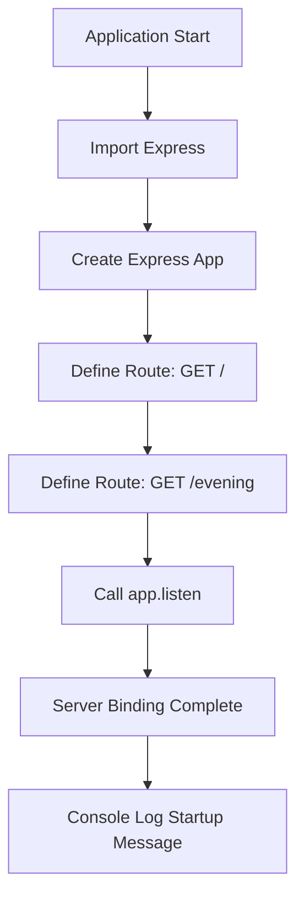
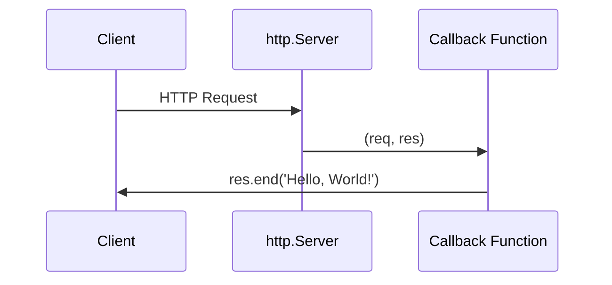
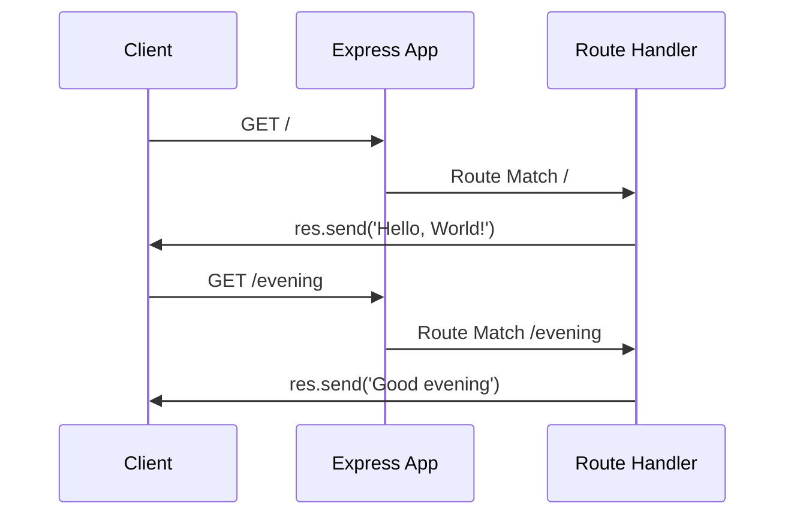
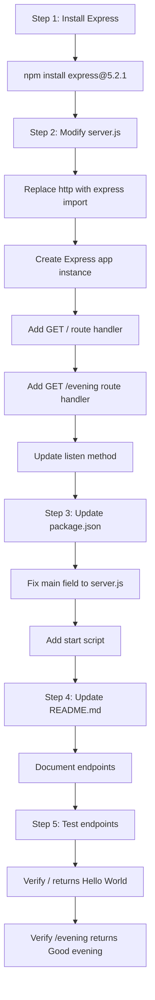
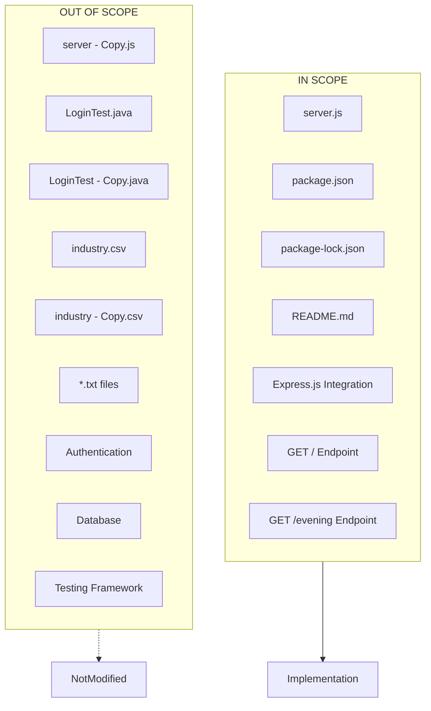
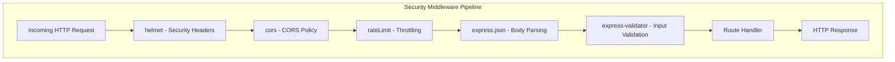

# Technical Specification

# 0. Agent Action Plan

## 0.1 Intent Clarification

This section translates the user's requirements into precise technical specifications that drive the implementation.

### 0.1.1 Core Feature Objective

Based on the prompt, the Blitzy platform understands that the new feature requirement is to:

- **Integrate Express.js Framework**: Add Express.js as a dependency to the existing Node.js "Hello World" HTTP server project, replacing or augmenting the current native `http` module implementation
- **Add New Endpoint**: Create a new HTTP endpoint that returns the response "Good evening" to complement the existing "Hello World" response
- **Maintain Existing Functionality**: Preserve the current "Hello, World!" endpoint behavior while adding the new functionality

**Implicit Requirements Detected:**

| Implicit Requirement | Rationale |
|---------------------|-----------|
| Route-based architecture | Express.js enables path-based routing, requiring separation of endpoints |
| Port configuration preservation | Maintain the existing port 3000 binding for backward compatibility |
| Response format consistency | Match the existing `text/plain` content-type pattern |
| CommonJS module compatibility | Existing code uses `require()` syntax, Express integration should follow same pattern |

**Feature Dependencies and Prerequisites:**

| Dependency | Description | Status |
|------------|-------------|--------|
| Node.js runtime | Version 18+ required for Express.js 5.x | Available (v20.19.6) |
| npm package manager | Required for installing Express.js | Available (v11.1.0) |
| Existing server.js | Foundation for feature integration | Present |
| package.json | Manifest for dependency declaration | Present |

### 0.1.2 Special Instructions and Constraints

**Architectural Requirements:**

- Use Express.js routing pattern instead of raw `http.createServer()` callback
- Follow repository conventions using CommonJS (`require`) module syntax
- Maintain the simple, minimal nature of the tutorial project

**User Example Preserved:**

```
User Example: "add expressjs into the project and add another endpoint that return the response of 'Good evening'"
```

**Web Search Requirements Identified:**

| Research Topic | Purpose | Status |
|----------------|---------|--------|
| Latest Express.js version | Ensure current, supported version | Completed - v5.2.1 |
| Express.js 5.x compatibility | Verify Node.js 18+ requirement | Completed |
| Express.js routing basics | Implementation pattern reference | Completed |

### 0.1.3 Technical Interpretation

These feature requirements translate to the following technical implementation strategy:

| Requirement | Technical Action | Component |
|-------------|------------------|-----------|
| Add Express.js | Install `express@5.2.1` via npm | package.json, package-lock.json |
| Create "Hello World" route | Define GET route at `/` or `/hello` | server.js |
| Create "Good evening" route | Define GET route at `/evening` or `/good-evening` | server.js |
| Preserve server behavior | Maintain port 3000 binding with console log | server.js |

**Technical Approach:**

- To **integrate Express.js**, we will **modify** `package.json` to add Express as a dependency and **refactor** `server.js` to use Express's application factory pattern
- To **implement the "Hello World" endpoint**, we will **create** a GET route handler that responds with "Hello, World!\n"
- To **implement the "Good evening" endpoint**, we will **create** a GET route handler at a designated path that responds with "Good evening"
- To **maintain startup behavior**, we will **preserve** the console.log output pattern when the server starts listening

## 0.2 Repository Scope Discovery

This section provides a comprehensive analysis of all files in the repository and identifies which require modification, creation, or remain unaffected.

### 0.2.1 Comprehensive File Analysis

**Current Repository Structure:**

| File Path | Type | Relevance | Action Required |
|-----------|------|-----------|-----------------|
| server.js | Source | **Critical** | MODIFY - Refactor to use Express.js |
| package.json | Config | **Critical** | MODIFY - Add Express dependency |
| package-lock.json | Lock | **Critical** | REGENERATE - Updated by npm install |
| README.md | Docs | Medium | MODIFY - Update documentation |
| server - Copy.js | Backup | Low | NO CHANGE - Historical backup |
| LoginTest.java | Test | None | OUT OF SCOPE |
| LoginTest - Copy.java | Test | None | OUT OF SCOPE |
| industry.csv | Data | None | OUT OF SCOPE |
| industry - Copy.csv | Data | None | OUT OF SCOPE |
| test.py.txt | Placeholder | None | OUT OF SCOPE |
| test.py - Copy.txt | Placeholder | None | OUT OF SCOPE |
| test.txt.txt | Placeholder | None | OUT OF SCOPE |

**Files Requiring Modification:**

| File | Current State | Required Changes |
|------|---------------|------------------|
| `server.js` | Uses native `http` module with single response | Refactor to use Express.js with multiple routes |
| `package.json` | No dependencies declared | Add `express` dependency |
| `package-lock.json` | Empty dependency tree | Will be regenerated with Express dependencies |
| `README.md` | Minimal description only | Add usage instructions for new endpoints |

### 0.2.2 Integration Point Discovery

**API Endpoint Mapping:**

| Endpoint | HTTP Method | Response | Status |
|----------|-------------|----------|--------|
| `/` or `/hello` | GET | "Hello, World!\n" | Existing (to be preserved) |
| `/evening` | GET | "Good evening" | **NEW** |

**Server Configuration Touchpoints:**

| Component | Current Location | Integration Impact |
|-----------|------------------|-------------------|
| Port binding | server.js:4 | Preserve `port = 3000` |
| Hostname | server.js:3 | May simplify to `0.0.0.0` or keep `127.0.0.1` |
| Startup log | server.js:13 | Preserve console output pattern |

### 0.2.3 Web Search Research Conducted

| Research Topic | Finding | Application |
|----------------|---------|-------------|
| Express.js latest version | v5.2.1 is current stable | Use `express@5.2.1` |
| Express 5.x Node.js requirement | Requires Node.js 18+ | Compatible (v20.19.6 available) |
| Express routing pattern | `app.get(path, handler)` | Apply for both endpoints |
| Express response methods | `res.send()` or `res.end()` | Use for response body |

### 0.2.4 New File Requirements

**New Source Files to Create:**

No new source files are required for this minimal feature addition. All changes will be made within the existing `server.js` file.

**New Test Files (Optional Enhancement):**

| File Path | Purpose | Priority |
|-----------|---------|----------|
| tests/server.test.js | Unit tests for endpoints | Optional |
| tests/integration.test.js | Integration testing | Optional |

**New Configuration Files:**

No additional configuration files are required for this feature.

### 0.2.5 Existing File Details

**server.js (Current Implementation):**

```javascript
const http = require('http');
const server = http.createServer((req, res) => {
  res.end('Hello, World!\n');
});
```

This file requires complete refactoring to use Express.js patterns while preserving the essential behavior.

**package.json (Current State):**

```json
{
  "name": "hello_world",
  "version": "1.0.0",
  "main": "index.js"
}
```

Note: The `main` field points to `index.js` but actual entry point is `server.js`. This discrepancy should be addressed.

## 0.3 Dependency Inventory

This section catalogs all dependencies required for the feature implementation, including new packages and existing configurations.

### 0.3.1 Private and Public Packages

**New Dependencies to Add:**

| Registry | Package Name | Version | Purpose |
|----------|--------------|---------|---------|
| npm (public) | express | 5.2.1 | Web framework for HTTP routing and middleware |

**Transitive Dependencies (Auto-installed with Express 5.2.1):**

| Package | Purpose |
|---------|---------|
| accepts | HTTP content negotiation |
| body-parser | Request body parsing |
| content-disposition | Content-Disposition header handling |
| content-type | Content-Type header parsing |
| cookie | Cookie parsing |
| debug | Debugging utility |
| depd | Deprecation warnings |
| encodeurl | URL encoding |
| escape-html | HTML escaping |
| etag | ETag generation |
| finalhandler | Final HTTP response handler |
| fresh | HTTP response freshness testing |
| http-errors | HTTP error handling |
| merge-descriptors | Object descriptor merging |
| methods | HTTP methods |
| mime-types | MIME type mapping |
| on-finished | Request/response finish events |
| parseurl | URL parsing |
| path-to-regexp | Route path matching |
| qs | Query string parsing |
| range-parser | Range header parsing |
| raw-body | Raw request body handling |
| router | Express router |
| safe-buffer | Safe Buffer API |
| safer-buffer | Buffer safety |
| send | Static file serving |
| serve-static | Static file middleware |
| setprototypeof | Prototype setting |
| statuses | HTTP status codes |
| type-is | Content-Type checking |
| utils-merge | Object merging |
| vary | Vary header manipulation |

### 0.3.2 Existing Dependencies

**Current State:**

| Category | Status |
|----------|--------|
| Runtime dependencies | None declared |
| Development dependencies | None declared |
| Peer dependencies | None declared |

**Built-in Module Usage (Unchanged):**

| Module | Type | Status After Change |
|--------|------|---------------------|
| http | Node.js built-in | No longer directly used (Express handles internally) |

### 0.3.3 Dependency Updates

**package.json Changes:**

| Field | Before | After |
|-------|--------|-------|
| dependencies | (not present) | `{ "express": "^5.2.1" }` |
| main | "index.js" | "server.js" (correction) |

**Security Package Dependencies (Recommended):**

| Package | Version | Registry | Purpose | Weekly Downloads |
|---------|---------|----------|---------|------------------|
| helmet | 8.1.0 | npm | Security headers middleware | 2,000,000+ |
| cors | 2.8.5 | npm | CORS middleware | 10,000,000+ |
| express-rate-limit | 8.2.1 | npm | Rate limiting middleware | 1,000,000+ |
| express-validator | 7.3.1 | npm | Input validation middleware | 1,000,000+ |

**Security Package Installation:**

```bash
npm install helmet@8.1.0 cors@2.8.5 express-rate-limit@8.2.1 express-validator@7.3.1
```

**Import Updates:**

| File | Current Import | New Import |
|------|----------------|------------|
| server.js | `const http = require('http');` | `const express = require('express');` |

**Security Middleware Imports (Recommended):**

| Package | Import Statement |
|---------|------------------|
| helmet | `const helmet = require('helmet');` |
| cors | `const cors = require('cors');` |
| express-rate-limit | `const rateLimit = require('express-rate-limit');` |
| express-validator | `const { body, validationResult } = require('express-validator');` |

**Import Transformation Rules:**

| Pattern | Before | After | Applies To |
|---------|--------|-------|------------|
| HTTP module | `require('http')` | `require('express')` | server.js |
| Server creation | `http.createServer()` | `express()` | server.js |

### 0.3.4 External Reference Updates

**Configuration Files:**

| File | Update Required |
|------|-----------------|
| package.json | Add dependencies field |
| package-lock.json | Regenerated by npm |

**Documentation:**

| File | Update Required |
|------|-----------------|
| README.md | Add Express.js usage instructions |

### 0.3.5 Version Compatibility Matrix

| Component | Minimum Version | Current Version | Compatible |
|-----------|-----------------|-----------------|------------|
| Node.js | 18.0.0 | 20.19.6 | ✓ Yes |
| npm | 7.0.0 | 11.1.0 | ✓ Yes |
| Express.js | 5.0.0 | 5.2.1 | ✓ Yes |

### 0.3.6 Installation Command

```bash
npm install express@5.2.1
```

This command will:
- Add Express.js 5.2.1 to package.json dependencies
- Install Express.js and all transitive dependencies to node_modules/
- Update package-lock.json with complete dependency tree

## 0.4 Integration Analysis

This section documents all integration points where the new Express.js feature connects with existing code.

### 0.4.1 Existing Code Touchpoints

**Direct Modifications Required:**

| File | Location | Change Description |
|------|----------|-------------------|
| server.js:1 | Import statement | Replace `http` with `express` module import |
| server.js:3-4 | Configuration | Preserve hostname and port constants |
| server.js:6-10 | Server creation | Replace `http.createServer()` with Express app pattern |
| server.js:12-14 | Server binding | Update to Express's `app.listen()` method |

**Line-by-Line Integration Map:**

| Original Line | Content | Action |
|---------------|---------|--------|
| 1 | `const http = require('http');` | REPLACE with Express import |
| 2 | (empty) | KEEP |
| 3 | `const hostname = '127.0.0.1';` | OPTIONAL - Express can default |
| 4 | `const port = 3000;` | KEEP - Preserve port configuration |
| 5 | (empty) | KEEP |
| 6-10 | `http.createServer()` callback | REPLACE with Express route handlers |
| 11 | (empty) | KEEP |
| 12-14 | `server.listen()` callback | REPLACE with `app.listen()` pattern |

### 0.4.2 API Route Integration

**Existing Endpoint Preservation:**

| Aspect | Current | After Express Integration |
|--------|---------|---------------------------|
| Path | All paths (catch-all) | Explicit route `/` |
| Method | All methods | GET only |
| Response | "Hello, World!\n" | "Hello, World!\n" (unchanged) |
| Status | 200 | 200 (unchanged) |
| Content-Type | text/plain | text/plain (unchanged) |

**New Endpoint Addition:**

| Aspect | Specification |
|--------|---------------|
| Path | `/evening` |
| Method | GET |
| Response | "Good evening" |
| Status | 200 |
| Content-Type | text/plain |

### 0.4.3 Application Lifecycle Integration

**Startup Sequence:**



**Shutdown Handling:**

Express.js uses Node.js built-in process handlers. No additional shutdown integration required for this simple implementation.

### 0.4.4 Request/Response Flow Integration

**Current Flow (Native http):**



**New Flow (Express.js):**



### 0.4.5 Middleware Chain (Default)

Express.js includes built-in middleware. For this simple implementation, no custom middleware is required:

| Middleware | Status | Purpose |
|------------|--------|---------|
| express.json() | Not needed | No JSON body parsing required |
| express.urlencoded() | Not needed | No form data parsing required |
| express.static() | Not needed | No static file serving required |
| Custom middleware | Not needed | Simple route handlers sufficient |

### 0.4.6 Error Handling Integration

Express.js provides default error handling. For this tutorial-level project:

| Error Scenario | Handling |
|----------------|----------|
| 404 Not Found | Express default (no custom handler needed) |
| 500 Server Error | Express default |
| Route errors | Express default error middleware |

### 0.4.7 No Database or Schema Updates Required

This feature addition does not require any database changes:

| Component | Status |
|-----------|--------|
| Database migrations | Not applicable |
| Schema updates | Not applicable |
| Data models | Not applicable |

## 0.5 Technical Implementation

This section provides the complete file-by-file execution plan with specific implementation details.

### 0.5.1 File-by-File Execution Plan

**Group 1 - Core Source Files:**

| Action | File | Purpose |
|--------|------|---------|
| MODIFY | server.js | Refactor to Express.js with dual endpoints |

**Group 2 - Dependency Configuration:**

| Action | File | Purpose |
|--------|------|---------|
| MODIFY | package.json | Add Express.js dependency, fix main entry |
| REGENERATE | package-lock.json | Updated dependency tree |

**Group 3 - Documentation:**

| Action | File | Purpose |
|--------|------|---------|
| MODIFY | README.md | Document new endpoint usage |

### 0.5.2 Implementation Approach per File

## server.js Transformation

**Current Implementation:**
```javascript
const http = require('http');
const server = http.createServer((req, res) => {
  res.end('Hello, World!\n');
});
server.listen(port, hostname, () => { ... });
```

**Target Implementation Pattern:**
```javascript
const express = require('express');
const app = express();
app.get('/', (req, res) => { ... });
app.get('/evening', (req, res) => { ... });
app.listen(port, () => { ... });
```

**Specific Changes:**

| Line Range | Before | After |
|------------|--------|-------|
| 1 | `const http = require('http');` | `const express = require('express');` |
| 3 | `const hostname = '127.0.0.1';` | (Optional: remove or keep) |
| 4 | `const port = 3000;` | `const port = 3000;` (unchanged) |
| 6 | `const server = http.createServer(...)` | `const app = express();` |
| 7-9 | Response in callback | Route handler for GET / |
| NEW | (none) | Route handler for GET /evening |
| 12-14 | `server.listen(port, hostname, ...)` | `app.listen(port, ...)` |

## package.json Updates

**Fields to Add/Modify:**

| Field | Before | After |
|-------|--------|-------|
| main | "index.js" | "server.js" |
| dependencies | (absent) | `{ "express": "^5.2.1" }` |
| scripts.start | (absent) | `"node server.js"` |

## README.md Updates

**Sections to Add:**

| Section | Content |
|---------|---------|
| Installation | `npm install` command |
| Running | `node server.js` or `npm start` |
| Endpoints | Document `/` and `/evening` routes |

### 0.5.3 Route Handler Specifications

**Route 1: Hello World Endpoint**

| Property | Value |
|----------|-------|
| Path | `/` |
| Method | GET |
| Handler | `(req, res) => res.send('Hello, World!\n')` |
| Content-Type | text/plain (auto via Express) |
| Status Code | 200 (default) |

**Route 2: Good Evening Endpoint**

| Property | Value |
|----------|-------|
| Path | `/evening` |
| Method | GET |
| Handler | `(req, res) => res.send('Good evening')` |
| Content-Type | text/plain (auto via Express) |
| Status Code | 200 (default) |

### 0.5.4 Server Configuration

**Port Configuration:**

| Setting | Value | Source |
|---------|-------|--------|
| Port | 3000 | Preserved from original |
| Host | 0.0.0.0 (Express default) | Simplified from 127.0.0.1 |

**Startup Console Output:**

| Original Message | Updated Message |
|------------------|-----------------|
| `Server running at http://127.0.0.1:3000/` | `Server running at http://localhost:3000/` |

### 0.5.5 Execution Order



### 0.5.6 Testing Verification Commands

**Start Server:**
```bash
node server.js
```

**Test Endpoints:**
```bash
curl http://localhost:3000/
curl http://localhost:3000/evening
```

**Expected Responses:**

| Endpoint | Expected Response |
|----------|-------------------|
| `GET /` | `Hello, World!` |
| `GET /evening` | `Good evening` |

### 0.5.7 User Interface Design

No UI components are required for this feature. The implementation consists of HTTP API endpoints only, returning plain text responses.

## 0.6 Scope Boundaries

This section clearly defines what is in scope and out of scope for this feature implementation.

### 0.6.1 Exhaustively In Scope

**Source Files:**

| Pattern | Files Matched | Purpose |
|---------|---------------|---------|
| server.js | server.js | Main Express.js server with endpoints |

**Configuration Files:**

| Pattern | Files Matched | Purpose |
|---------|---------------|---------|
| package.json | package.json | Dependency declaration, entry point fix |
| package-lock.json | package-lock.json | Dependency lock file (regenerated) |

**Documentation Files:**

| Pattern | Files Matched | Purpose |
|---------|---------------|---------|
| README.md | README.md | Usage documentation update |

**Complete In-Scope File List:**

| # | File Path | Action | Priority |
|---|-----------|--------|----------|
| 1 | server.js | MODIFY | Critical |
| 2 | package.json | MODIFY | Critical |
| 3 | package-lock.json | REGENERATE | Critical |
| 4 | README.md | MODIFY | Medium |

**In-Scope Functionality:**

| Feature | Description | Status |
|---------|-------------|--------|
| Express.js integration | Add Express framework | Required |
| GET / endpoint | "Hello, World!" response | Required |
| GET /evening endpoint | "Good evening" response | Required |
| Port 3000 binding | Server network configuration | Required |
| Startup logging | Console output on server start | Required |

### 0.6.2 Explicitly Out of Scope

**Unrelated Files (No Changes):**

| File | Reason |
|------|--------|
| server - Copy.js | Backup file, not primary implementation |
| LoginTest.java | Java test file, unrelated to Node.js |
| LoginTest - Copy.java | Java backup, unrelated to Node.js |
| industry.csv | Data file, no relation to HTTP server |
| industry - Copy.csv | Data backup, no relation to HTTP server |
| test.py.txt | Empty placeholder, no content |
| test.py - Copy.txt | Empty placeholder, no content |
| test.txt.txt | Empty placeholder, no content |

**Out-of-Scope Functionality:**

| Feature | Reason |
|---------|--------|
| Authentication/Authorization | Not requested |
| Database integration | Not requested |
| Session management | Not requested |
| Template rendering | Not requested |
| Static file serving | Not requested |
| API versioning | Not requested |
| CORS middleware | Not requested |
| Request logging middleware | Not requested |
| Input validation | Not requested |
| Error handling middleware | Not requested |
| Rate limiting | Not requested |
| HTTPS/TLS | Not requested |
| Containerization | Not requested |
| CI/CD pipeline | Not requested |
| Unit testing framework | Not requested |
| TypeScript conversion | Not requested |

**Performance Optimizations Excluded:**

| Optimization | Status |
|--------------|--------|
| Clustering | Out of scope |
| Caching | Out of scope |
| Compression | Out of scope |
| Load balancing | Out of scope |

**Refactoring Excluded:**

| Refactor | Status |
|----------|--------|
| Convert to ES Modules | Out of scope |
| Add TypeScript | Out of scope |
| Restructure to MVC | Out of scope |
| Extract routes to separate files | Out of scope |

### 0.6.3 Scope Verification Checklist

| Requirement | In Scope | Implementation |
|-------------|----------|----------------|
| Add Express.js to project | ✓ | npm install express@5.2.1 |
| Add endpoint returning "Good evening" | ✓ | GET /evening route |
| Preserve existing functionality | ✓ | GET / route for "Hello, World!" |
| Modify unrelated files | ✗ | Java, CSV, txt files unchanged |
| Add new features beyond request | ✗ | Only requested endpoints |

### 0.6.4 Boundary Diagram



## 0.7 Rules for Feature Addition

This section documents all rules, constraints, and conventions that must be followed during implementation.

### 0.7.1 Code Convention Rules

**Module System:**

| Rule | Specification |
|------|---------------|
| Module format | CommonJS (`require()`) |
| Rationale | Maintain consistency with existing codebase |

**Coding Style:**

| Rule | Specification |
|------|---------------|
| String quotes | Single quotes (`'`) preferred |
| Semicolons | Required at end of statements |
| Indentation | 2 spaces |
| Line length | No strict limit (follow existing patterns) |

**Express.js Patterns:**

| Pattern | Requirement |
|---------|-------------|
| App initialization | `const app = express();` |
| Route definition | `app.get(path, handler)` |
| Response sending | `res.send()` for plain text |
| Server startup | `app.listen(port, callback)` |

### 0.7.2 Naming Conventions

**Variables:**

| Variable | Convention |
|----------|------------|
| Express app | `app` |
| Port number | `port` |
| Request object | `req` |
| Response object | `res` |

**Routes:**

| Endpoint | Path Format |
|----------|-------------|
| Hello World | `/` (root) |
| Good Evening | `/evening` (lowercase, hyphen-separated for multi-word) |

### 0.7.3 Response Format Rules

**Consistency Requirements:**

| Aspect | Requirement |
|--------|-------------|
| Content-Type | text/plain (consistent with existing) |
| Character encoding | UTF-8 |
| Response body | Plain string, no JSON unless specified |
| Trailing newline | Optional for new endpoint (original has `\n`) |

**Response Specifications:**

| Endpoint | Exact Response |
|----------|----------------|
| GET / | `Hello, World!\n` (preserve original) |
| GET /evening | `Good evening` (per user request) |

### 0.7.4 Integration Requirements

**Backward Compatibility:**

| Requirement | Specification |
|-------------|---------------|
| Port number | Must remain 3000 |
| Hello World response | Must return identical text |
| Startup behavior | Must log server running message |

**Express-Specific Integration:**

| Requirement | Specification |
|-------------|---------------|
| No middleware required | Keep implementation simple |
| Default error handling | Use Express defaults |
| No route parameters | Static paths only |

### 0.7.5 Dependency Rules

**Version Constraints:**

| Dependency | Version | Constraint Type |
|------------|---------|-----------------|
| express | ^5.2.1 | Caret range (compatible updates allowed) |
| Node.js | >=18.0.0 | Minimum version required |

**No Additional Dependencies:**

| Rule | Specification |
|------|---------------|
| Extra packages | Do not add unless required by Express |
| Dev dependencies | Not required for this minimal implementation |

### 0.7.6 Security Considerations

**Security Architecture Overview:**

This section documents the recommended security hardening features for the Express.js application. For detailed implementation instructions, refer to the [Security Implementation Guide](./Security%20Implementation%20Guide.md).

**Security Middleware Stack:**



**Security Feature Matrix:**

| Security Feature | Package | Version | Purpose | Status |
|-----------------|---------|---------|---------|--------|
| Security Headers | helmet | 8.1.0 | Sets 13 HTTP security headers | Documented |
| CORS Policy | cors | 2.8.5 | Cross-origin resource sharing control | Documented |
| Rate Limiting | express-rate-limit | 8.2.1 | Request throttling and abuse prevention | Documented |
| Input Validation | express-validator | 7.3.1 | Request data validation and sanitization | Documented |
| HTTPS/TLS | Node.js https | built-in | Encrypted transport layer | Documented |

**Helmet.js Security Headers (Default Configuration):**

| Header | Purpose | Default Value |
|--------|---------|---------------|
| Content-Security-Policy | Prevents XSS attacks | `default-src 'self'` |
| Cross-Origin-Opener-Policy | Isolates browsing context | `same-origin` |
| Cross-Origin-Resource-Policy | Controls resource sharing | `same-origin` |
| Origin-Agent-Cluster | Requests origin-keyed cluster | `?1` |
| Referrer-Policy | Controls referrer information | `no-referrer` |
| Strict-Transport-Security | Enforces HTTPS | `max-age=15552000; includeSubDomains` |
| X-Content-Type-Options | Prevents MIME sniffing | `nosniff` |
| X-DNS-Prefetch-Control | Controls DNS prefetching | `off` |
| X-Download-Options | Prevents file opening (IE) | `noopen` |
| X-Frame-Options | Prevents clickjacking | `SAMEORIGIN` |
| X-Permitted-Cross-Domain-Policies | Controls Flash/Acrobat | `none` |
| X-XSS-Protection | Disables XSS auditor | `0` |
| X-Powered-By | Hide technology stack | (removed) |

**CORS Configuration Options:**

| Option | Type | Default | Description |
|--------|------|---------|-------------|
| `origin` | String/Array/Function | `*` | Allowed origins |
| `methods` | String/Array | `GET,HEAD,PUT,PATCH,POST,DELETE` | Allowed HTTP methods |
| `allowedHeaders` | String/Array | (reflects request) | Allowed request headers |
| `exposedHeaders` | String/Array | None | Headers exposed to client |
| `credentials` | Boolean | `false` | Allow credentials |
| `maxAge` | Number | None | Preflight cache duration |
| `preflightContinue` | Boolean | `false` | Pass to next handler |
| `optionsSuccessStatus` | Number | `204` | OPTIONS success status |

**Rate Limiting Configuration:**

| Option | Type | Default | Description |
|--------|------|---------|-------------|
| `windowMs` | Number | `60000` | Time window in milliseconds |
| `limit` | Number | `5` | Max requests per window |
| `message` | String/Object | `Too many requests...` | Response when exceeded |
| `statusCode` | Number | `429` | HTTP status when exceeded |
| `standardHeaders` | Boolean/String | `draft-6` | RateLimit header format |
| `legacyHeaders` | Boolean | `true` | X-RateLimit headers |

**Input Validation Methods:**

| Method | Description | Example |
|--------|-------------|---------|
| `body(field)` | Validate request body | `body('email').isEmail()` |
| `query(field)` | Validate query parameter | `query('page').isInt()` |
| `param(field)` | Validate route parameter | `param('id').isUUID()` |
| `validationResult(req)` | Get validation errors | Returns errors array |

**Express 5.x Built-in Security Features:**

| Feature | Status |
|---------|--------|
| Updated path-to-regexp | Automatically included (ReDoS mitigation) |
| Promise rejection handling | Built-in (middleware can return rejected promises) |

**Security Testing Commands:**

```bash
# Verify security headers
curl -I http://localhost:3000/

# Test rate limiting
for i in {1..110}; do curl -s -o /dev/null -w "%{http_code}\n" http://localhost:3000/; done

# Test CORS preflight
curl -X OPTIONS http://localhost:3000/ -H "Origin: https://example.com" -I
```

**Security Documentation Reference:**

| Document | Purpose |
|----------|---------|
| [Security Implementation Guide](./Security%20Implementation%20Guide.md) | Complete security middleware setup guide |
| https://helmetjs.github.io | Helmet.js official documentation |
| https://expressjs.com/en/resources/middleware/cors.html | CORS middleware documentation |
| https://express-rate-limit.mintlify.app | Rate limiting documentation |
| https://express-validator.github.io | Input validation documentation |

### 0.7.7 Documentation Rules

**README.md Updates:**

| Section | Requirement |
|---------|-------------|
| Available endpoints | List both / and /evening |
| Running instructions | Include `node server.js` |
| Express.js mention | Note the framework in use |

### 0.7.8 User-Specified Rules

The user did not specify additional rules beyond:

| User Direction | Interpretation |
|----------------|----------------|
| "add expressjs into the project" | Install Express.js as dependency |
| "add another endpoint that return the response of 'Good evening'" | Create new GET endpoint with exact response text |

No other special patterns, conventions, performance requirements, or security mandates were explicitly emphasized by the user.

## 0.8 References

This section documents all sources referenced during the analysis and planning phase.

### 0.8.1 Repository Files Searched

**Files Retrieved and Analyzed:**

| File Path | Purpose | Key Findings |
|-----------|---------|--------------|
| server.js | Current server implementation | Uses native `http` module, single endpoint returning "Hello, World!" |
| package.json | Project manifest | No dependencies, MIT license, main points to incorrect file |
| package-lock.json | Dependency lock | Empty dependency tree confirms zero deps |
| README.md | Project documentation | Minimal description: "test project for backprop integration" |

**Files Identified (Out of Scope):**

| File Path | Reason Excluded |
|-----------|-----------------|
| server - Copy.js | Backup file, not modified |
| LoginTest.java | Unrelated Java file |
| LoginTest - Copy.java | Unrelated Java backup |
| industry.csv | Data file, unrelated |
| industry - Copy.csv | Data backup, unrelated |
| test.py.txt | Empty placeholder |
| test.py - Copy.txt | Empty placeholder |
| test.txt.txt | Empty placeholder |

### 0.8.2 Technical Specification Sections Referenced

| Section | Content Retrieved | Application |
|---------|-------------------|-------------|
| 3.3 Frameworks & Libraries | Current framework-less architecture | Baseline for Express integration |
| Node.js Runtime | Version compatibility info | Confirmed Node.js 18+ needed for Express 5 |
| 2.2 Feature Catalog | Existing feature documentation | Understanding current "Hello World" feature |

### 0.8.3 External Research Conducted

**Web Search Queries:**

| Query | Purpose | Key Findings |
|-------|---------|--------------|
| "Express.js latest version npm 2025" | Verify current stable version | Express 5.2.1 is latest stable |

**External Sources Referenced:**

| Source | URL | Information Used |
|--------|-----|------------------|
| npm Express Package | https://www.npmjs.com/package/express | Latest version 5.2.1 confirmation |
| Express.js GitHub Releases | https://github.com/expressjs/express/releases | Express v5 release notes, Node.js 18+ requirement |
| Express.js Official Blog | https://expressjs.com/2025/03/31/v5-1-latest-release.html | Express 5.1.0 becoming npm default |
| endoflife.date Express | https://endoflife.date/express | Express LTS information |

### 0.8.4 User-Provided Attachments

| Attachment | Status |
|------------|--------|
| Files | None provided |
| Figma URLs | None provided |
| Documentation | None provided |

### 0.8.5 Environment Information

**Runtime Environment:**

| Component | Version |
|-----------|---------|
| Node.js | v20.19.6 |
| npm | v11.1.0 |

**Target Dependency:**

| Package | Target Version | Source |
|---------|----------------|--------|
| express | 5.2.1 | npm registry |

### 0.8.6 Related Documentation

| Document | Purpose |
|----------|---------|
| Express.js Documentation | https://expressjs.com/ |
| Express.js API Reference | https://expressjs.com/en/5x/api.html |
| Express.js Migration Guide | https://expressjs.com/en/guide/migrating-5.html |

### 0.8.7 Analysis Summary

| Category | Count |
|----------|-------|
| Files analyzed | 4 |
| Files to modify | 4 |
| Files out of scope | 8 |
| New dependencies | 1 |
| New endpoints | 1 |
| Tech spec sections referenced | 3 |
| Web searches conducted | 1 |
| External sources cited | 4 |

