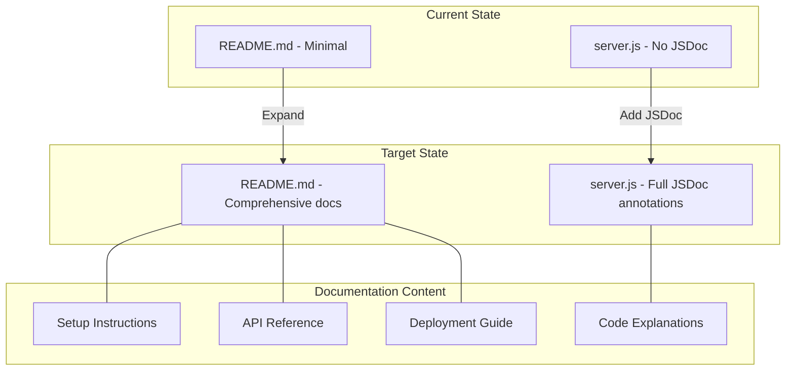
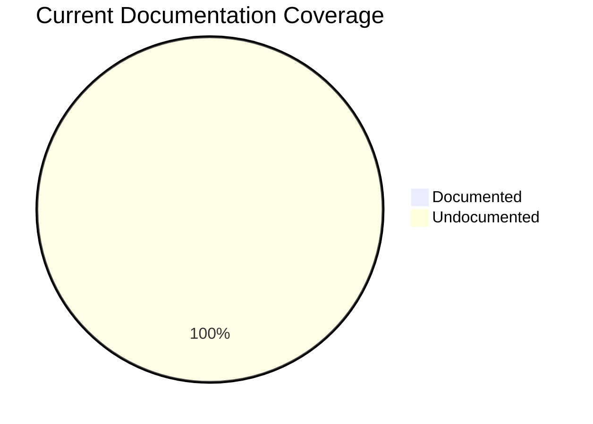
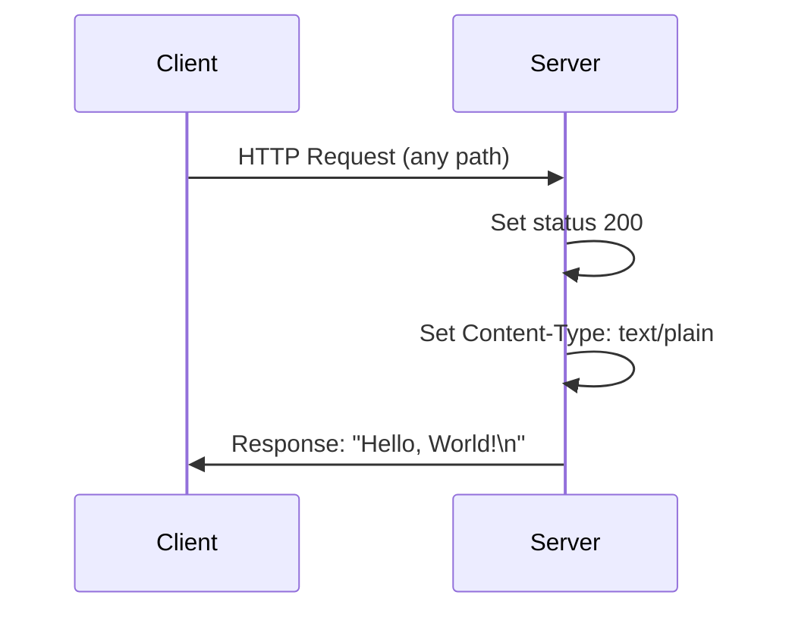
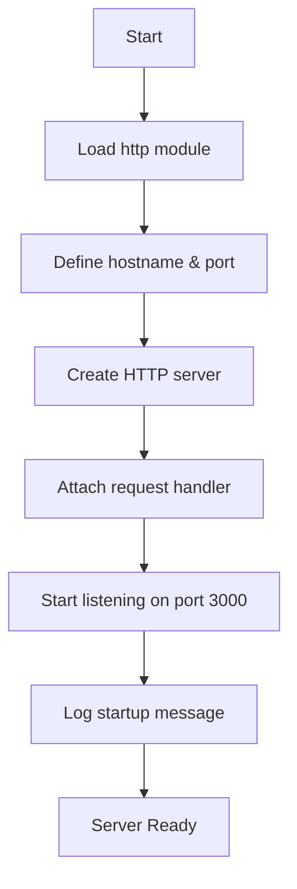

# Technical Specification

# 0. Agent Action Plan

## 0.1 Intent Clarification

### 0.1.1 Core Documentation Objective

Based on the provided requirements, the Blitzy platform understands that the documentation objective is to **comprehensively document an existing Node.js HTTP server application** by adding JSDoc inline comments and creating a complete README documentation suite.

| Attribute | Value |
|-----------|-------|
| **Request Category** | Create new documentation + Update existing documentation |
| **Documentation Types** | JSDoc inline comments, API documentation, User guide, Deployment guide |
| **Target Repository** | hello_world Node.js HTTP server |
| **Complexity Level** | Low (minimal source codebase with single server file) |

#### Documentation Requirements with Enhanced Clarity

| Requirement | Description | Deliverables |
|-------------|-------------|--------------|
| **JSDoc Comments** | Add comprehensive JSDoc annotations to all functions and constants in server.js | `@fileoverview`, `@const`, `@param`, `@returns`, inline explanations |
| **Setup Instructions** | Create comprehensive getting started guide | Prerequisites, installation steps, environment configuration |
| **API Documentation** | Document the HTTP server endpoints and behavior | Endpoint descriptions, request/response formats, examples |
| **Deployment Guide** | Create production deployment documentation | Production considerations, hosting options, scaling guidance |
| **Inline Code Explanations** | Add detailed inline comments explaining code logic | Line-by-line explanations for educational purposes |

#### Implicit Documentation Needs

Based on the codebase analysis, the following implicit documentation requirements are identified:

| Implicit Requirement | Rationale |
|---------------------|-----------|
| **File Overview Documentation** | The `@fileoverview` JSDoc tag is needed to describe the purpose and scope of server.js |
| **Constants Documentation** | The hostname and port constants require `@const` JSDoc annotations with type information |
| **Request Handler Documentation** | The HTTP request callback function needs comprehensive JSDoc with parameter types |
| **Project Structure Documentation** | README should include file structure explanation for newcomers |
| **Testing Documentation** | Instructions for testing the server locally should be included |
| **Troubleshooting Section** | Common issues and solutions should be documented for users |

### 0.1.2 Special Instructions and Constraints

#### Critical Directives

| Directive | Implementation Approach |
|-----------|------------------------|
| Add JSDoc comments to server.js functions | Document all functions, constants, and callbacks with JSDoc syntax |
| Create comprehensive README | Transform minimal README into full documentation suite |
| Include setup instructions | Document prerequisites, installation, and configuration |
| Add API documentation | Document HTTP endpoints, methods, responses |
| Create deployment guide | Document production deployment considerations |
| Add inline code explanations | Include educational comments explaining code logic |

#### Documentation Style Requirements

- JSDoc syntax must follow the official JSDoc specification (jsdoc.app)
- README should use standard Markdown formatting with clear section headers
- Code examples must include syntax highlighting with language specifiers
- All documentation should be beginner-friendly while technically accurate

#### Preserved Examples

No specific examples were provided by the user. The documentation will follow standard best practices for Node.js projects.

### 0.1.3 Technical Interpretation

These documentation requirements translate to the following technical documentation strategy:



#### Requirement-to-Action Mapping

| Requirement | Documentation Action | Target File(s) |
|-------------|---------------------|----------------|
| JSDoc comments for server.js functions | Add `@fileoverview`, `@const`, `@param`, `@returns` annotations | server.js |
| Comprehensive README | Complete rewrite with structured sections | README.md |
| Setup instructions | Create "Getting Started" section with prerequisites and steps | README.md |
| API documentation | Create "API Reference" section with endpoint details | README.md |
| Deployment guide | Create "Deployment" section with production guidance | README.md |
| Inline code explanations | Add detailed inline comments explaining each code block | server.js |

### 0.1.4 Inferred Documentation Needs

Based on code analysis of the repository:

| Discovery | Inferred Need |
|-----------|---------------|
| `server.js` contains undocumented HTTP callback function | JSDoc for request handler with `@param {http.IncomingMessage}` and `@param {http.ServerResponse}` |
| `server.js` has undocumented constants | JSDoc `@const` tags for `hostname`, `port`, and `server` variables |
| Single-file architecture | README should explain why single-file approach is used |
| No error handling in current code | Documentation should note the basic nature and suggest production improvements |
| Uses built-in `http` module only | Document zero-dependency approach as a feature |
| Bound to localhost only | Document how to modify for network access in deployment guide |


## 0.2 Documentation Discovery and Analysis

### 0.2.1 Existing Documentation Infrastructure Assessment

Repository analysis reveals a **minimal documentation structure** with basic README.md and no dedicated documentation tooling.

#### Current Documentation State

| Documentation Asset | Status | Coverage |
|--------------------|--------|----------|
| README.md | EXISTS - Minimal (2 lines) | Project name and warning only |
| JSDoc comments | MISSING | 0% of code documented |
| API documentation | MISSING | No endpoint documentation |
| Setup guide | MISSING | No installation instructions |
| Deployment guide | MISSING | No production guidance |
| Code comments | MISSING | No inline explanations |

#### Search Patterns Employed

| Pattern | Target | Results |
|---------|--------|---------|
| `README*` | Project overview documentation | README.md found (minimal content) |
| `docs/**` | Documentation folder | Not present |
| `*.md` | Markdown documentation files | Only README.md exists |
| `CONTRIBUTING.md` | Contribution guidelines | Not present |
| `CHANGELOG.md` | Version history | Not present |
| `jsdoc.conf.json` | JSDoc configuration | Not present |
| `.jsdoc.json` | JSDoc configuration (alt) | Not present |

#### Current Documentation Content Analysis

**README.md** (Source: `/README.md:1-2`)
```
# hao-backprop-test

test project for backprop integration. Do not touch!
```

**Assessment:**
- Contains only project title and warning message
- No technical documentation whatsoever
- No setup or usage instructions
- No API reference
- No deployment guidance

### 0.2.2 Documentation Framework Analysis

| Aspect | Current State | Required State |
|--------|--------------|----------------|
| **Documentation framework** | None configured | JSDoc for inline docs |
| **Documentation generator config** | Not present | Optional jsdoc.conf.json |
| **API documentation tools** | Not installed | JSDoc 4.0.5 recommended |
| **Diagram tools** | Not present | Mermaid (embedded in README) |
| **Documentation hosting** | Not configured | GitHub README (primary) |

### 0.2.3 Repository Code Analysis for Documentation

#### Key Source Files Examined

| File | Path | Documentation Status | Analysis |
|------|------|---------------------|----------|
| **server.js** | `/server.js` | No JSDoc | Contains HTTP server implementation requiring full JSDoc coverage |
| **server - Copy.js** | `/server - Copy.js` | No JSDoc | Duplicate file - out of scope for documentation |
| **package.json** | `/package.json` | Partial | Has basic metadata, missing docs script |
| **package-lock.json** | `/package-lock.json` | N/A | Auto-generated, no documentation needed |

#### Code Elements Requiring Documentation

**server.js Analysis** (Source: `/server.js:1-14`)

| Element | Type | Line(s) | Documentation Needed |
|---------|------|---------|---------------------|
| `http` import | Module Import | 1 | `@requires` annotation |
| `hostname` | Constant | 3 | `@const {string}` with description |
| `port` | Constant | 4 | `@const {number}` with description |
| `server` | Constant (Server Instance) | 6-10 | `@const {http.Server}` with description |
| Request handler callback | Arrow Function | 6-9 | `@param`, `@returns` annotations |
| `server.listen()` callback | Arrow Function | 12-13 | Inline comment for startup logging |

### 0.2.4 Web Search Research Conducted

| Research Topic | Findings Applied |
|----------------|-----------------|
| JSDoc best practices for Node.js | Use `@fileoverview` for file-level docs, `@const` for constants, `@param` with types |
| JSDoc current version | JSDoc 4.0.5 is latest stable version on npm |
| Node.js HTTP server documentation patterns | Document request handler parameters with Node.js types (`http.IncomingMessage`, `http.ServerResponse`) |
| README structure conventions | Use standard sections: Description, Installation, Usage, API, Deployment, License |
| Mermaid diagram integration | Embed diagrams directly in README using triple-backtick mermaid blocks |

### 0.2.5 Related Documentation Context

Based on repository exploration, no related documentation exists that could provide style guidance or templates. The documentation will follow industry-standard conventions:

| Convention Source | Application |
|------------------|-------------|
| Official JSDoc Documentation (jsdoc.app) | JSDoc syntax and tag usage |
| Node.js Documentation Style | Type annotations for built-in modules |
| GitHub README Best Practices | Section structure and markdown formatting |
| Google JavaScript Style Guide | JSDoc comment formatting patterns |


## 0.3 Documentation Scope Analysis

### 0.3.1 Code-to-Documentation Mapping

#### Module: server.js (Source: `/server.js:1-14`)

| Component | Type | Location | Current Docs | Documentation Needed |
|-----------|------|----------|--------------|---------------------|
| File header | N/A | Line 0 (new) | MISSING | `@fileoverview` block with module description |
| `http` require | Import | Line 1 | MISSING | `@requires` or inline comment |
| `hostname` | Constant | Line 3 | MISSING | `@const {string}` with purpose |
| `port` | Constant | Line 4 | MISSING | `@const {number}` with purpose |
| `server` | Server Instance | Lines 6-10 | MISSING | `@const {http.Server}` with full description |
| Request handler | Callback Function | Lines 6-9 | MISSING | `@callback` or inline `@param` annotations |
| `res.statusCode` | Property Assignment | Line 7 | MISSING | Inline explanation comment |
| `res.setHeader()` | Method Call | Line 8 | MISSING | Inline explanation comment |
| `res.end()` | Method Call | Line 9 | MISSING | Inline explanation comment |
| `server.listen()` | Method Call | Lines 12-14 | MISSING | Inline explanation comment |
| Listen callback | Callback Function | Lines 12-13 | MISSING | Inline explanation comment |

#### Public API Elements

| API Element | Exposure | Documentation Type Required |
|-------------|----------|---------------------------|
| HTTP Endpoint (/) | External (HTTP) | API Reference in README |
| HTTP Response Format | External (HTTP) | Response specification in README |
| Server Port (3000) | Configuration | Configuration section in README |
| Server Host (127.0.0.1) | Configuration | Configuration section in README |

### 0.3.2 Configuration Options Requiring Documentation

| Config Element | Source | Current Docs | Documentation Location |
|----------------|--------|--------------|----------------------|
| `hostname` (127.0.0.1) | server.js:3 | MISSING | README Configuration section + JSDoc |
| `port` (3000) | server.js:4 | MISSING | README Configuration section + JSDoc |
| Node.js runtime | Implicit | MISSING | README Prerequisites section |
| npm package manager | Implicit | MISSING | README Prerequisites section |

### 0.3.3 Features Requiring User Guides

| Feature | Current Coverage | Documentation Gaps |
|---------|-----------------|-------------------|
| **HTTP Server Startup** | Not documented | How to start, verify running, access logs |
| **Request Handling** | Not documented | What requests are accepted, response format |
| **Server Configuration** | Not documented | How to modify host/port |
| **Error Scenarios** | Not documented | Common errors, troubleshooting steps |
| **Development Workflow** | Not documented | How to modify and test changes |

### 0.3.4 Documentation Gap Analysis

Based on requirements and repository analysis, documentation gaps include:

#### Critical Gaps (Must Address)

| Gap | Impact | Priority |
|-----|--------|----------|
| No JSDoc in server.js | IDE tooling unusable, code intent unclear | HIGH |
| No setup instructions | Users cannot get started | HIGH |
| No API documentation | Users cannot understand server behavior | HIGH |
| No deployment guide | Users cannot move to production | HIGH |

#### Undocumented Public APIs

| API | Type | Documentation Required |
|-----|------|----------------------|
| `GET /` (and all routes) | HTTP Endpoint | Full endpoint documentation |
| Response: "Hello, World!\n" | HTTP Response | Response format specification |
| Status Code: 200 | HTTP Response | Status code explanation |
| Content-Type: text/plain | HTTP Header | Header documentation |

#### Missing User Guides

| Guide | Content Required |
|-------|-----------------|
| Quick Start | 3-step guide to run the server |
| Installation | Prerequisites, npm/node verification, repository cloning |
| Configuration | How to change host and port |
| Testing | How to test the running server |
| Troubleshooting | Common issues and solutions |

#### Missing Architecture Documentation

| Documentation | Content Required |
|--------------|-----------------|
| Code Structure | Explanation of single-file architecture |
| Request Flow | How requests are processed |
| Dependencies | Zero external dependencies explanation |

### 0.3.5 Documentation Coverage Matrix



| Category | Items Documented | Total Items | Coverage |
|----------|-----------------|-------------|----------|
| JSDoc File Overview | 0 | 1 | 0% |
| JSDoc Constants | 0 | 3 | 0% |
| JSDoc Functions | 0 | 2 | 0% |
| Inline Comments | 0 | 7 | 0% |
| README Sections | 0 | 8 | 0% |
| **Overall** | **0** | **21** | **0%** |

Target after documentation task completion: **100% coverage** across all categories.


## 0.4 Documentation Implementation Design

### 0.4.1 Documentation Structure Planning

#### Target Documentation Hierarchy

```
/
├── README.md                    # Comprehensive project documentation
│   ├── Project Overview         # Description and features
│   ├── Prerequisites            # Required software
│   ├── Installation             # Step-by-step setup
│   ├── Usage                    # How to run the server
│   ├── API Reference            # HTTP endpoint documentation
│   ├── Configuration            # Customization options
│   ├── Deployment               # Production deployment guide
│   ├── Troubleshooting          # Common issues and solutions
│   ├── Contributing             # How to contribute
│   └── License                  # License information
│
└── server.js                    # Source code with JSDoc + inline comments
    ├── @fileoverview            # File-level documentation
    ├── @const hostname          # Host configuration doc
    ├── @const port              # Port configuration doc
    ├── @const server            # Server instance doc
    ├── Request handler docs     # Callback function documentation
    └── Inline explanations      # Line-by-line code comments
```

### 0.4.2 Content Generation Strategy

#### Information Extraction Approach

| Source | Target | Extraction Method |
|--------|--------|-------------------|
| server.js:1 | JSDoc `@requires` | Document http module import |
| server.js:3-4 | JSDoc `@const` | Document configuration constants |
| server.js:6-10 | JSDoc `@const` + `@callback` | Document server creation and handler |
| server.js:12-14 | Inline comments | Document server startup |
| package.json | README Prerequisites | Extract Node.js compatibility |
| Runtime behavior | README API Reference | Document HTTP response format |

#### JSDoc Documentation Strategy

**File Header Block:**
```javascript
/**
 * @fileoverview Simple HTTP server that responds with "Hello, World!"
 * @module hello_world/server
 * @author hxu
 * @version 1.0.0
 * @license MIT
 */
```

**Constant Documentation Pattern:**
```javascript
/**
 * The hostname the server binds to
 * @const {string}
 * @default '127.0.0.1'
 */
const hostname = '127.0.0.1';
```

**Request Handler Documentation Pattern:**
```javascript
/**
 * @param {http.IncomingMessage} req - The incoming request
 * @param {http.ServerResponse} res - The server response
 */
```

### 0.4.3 Documentation Standards

| Standard | Implementation |
|----------|---------------|
| **Markdown Headers** | Use `#` for title, `##` for main sections, `###` for subsections |
| **Code Blocks** | Use triple backticks with language specifier (`javascript`, `bash`) |
| **Mermaid Diagrams** | Use triple backticks with `mermaid` specifier |
| **Tables** | Use pipe-delimited markdown tables for structured data |
| **Source Citations** | Reference as `Source: /path/to/file.js:LineNumber` |
| **JSDoc Tags** | Follow official JSDoc tag specification from jsdoc.app |
| **Inline Comments** | Use `//` for single-line explanations above or beside code |

### 0.4.4 Diagram and Visual Strategy

#### Mermaid Diagrams to Create

| Diagram Type | Purpose | Location |
|--------------|---------|----------|
| **Sequence Diagram** | Show HTTP request/response flow | README API Reference |
| **Flowchart** | Show server startup sequence | README Usage section |

**Request Flow Diagram (for README):**


**Server Startup Flowchart (for README):**


### 0.4.5 README Section Design

| Section | Content Requirements | Source References |
|---------|---------------------|-------------------|
| **Project Overview** | Project name, description, purpose, features | package.json, server.js |
| **Prerequisites** | Node.js version, npm version | package.json |
| **Installation** | Clone, verify tools, run commands | Standard workflow |
| **Usage** | Start command, verification, expected output | server.js:12-14 |
| **API Reference** | Endpoint, method, response format, examples | server.js:6-10 |
| **Configuration** | Hostname, port, how to modify | server.js:3-4 |
| **Deployment** | Production considerations, hosting options | Best practices |
| **Troubleshooting** | Common errors, solutions | Standard patterns |
| **Contributing** | How to contribute to the project | Standard guidelines |
| **License** | MIT license information | package.json |

### 0.4.6 JSDoc Section Design for server.js

| Section | JSDoc Tags | Content |
|---------|-----------|---------|
| **File Header** | `@fileoverview`, `@module`, `@author`, `@version`, `@license` | Module purpose and metadata |
| **http Require** | Inline comment | Explain Node.js built-in module usage |
| **hostname Constant** | `@const`, `@type`, `@default` | Host binding explanation |
| **port Constant** | `@const`, `@type`, `@default` | Port number explanation |
| **server Constant** | `@const`, `@type`, with nested callback docs | Server instance and handler documentation |
| **Request Handler** | `@param` (req, res) | Parameter types and purposes |
| **Response Logic** | Inline comments | Step-by-step response construction |
| **server.listen()** | Inline comments | Server startup and callback explanation |


## 0.5 Documentation File Transformation Mapping

### 0.5.1 File-by-File Documentation Plan

#### Documentation Transformation Summary

| Target Documentation File | Transformation | Source Code/Docs | Content/Changes |
|---------------------------|----------------|------------------|-----------------|
| server.js | UPDATE | server.js | Add JSDoc comments for all functions, constants, and file header; add inline code explanations throughout |
| README.md | UPDATE | README.md, server.js, package.json | Complete rewrite: add project overview, prerequisites, installation, usage, API reference, configuration, deployment guide, troubleshooting, contributing, and license sections |

### 0.5.2 Detailed Documentation File Specifications

## server.js - JSDoc and Inline Comments (UPDATE)

**File:** `server.js`
**Type:** Source Code with Documentation Comments
**Source Code:** `/server.js:1-14`

**Sections to Add:**

| Section | Location | Content Type |
|---------|----------|--------------|
| File Header Block | Before line 1 | JSDoc `@fileoverview` block |
| http require comment | Line 1 | Inline comment explaining import |
| hostname JSDoc | Before line 3 | `@const` block with type and description |
| port JSDoc | Before line 4 | `@const` block with type and description |
| server JSDoc | Before line 6 | `@const` block with callback documentation |
| Request handler annotations | Lines 6-9 | `@param` for req/res, inline explanations |
| Response logic comments | Lines 7-9 | Inline comments for each response step |
| server.listen comment | Before line 12 | Inline comment explaining server start |
| Listen callback comment | Line 13 | Inline comment explaining logging |

**Key JSDoc Annotations:**
- `@fileoverview` - Module-level documentation
- `@module` - Module identifier
- `@author` - Author from package.json (hxu)
- `@version` - Version from package.json (1.0.0)
- `@license` - License from package.json (MIT)
- `@requires` - http module dependency
- `@const` - For hostname, port, and server constants
- `@type` - Type annotations for all constants
- `@param` - For request handler parameters
- `@default` - Default values for configuration

**Source Citations:**
- Author: package.json:9
- Version: package.json:3
- License: package.json:10
- Server implementation: server.js:1-14

---

## README.md - Comprehensive Documentation (UPDATE)

**File:** `README.md`
**Type:** Project Documentation
**Source Code/Docs:** `/README.md`, `/server.js`, `/package.json`

**Current Content:**
```
# hao-backprop-test

test project for backprop integration. Do not touch!
```

**New Sections to Create:**

| Section | Heading Level | Content Summary |
|---------|--------------|-----------------|
| Project Title & Badges | H1 | Project name, optional badges |
| Description | Paragraph | What the project does and its purpose |
| Features | H2 | Key features list (zero dependencies, simple, educational) |
| Prerequisites | H2 | Node.js and npm requirements |
| Installation | H2 | Step-by-step installation guide |
| Usage | H2 | How to start and use the server |
| API Reference | H2 | HTTP endpoint documentation |
| Configuration | H2 | How to modify hostname and port |
| Deployment | H2 | Production deployment guidance |
| Project Structure | H2 | File and directory explanation |
| Troubleshooting | H2 | Common issues and solutions |
| Contributing | H2 | Contribution guidelines |
| License | H2 | MIT license information |

**Detailed Section Content:**

**Prerequisites Section:**
- Node.js version requirement (v12.0.0 or higher based on npm compatibility)
- npm version (included with Node.js)
- Source: package.json, package-lock.json

**Installation Section:**
- Clone repository command
- Navigate to directory
- Verify Node.js installation
- No npm install needed (zero dependencies)

**Usage Section:**
- Start command: `node server.js`
- Expected console output: "Server running at http://127.0.0.1:3000/"
- Verification: Open browser or use curl
- Source: server.js:12-14

**API Reference Section:**
- Endpoint: `/*` (all routes)
- Method: All HTTP methods accepted
- Response Status: 200 OK
- Response Headers: Content-Type: text/plain
- Response Body: "Hello, World!\n"
- Example curl command
- Source: server.js:6-10

**Configuration Section:**
- hostname configuration (server.js:3)
- port configuration (server.js:4)
- How to modify for different environments

**Deployment Section:**
- Production considerations (change hostname from 127.0.0.1 to 0.0.0.0)
- Process managers (PM2, forever)
- Reverse proxy setup (nginx, Apache)
- Container deployment (Docker)
- Cloud hosting options

**Troubleshooting Section:**
- Port already in use error
- Permission denied errors
- Connection refused issues
- Node.js not found

**Diagrams to Include:**
- Request/Response sequence diagram (Mermaid)
- Server startup flowchart (Mermaid)

**Source Citations:**
- Server configuration: server.js:3-4
- Request handling: server.js:6-10
- Server startup: server.js:12-14
- Package metadata: package.json

### 0.5.3 Cross-Documentation Dependencies

| Dependency Type | Source | Target | Purpose |
|-----------------|--------|--------|---------|
| Version Number | package.json:3 | README.md, server.js JSDoc | Consistent versioning |
| Author | package.json:9 | server.js JSDoc | Attribution |
| License | package.json:10 | README.md, server.js JSDoc | Legal compliance |
| Port/Host | server.js:3-4 | README.md Configuration | User guidance |
| Response Format | server.js:7-9 | README.md API Reference | API specification |

### 0.5.4 Documentation Validation Checklist

| File | Validation | Command/Method |
|------|------------|----------------|
| server.js | JSDoc syntax | `npx jsdoc server.js --explain` |
| server.js | JavaScript validity | `node --check server.js` |
| README.md | Markdown validity | Visual inspection, markdown linter |
| README.md | Links work | Manual verification |
| README.md | Code blocks render | GitHub preview |
| README.md | Mermaid diagrams render | GitHub preview |


## 0.6 Dependency Inventory

### 0.6.1 Documentation Dependencies

The following documentation tools and packages are relevant to this documentation task:

| Registry | Package Name | Version | Purpose |
|----------|--------------|---------|---------|
| npm | jsdoc | 4.0.5 | Generate HTML documentation from JSDoc comments (optional) |
| npm | eslint-plugin-jsdoc | 50.6.3 | Lint JSDoc comments for correctness (optional) |
| Built-in | Markdown | N/A | README documentation format (no install needed) |
| Built-in | Mermaid | N/A | Diagram rendering in GitHub (no install needed) |

**Note:** The documentation task primarily involves adding JSDoc comments directly to source files and updating README.md. No additional dependencies are strictly required for the core documentation work. The packages listed above are optional tools for validation and HTML generation.

### 0.6.2 Runtime Dependencies

The project has **zero runtime dependencies** as specified in package.json:

| Dependency Type | Count | Notes |
|-----------------|-------|-------|
| dependencies | 0 | No runtime dependencies |
| devDependencies | 0 | No development dependencies |
| peerDependencies | 0 | No peer dependencies |

**Source:** `/package.json` and `/package-lock.json`

### 0.6.3 Development Environment Requirements

| Requirement | Version | Source | Purpose |
|-------------|---------|--------|---------|
| Node.js | ≥12.0.0 | package-lock.json (lockfileVersion 3) | Runtime for server.js |
| npm | ≥7.0.0 | Implied by lockfileVersion 3 | Package management |

**Current Environment:**
- Node.js: v20.20.0 (verified)
- npm: 11.1.0 (verified)

### 0.6.4 Optional Documentation Tooling

If the project wishes to enhance documentation workflow in the future, consider:

| Tool | Version | Registry | Purpose |
|------|---------|----------|---------|
| jsdoc | 4.0.5 | npm | Generate HTML API documentation from JSDoc |
| docdash | 2.0.2 | npm | Better JSDoc template with navigation |
| jsdoc-to-markdown | 9.1.0 | npm | Generate markdown from JSDoc |
| documentation.js | 14.0.3 | npm | Alternative documentation generator |

**Installation Command (Optional):**
```bash
npm install --save-dev jsdoc@4.0.5
```

**Documentation Generation Command (Optional):**
```bash
npx jsdoc server.js -d docs/
```

### 0.6.5 Documentation Reference Updates

No link updates are required as this is the initial comprehensive documentation of the project. Future documentation maintenance should ensure:

| Reference Type | Location | Maintenance Need |
|----------------|----------|------------------|
| Internal code references | README.md | Update if server.js changes |
| Version numbers | README.md, server.js JSDoc | Update with package.json |
| API specifications | README.md | Update if endpoints change |
| Configuration values | README.md | Update if defaults change |

### 0.6.6 Dependency Verification

```bash
# Verify Node.js version

node --version  # Should output v12.0.0 or higher

#### Verify npm version

npm --version   # Should output v7.0.0 or higher

#### Verify no dependencies needed

cat package.json | grep -A2 '"dependencies"'  # Should show no entries
```

**Verification Results:**
- ✅ Node.js: v20.20.0 (exceeds minimum v12.0.0)
- ✅ npm: 11.1.0 (exceeds minimum v7.0.0)
- ✅ Zero dependencies confirmed in package.json and package-lock.json


## 0.7 Coverage and Quality Targets

### 0.7.1 Documentation Coverage Metrics

#### Current Coverage Analysis

| Category | Items Documented | Total Items | Current Coverage |
|----------|-----------------|-------------|------------------|
| **JSDoc File Overview** | 0 | 1 | 0% |
| **JSDoc Constants** | 0 | 3 (hostname, port, server) | 0% |
| **JSDoc Functions/Callbacks** | 0 | 2 (request handler, listen callback) | 0% |
| **Inline Code Comments** | 0 | 7 (major code lines) | 0% |
| **README Sections** | 1 (title only) | 10 | 10% |
| **OVERALL** | **1** | **23** | **4%** |

#### Target Coverage After Documentation

| Category | Target Items | Target Coverage |
|----------|-------------|-----------------|
| **JSDoc File Overview** | 1 | 100% |
| **JSDoc Constants** | 3 | 100% |
| **JSDoc Functions/Callbacks** | 2 | 100% |
| **Inline Code Comments** | 7 | 100% |
| **README Sections** | 10 | 100% |
| **OVERALL** | **23** | **100%** |

### 0.7.2 Documentation Quality Criteria

#### Completeness Requirements

| Requirement | Specification | Validation Method |
|-------------|--------------|-------------------|
| **JSDoc File Header** | Must include `@fileoverview`, `@module`, `@author`, `@version`, `@license` | JSDoc parser validation |
| **Constant Documentation** | Each constant must have `@const`, `@type`, description, and `@default` where applicable | JSDoc parser validation |
| **Function Documentation** | Request handler must have `@param` for both req and res with correct types | JSDoc parser validation |
| **Inline Comments** | Every major code operation must have explanatory comment | Manual review |
| **README Sections** | All 10 required sections must be present and complete | Section checklist |

#### JSDoc Completeness Checklist

| Element | Required Tags | Status |
|---------|--------------|--------|
| File header | `@fileoverview`, `@module`, `@author`, `@version`, `@license` | Required |
| hostname | `@const`, `@type {string}`, description, `@default` | Required |
| port | `@const`, `@type {number}`, description, `@default` | Required |
| server | `@const`, `@type {http.Server}`, description | Required |
| Request handler | `@param {http.IncomingMessage} req`, `@param {http.ServerResponse} res` | Required |

#### README Completeness Checklist

| Section | Required Content | Status |
|---------|-----------------|--------|
| Title | Project name | Required |
| Description | What the project does | Required |
| Features | Key features list | Required |
| Prerequisites | Node.js/npm requirements | Required |
| Installation | Clone and setup steps | Required |
| Usage | How to run with examples | Required |
| API Reference | Endpoint documentation | Required |
| Configuration | Hostname/port settings | Required |
| Deployment | Production guidance | Required |
| Troubleshooting | Common issues/solutions | Required |
| Contributing | How to contribute | Required |
| License | MIT license info | Required |

### 0.7.3 Accuracy Validation

| Validation Type | Method | Acceptance Criteria |
|-----------------|--------|---------------------|
| **Code Examples** | Execute commands from README | All commands execute successfully |
| **API Signatures** | Compare JSDoc types to actual code | Types match Node.js documentation |
| **Port/Host Values** | Cross-reference JSDoc and README | Values match server.js constants |
| **Version Numbers** | Cross-reference with package.json | Version matches package.json |
| **Response Format** | Test actual server response | Response matches documentation |

### 0.7.4 Clarity Standards

| Standard | Implementation |
|----------|---------------|
| **Technical Accuracy** | Use correct Node.js terminology and types |
| **Accessible Language** | Write for developers of all experience levels |
| **Progressive Disclosure** | Start with simple usage, then advanced topics |
| **Consistent Terminology** | Use same terms throughout (e.g., "server", "request handler") |
| **Code Examples** | Provide working examples for every concept |

### 0.7.5 Maintainability Criteria

| Criterion | Implementation |
|-----------|---------------|
| **Source Citations** | Every technical claim references source file:line |
| **Version Tracking** | JSDoc `@version` matches package.json |
| **Modular Structure** | README sections are independent and updateable |
| **Standard Format** | Follow JSDoc and Markdown conventions |
| **Single Source of Truth** | Configuration values documented once, referenced elsewhere |

### 0.7.6 Example and Diagram Requirements

| Requirement | Target | Validation |
|-------------|--------|------------|
| **Code Examples** | Minimum 1 per README section | Count examples in README |
| **Command Examples** | All installation/usage commands | Execute and verify |
| **curl Example** | API testing command | Execute and verify response |
| **Mermaid Diagrams** | 2 diagrams (request flow, startup flow) | GitHub render check |

### 0.7.7 Quality Metrics Summary

| Metric | Target | Measurement |
|--------|--------|-------------|
| JSDoc coverage | 100% | All public elements documented |
| README sections | 12/12 | All required sections present |
| Code examples | ≥5 | Working examples in README |
| Diagrams | 2 | Mermaid diagrams in README |
| Inline comments | 7 | Comments on major code lines |
| Cross-references | All values verified | package.json ↔ JSDoc ↔ README |


## 0.8 Scope Boundaries

### 0.8.1 Exhaustively In Scope

#### Documentation Files to Create/Update

| File Pattern | Transformation | Purpose |
|--------------|----------------|---------|
| `server.js` | UPDATE | Add JSDoc comments and inline code explanations |
| `README.md` | UPDATE | Complete rewrite with comprehensive documentation |

#### JSDoc Documentation (server.js)

| Element | In Scope |
|---------|----------|
| File header with `@fileoverview` | ✅ Yes |
| Module declaration with `@module` | ✅ Yes |
| Author annotation with `@author` | ✅ Yes |
| Version annotation with `@version` | ✅ Yes |
| License annotation with `@license` | ✅ Yes |
| `hostname` constant with `@const` | ✅ Yes |
| `port` constant with `@const` | ✅ Yes |
| `server` constant with `@const` | ✅ Yes |
| Request handler `@param` annotations | ✅ Yes |
| Inline comments for `res.statusCode` | ✅ Yes |
| Inline comments for `res.setHeader()` | ✅ Yes |
| Inline comments for `res.end()` | ✅ Yes |
| Inline comments for `server.listen()` | ✅ Yes |
| Inline comments for startup callback | ✅ Yes |

#### README Documentation Sections

| Section | In Scope |
|---------|----------|
| Project Title | ✅ Yes |
| Project Description | ✅ Yes |
| Features List | ✅ Yes |
| Prerequisites | ✅ Yes |
| Installation Guide | ✅ Yes |
| Usage Instructions | ✅ Yes |
| API Reference | ✅ Yes |
| Configuration Guide | ✅ Yes |
| Deployment Guide | ✅ Yes |
| Project Structure | ✅ Yes |
| Troubleshooting | ✅ Yes |
| Contributing Guidelines | ✅ Yes |
| License Information | ✅ Yes |
| Mermaid Diagrams | ✅ Yes |

#### Documentation Assets

| Asset Type | In Scope |
|------------|----------|
| Mermaid sequence diagram (request flow) | ✅ Yes |
| Mermaid flowchart (server startup) | ✅ Yes |
| Code examples in README | ✅ Yes |
| Command-line examples | ✅ Yes |
| curl examples for API testing | ✅ Yes |

### 0.8.2 Explicitly Out of Scope

#### Files NOT to Modify

| File | Reason |
|------|--------|
| `server - Copy.js` | Duplicate/backup file, not main source |
| `package.json` | No documentation script additions requested |
| `package-lock.json` | Auto-generated file |
| `LoginTest.java` | Unrelated Java file |
| `LoginTest - Copy.java` | Duplicate unrelated file |
| `industry.csv` | Data file, not code |
| `industry - Copy.csv` | Duplicate data file |
| `test.py.txt` | Empty placeholder file |
| `test.py - Copy.txt` | Duplicate empty file |
| `test.txt.txt` | Empty placeholder file |

#### Activities NOT In Scope

| Activity | Reason |
|----------|--------|
| Source code modifications | Only documentation changes requested |
| Adding new features | Documentation task only |
| Bug fixes | Not a bug fix task |
| Refactoring code logic | Only adding comments, not changing code |
| Adding dependencies | No new packages required for docs |
| Creating docs/ folder | README is primary documentation target |
| HTML documentation generation | Not explicitly requested |
| Setting up JSDoc tooling | Not explicitly requested |
| Test file creation | Not a testing task |
| CI/CD configuration | Not requested |
| Deployment automation | Only documenting deployment, not automating |

#### Documentation NOT In Scope

| Documentation Type | Reason |
|-------------------|--------|
| Separate API documentation file | API docs go in README as requested |
| Separate deployment documentation file | Deployment guide goes in README |
| Generated HTML documentation | Not explicitly requested |
| Swagger/OpenAPI specification | Simple server doesn't warrant it |
| Architecture Decision Records | Minimal project doesn't warrant it |
| CHANGELOG.md | Not requested |
| CONTRIBUTING.md separate file | Contributing section goes in README |
| Wiki pages | Not requested |

### 0.8.3 Scope Verification Matrix

| Requested Item | Deliverable | Location | In Scope |
|----------------|-------------|----------|----------|
| JSDoc comments to server.js functions | JSDoc annotations | server.js | ✅ |
| Comprehensive README | Full README rewrite | README.md | ✅ |
| Setup instructions | Prerequisites + Installation sections | README.md | ✅ |
| API documentation | API Reference section | README.md | ✅ |
| Deployment guide | Deployment section | README.md | ✅ |
| Inline code explanations | Inline comments | server.js | ✅ |

### 0.8.4 Boundary Conditions

| Condition | Decision |
|-----------|----------|
| If JSDoc HTML generation is desired later | Out of scope - document how to add in README |
| If additional endpoints are added | Out of scope - current single endpoint only |
| If code changes are needed for clarity | Out of scope - document code as-is |
| If package.json scripts should be added | Out of scope - not requested |
| If tests should be documented | Out of scope - no tests exist |

### 0.8.5 Execution Parameters

#### Documentation-Specific Commands

| Command | Purpose |
|---------|---------|
| `node server.js` | Start the server (documented in README) |
| `curl http://127.0.0.1:3000/` | Test the API (documented in README) |
| `node --check server.js` | Validate JavaScript syntax (optional validation) |

#### Default Formats

| Element | Format |
|---------|--------|
| Documentation format | Markdown |
| Diagrams | Mermaid (embedded in Markdown) |
| Code blocks | Fenced with language specifier |
| Comments | JSDoc (`/** */`) and inline (`//`) |

#### Documentation Validation

| Validation | Method |
|------------|--------|
| Markdown syntax | GitHub preview |
| Mermaid rendering | GitHub preview |
| JSDoc syntax | Manual review against jsdoc.app |
| Code example accuracy | Manual execution |


## 0.9 Rules for Documentation

### 0.9.1 User-Specified Documentation Rules

Based on the user's requirements, the following documentation rules apply:

| Rule | Interpretation | Implementation |
|------|----------------|----------------|
| **Add JSDoc comments to server.js functions** | Document all functions and callable elements with JSDoc syntax | Use standard JSDoc tags (@param, @returns, @const, etc.) |
| **Create comprehensive README** | README must be complete and thorough | Include all standard documentation sections |
| **Setup instructions** | Must guide users from zero to running server | Prerequisites, installation, verification steps |
| **API documentation** | Must document HTTP interface | Endpoints, methods, request/response formats |
| **Deployment guide** | Must cover production deployment | Production configurations, hosting options, best practices |
| **Inline code explanations** | Must explain code logic in context | Use // comments to explain each significant code operation |

### 0.9.2 JSDoc Documentation Standards

| Standard | Rule |
|----------|------|
| **Comment Blocks** | Use /** */ for JSDoc, // for inline explanations |
| **File-Level Docs** | Every file must have @fileoverview block |
| **Type Annotations** | All @param and @const must include {type} |
| **Descriptions** | Every JSDoc element must have descriptive text |
| **Consistent Style** | Follow official JSDoc syntax from jsdoc.app |
| **Node.js Types** | Use Node.js built-in types (e.g., http.IncomingMessage) |

### 0.9.3 README Documentation Standards

| Standard | Rule |
|----------|------|
| **Markdown Format** | Use standard GitHub-Flavored Markdown |
| **Section Headers** | Use hierarchical headers (#, ##, ###) |
| **Code Blocks** | Always specify language (javascript, bash) |
| **Diagrams** | Use Mermaid for all diagrams |
| **Examples** | Every concept must have a working example |
| **Commands** | All commands must be tested and working |

### 0.9.4 Code Example Requirements

| Requirement | Rule |
|-------------|------|
| **Executability** | All code examples must be executable |
| **Completeness** | Examples must be self-contained |
| **Accuracy** | Examples must produce documented output |
| **Syntax Highlighting** | Use appropriate language specifiers |
| **Comments in Examples** | Add explanatory comments where helpful |

### 0.9.5 Inline Comment Guidelines

| Guideline | Application |
|-----------|-------------|
| **Placement** | Place comment on line above or beside code |
| **Brevity** | Keep comments concise but informative |
| **Purpose Focus** | Explain WHY, not just WHAT |
| **Technical Accuracy** | Use correct terminology |
| **Beginner-Friendly** | Assume reader may be learning |

### 0.9.6 Cross-Reference Requirements

| Requirement | Implementation |
|-------------|----------------|
| **Source Citations** | Reference file:line for technical claims |
| **Version Consistency** | JSDoc @version must match package.json |
| **Author Attribution** | JSDoc @author must match package.json |
| **License Accuracy** | JSDoc @license must match package.json |
| **Value Consistency** | Config values in README must match server.js |

### 0.9.7 Quality Assurance Rules

| Rule | Verification Method |
|------|---------------------|
| **No Broken Commands** | Execute all documented commands |
| **No Broken Links** | Check all internal references |
| **Diagram Rendering** | Verify Mermaid renders on GitHub |
| **Code Block Rendering** | Verify syntax highlighting works |
| **Completeness** | Check all sections are present |
| **Accuracy** | Verify against actual code behavior |

### 0.9.8 Documentation Maintenance Rules

| Rule | Purpose |
|------|---------|
| **Single Source of Truth** | Define values once, reference elsewhere |
| **Modular Updates** | Sections should be independently updateable |
| **Version Tracking** | Update version references when package.json changes |
| **Change Documentation** | Document how to update documentation |

### 0.9.9 Prohibited Practices

| Prohibited | Reason |
|------------|--------|
| **Placeholder Text** | All sections must have real content |
| **TODO Comments** | All documentation must be complete |
| **Broken Examples** | All examples must work |
| **Outdated Information** | All information must match current code |
| **Missing Types** | All JSDoc must include type annotations |
| **Undocumented Parameters** | All function parameters must be documented |
| **Vague Descriptions** | Descriptions must be specific and helpful |


## 0.10 References

### 0.10.1 Repository Files Analyzed

The following files and folders were searched and analyzed to derive the conclusions in this Agent Action Plan:

#### Source Code Files

| File Path | Analysis Purpose | Key Findings |
|-----------|-----------------|--------------|
| `/server.js` | Primary documentation target | 14-line HTTP server with no JSDoc, needs full documentation |
| `/server - Copy.js` | Duplicate assessment | Backup file, excluded from scope |
| `/package.json` | Metadata extraction | Project name "hello_world", version 1.0.0, author "hxu", MIT license, no dependencies |
| `/package-lock.json` | Dependency verification | Lockfile version 3, confirms zero dependencies |
| `/README.md` | Existing documentation assessment | Minimal 2-line content, requires complete rewrite |

#### Other Repository Files (Not In Scope)

| File Path | Assessment |
|-----------|------------|
| `/LoginTest.java` | Unrelated Java file, excluded |
| `/LoginTest - Copy.java` | Duplicate Java file, excluded |
| `/industry.csv` | Data file, excluded |
| `/industry - Copy.csv` | Duplicate data file, excluded |
| `/test.py.txt` | Empty placeholder, excluded |
| `/test.py - Copy.txt` | Empty placeholder, excluded |
| `/test.txt.txt` | Empty placeholder, excluded |

#### Configuration Files Checked

| File/Pattern | Status | Findings |
|--------------|--------|----------|
| `.blitzyignore` | Not found | No files to ignore |
| `jsdoc.conf.json` | Not found | No existing JSDoc config |
| `.jsdoc.json` | Not found | No existing JSDoc config |
| `docs/**` | Not found | No documentation folder |
| `*.md` (except README) | Not found | No additional markdown docs |

### 0.10.2 External References

#### Web Search Research

| Topic | Source | Key Information Applied |
|-------|--------|------------------------|
| JSDoc Best Practices | pullrequest.com/blog | JSDoc as documentation syntax, IDE integration, @param/@returns usage |
| JSDoc npm Package | npmjs.com/package/jsdoc | Latest version 4.0.5, Node.js 12+ support |
| JSDoc Official Docs | jsdoc.app | Tag reference, CommonJS module documentation |
| Google JavaScript Style Guide | google.github.io/styleguide/jsguide.html | JSDoc formatting standards, @param syntax |
| Creating Better JSDoc | medium.com | Template recommendations (docdash), namespace usage |

#### Documentation Standards Referenced

| Standard | Source | Application |
|----------|--------|-------------|
| JSDoc Tag Reference | jsdoc.app | Tag syntax for @fileoverview, @const, @param, @returns |
| GitHub-Flavored Markdown | GitHub Docs | README formatting syntax |
| Mermaid Diagram Syntax | mermaid.js.org | Sequence and flowchart diagram syntax |
| Node.js API Types | nodejs.org/api | http.IncomingMessage, http.ServerResponse types |

### 0.10.3 Tech Spec Sections Referenced

| Section | Purpose |
|---------|---------|
| 0.1 Intent Clarification (existing) | Background on refactoring context |

### 0.10.4 User-Provided Attachments

| Attachment Type | Count | Description |
|-----------------|-------|-------------|
| Files | 0 | No files provided |
| Figma Screens | 0 | No Figma screens provided |
| Templates | 0 | No templates provided |
| Examples | 0 | No examples provided |

### 0.10.5 Environment Verification

| Verification | Result |
|--------------|--------|
| Node.js Version | v20.20.0 (verified via `node --version`) |
| npm Version | 11.1.0 (verified via `npm --version`) |
| .blitzyignore Files | None found |
| Project Dependencies | Zero (verified via package.json and package-lock.json) |

### 0.10.6 Search History Summary

| Search # | Tool | Target | Purpose |
|----------|------|--------|---------|
| 1 | bash | .blitzyignore | Check for ignored files |
| 2 | get_source_folder_contents | Root (/) | Repository structure analysis |
| 3 | read_file | /server.js | Primary source code analysis |
| 4 | read_file | /README.md | Current documentation state |
| 5 | read_file | /package.json | Project metadata |
| 6 | read_file | /package-lock.json | Dependency verification |
| 7 | get_tech_spec_section | 0.1 Intent Clarification | Context gathering |
| 8 | web_search | JSDoc best practices | Documentation standards |
| 9 | web_search | JSDoc npm version | Tool version verification |
| 10 | bash | node --version | Environment verification |
| 11 | bash | npm --version | Environment verification |

### 0.10.7 Citation Index

| Citation ID | Source | Line(s) | Content Referenced |
|-------------|--------|---------|-------------------|
| SRC-001 | /server.js | 1 | http module import |
| SRC-002 | /server.js | 3 | hostname constant |
| SRC-003 | /server.js | 4 | port constant |
| SRC-004 | /server.js | 6-10 | Server creation and request handler |
| SRC-005 | /server.js | 12-14 | Server listen and startup callback |
| PKG-001 | /package.json | 2 | Package name "hello_world" |
| PKG-002 | /package.json | 3 | Version "1.0.0" |
| PKG-003 | /package.json | 9 | Author "hxu" |
| PKG-004 | /package.json | 10 | License "MIT" |
| README-001 | /README.md | 1-2 | Current minimal README content |


